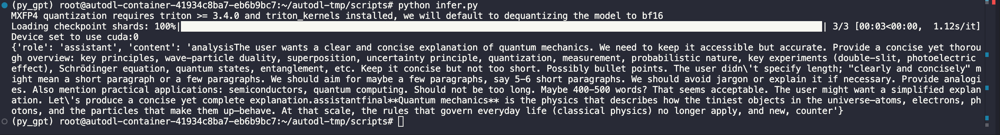
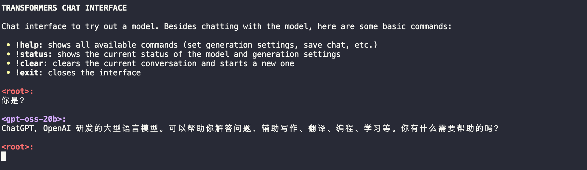
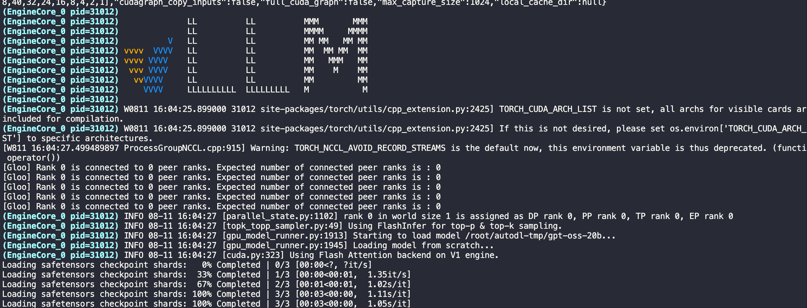
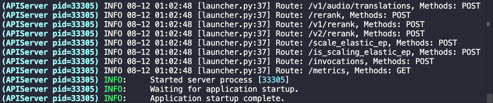

# **01-GPT-OSS-20b** **vLLM** **部署调用**

## 引言

> 看完本教程你将收获：
> 
> - 通过transformer在本地部署调用gpt-oss的能力！
> 	
> - 使用vLLM部署调用gpt-oss的能力！
> 	

GPT-OSS 是 OpenAI 推出的开源大语言模型系列，包含两个版本：gpt-oss-120b 和 gpt-oss-20b。这两个模型均采用 MoE（Mixture-of-Experts）Transformer 架构，支持 128K 的上下文长度，并采用 Apache 2.0 许可协议，允许自由使用和商业应用。GPT-OSS-120B 模型在核心推理基准测试中与 OpenAI o4-mini 模型几乎持平，同时能在单个 80GB GPU 上高效运行。GPT-OSS-20B 模型在常见基准测试中与 OpenAI o3‑mini 模型取得类似结果，且可在仅配备 16GB 内存的边缘设备上运行，使其成为设备端应用、本地推理或无需昂贵基础设施的快速迭代的理想选择。这两个模型在工具使用、少样本函数调用、CoT推理（如在 Tau-Bench 智能体评估套件中的结果所示）以及 HealthBench 测试中表现强劲（甚至超越了 OpenAI o1 和 GPT‑4o 等专有模型）。
vLLM 支持以下两种规模的gpt-oss:

- [openai/gpt-oss-20b](https://huggingface.co/openai/gpt-oss-20b)
	- 较小的模型
		
	- 仅需约 16GB 显存
		
	- 可在消费级显卡如A100或H20上运行
		
- [openai/gpt-oss-120b](https://huggingface.co/openai/gpt-oss-120b)
	- 更大的全尺寸模型
		
	- 显存≥60GB时效果最佳
		
	- 可在单张H100或多GPU设置上运行
		

## **环境准备**

配置环境比较头疼，我们为同学们准备了镜像：
- ⚠️**注意**：由于支持gpt-oss模型的vLLM 0.10.1版本还未正式发布（2025.8.6），需要从源码安装vLLM和gpt-oss的依赖。推荐启动一个新的python 3.12环境，避免对现有环境造成影响。
- ⚠️**注意：** vllm-gpt-oss的很多依赖均为最新，如果不是最新配置环境会出问题！！！ 如需升级conda，升级cuda命令

```Bash
conda search cuda-toolkit --channel nvidia
conda install cuda-toolkit=<新版本号> --channel nvidia
nvcc --version #查看是否升级成功

export CUDA_HOME=$CONDA_PREFIX 
export LD_LIBRARY_PATH=$CONDA_PREFIX/lib:$LD_LIBRARY_PATH #在conda升级后需设置一下路径
```

本文的试验基础环境如下：

> PyTorch 2.9.0
> Python 3.12(ubuntu22.04)
> CUDA 12.8
> GPU NVIDIA H20-96GB \* 1

1. 克隆代码仓
	

```Bash
git clone https://github.com/huggingface/gpt-oss-recipes.git
cd gpt-oss-recipes
```

2. `pip`换源加速，下载并安装依赖包
	

```Bash
conda create -n gpt_oss_vllm python=3.12
conda activate gpt_oss_vllm

python -m pip install --upgrade pip
pip config set global.index-url https://pypi.tuna.tsinghua.edu.cn/simple

export HF_ENDPOINT="https://hf-mirror.com"
pip install -U huggingface_hub
```

3. `gpt-oss`依赖
	

```Python
pip install -U transformers kernels torch accelerate
```

## **模型下载**

模型可以从Hugging Face和ModelScope仓库获取。可以显式下载，也可以在首次使用时执行仓库代码自动下载。

### **Hugging Face** **CLI**

```Bash
huggingface-cli download openai/gpt-oss-20b --local-dir gpt-oss-20b
```

ps：记得修改对应的 `cache_dir` / `local_dir`为你的模型下载路径哦~

## **transformers** **调用方式**

### 通过脚本调用

使用`transformers`库作为推理的改写交互脚本进行调用测试

```Python
from transformers import pipeline
import torch

model_id = "openai/gpt-oss-20b"

pipe = pipeline(
    "text-generation",
    model=model_id,
    torch_dtype="auto",
    device_map="auto",
)

messages = [
    {"role": "user", "content": "Explain quantum mechanics clearly and concisely."},
]

outputs = pipe(
    messages,
    max_new_tokens=256,
)
print(outputs[0]["generated_text"][-1])
```



### 通过服务调用

```Bash
transformers serve
transformers chat localhost:8000 --model-name-or-path openai/gpt-oss-20b
```

ps：记得修改为你的模型下载路径哦~


### 调整生成参数

可以通过系统提示调整推理的详细程度。例如，设置高推理级别：

```JSON
messages = [
    {"role": "system", "content": "Reasoning: high"},
    {"role": "user", "content": "解释量子计算的基本原理"}
]
```

## **vLLM** **调用代码准备**

### vLLM环境配置

注意：vLLM版本之间兼容性很差，注意识别

```Bash
pip install --pre vllm==0.10.1+gptoss \
    --extra-index-url https://wheels.vllm.ai/gpt-oss/ \
    --extra-index-url https://download.pytorch.org/whl/nightly/cu128
 
# !!!安装 FlashInfer!!!
pip install flashinfer-python==0.2.10
```

### 启动服务器并下载模型

vLLM 提供了一个命令，该命令将自动从 HuggingFace 下载模型并在 上启动与 OpenAI 兼容的服务器。
根据服务器上的终端会话中所需的模型大小运行以下命令。

```Bash
# For 20B 可以替换成本地下载的目录
vllm serve openai/gpt-oss-20b
 
# For 120B 可以替换成本地下载的目录
vllm serve openai/gpt-oss-120b
```



### 测试

```Python
VLLM_ATTENTION_BACKEND=TRITON_ATTN_VLLM_V1 vllm serve openai/gpt-oss-20b --served-model-name gpt-oss-20b --trust_remote_code --port 8801
```



### 参考链接

- 在线体验网址：[https://gpt-oss.com/](https://gpt-oss.com/?utm_source=aihub.cn)
	
- Huggingface：[https://huggingface.co/openai/gpt-oss-120b](https://huggingface.co/openai/gpt-oss-120b/?utm_source=aihub.cn)
	
- vLLM官方gpt-oss文档：https://docs.vllm.ai/projects/recipes/en/latest/OpenAI/GPT-OSS.html#gpt-oss-vllm-usage-guide
