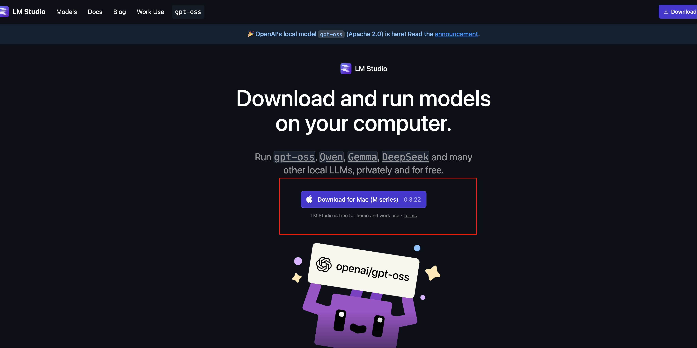
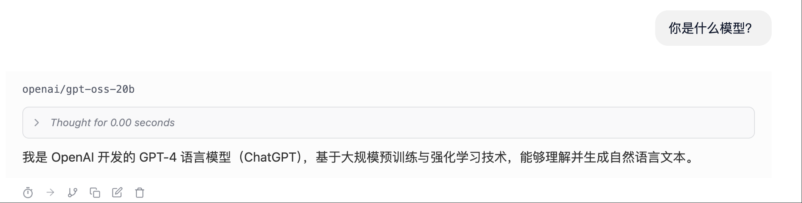
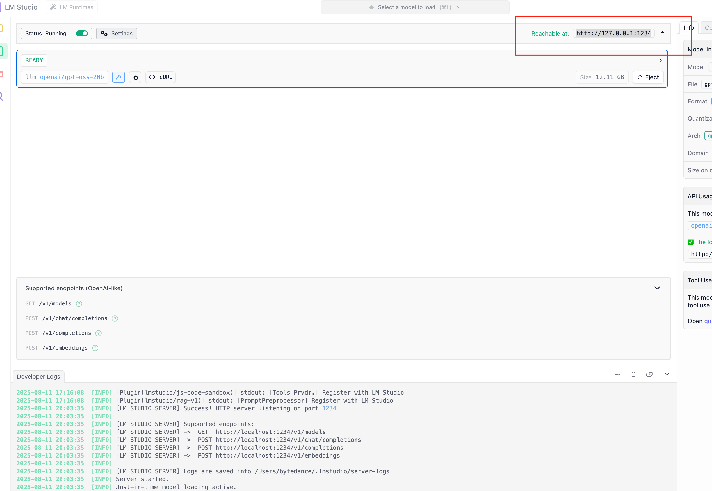

# 03-gpt-oss-20b lmstudio 本地部署调用

## 引言

> 看完本教程你将收获：
> 
> - 通过lmstudio部署gpt-oss-20b并应用MCP
> 	

在本地运行大型语言模型（LLMs）已成为许多开发者和爱好者的热门选择，它提供了隐私性、定制化和离线使用的可能性。虽然像 Ollama 这样的工具提供了强大的命令行界面来管理和运行本地模型，但 LM Studio 则为寻求更图形化、更直观交互体验的用户提供了一个极具吸引力的替代方案。
相比于 Ollama，LM Studio 拥有更加丰富的用户界面，同样强大的模型生态系统支持，以及更易于上手的交互体验。其突出的优势之一在于它非常适合在无网络环境下部署和使用大模型，使其成为一个出色的本地 LLM 应用产品。
本教程将带您一步步了解如何开始使用 LM Studio。我们将涵盖：

1. 下载与安装：快速获取并安装 LM Studio 应用程序。
	
2. 模型下载（在线）：学习如何在 LM Studio 界面内搜索、选择（根据硬件推荐）并下载模型，以 **gpt-oss-20b** 为例。
	
3. 模型安装（离线）：针对网络不佳或希望手动管理模型文件的用户，展示如何从魔搭社区等来源下载模型文件，并将其正确放置到 LM Studio 的模型库中。
	
4. 模型测试：通过 LM Studio 内建的聊天界面与下载好的 gpt-oss-20b 模型进行交互。
	
5. 本地 API 调用：设置 LM Studio 的本地服务器，并使用 Python 和 OpenAI 库通过 API 调用已加载的 **gpt-oss-20b**模型，实现程序化交互。
	
6. 如何调用MCP让模型大展身手！
	

无论您是想探索本地 LLM 的新手，还是在寻找一个界面友好、支持离线运行的工具，本指南都将帮助您轻松上手 LM Studio，并成功部署和调用 **gpt-oss-20b** 这样强大的模型。让我们开始吧！

## 安装Imstudio

安装 LM Studio LM Studio 适用于 Windows、macOS 和 Linux。 [在这里获取。](https://lmstudio.ai/download)

> 选择适合你的系统进行下载～



## 模型下载

在 LM Studio 中加载模型 → 打开 LM Studio，使用模型加载界面加载下载的 gpt-oss 模型。

或者，您可以使用命令行（苹果用户是终端）运行：

```Bash
# For 20B
lms get openai/gpt-oss-20b
# or for 120B
lms get openai/gpt-oss-120b
```

## 运行模型

> 使用模型 →加载后，您可以直接在 LM Studio 的聊天界面或通过 API 与模型进行交互。



## 在终端 or lmstudio页面与gpt-oss聊天

```Bash
lms chat openai/gpt-oss-20b #注意第一次运行之后才能使用lmx命令
```

## 在python脚本中调用本地部署的gpt-oss



```Python
from openai import OpenAI
 
client = OpenAI(
    base_url="http://localhost:1234/v1",
    api_key="not-needed"  # LM Studio does not require an API key
)
 
result = client.chat.completions.create(
    model="openai/gpt-oss-20b",
    messages=[
        {"role": "system", "content": "You are a helpful assistant."},
        {"role": "user", "content": "Explain what MXFP4 quantization is."}
    ]
)
 
print(result.choices[0].message.content)
```

## 如何应用MCP

> LM Studio 是一个 [MCP 客户端](https://lmstudio.ai/docs/app/plugins/mcp)，这意味着您可以将 MCP 服务器连接，允许我们为 gpt-oss 模型提供外部工具。

1. 查看mcp路径
	

`~/.lmstudio/mcp.json`
LM Studio 的 SDK 有 ++[Python](https://github.com/lmstudio-ai/lmstudio-python)++ 和 ++[TypeScript](https://github.com/lmstudio-ai/lmstudio-js)++ 版本。您可以利用 SDK 实现工具调用和本地函数执行 gpt-oss。实现此目的的方法是通过 `.act（）` 调用，它允许您向 gpt-oss 提供工具，并让它在调用工具和推理之间切换，直到它完成您的任务。
下面的示例显示了如何为模型提供能够在本地文件系统上创建文件的单个工具。您可以使用此示例作为起点，并使用更多工具对其进行扩展。请参阅有关 ++[Python](https://lmstudio.ai/docs/python/agent/tools)++ 和 ++[TypeScript](https://lmstudio.ai/docs/typescript/agent/tools)++ 的工具定义的文档。

```Bash
uv pip install lmstudio
```

```Bash
pip install lmstudio
```

2. 在python脚本中使用
	

```Python
import readline  # 启用输入行编辑功能，支持历史记录和快捷键
from pathlib import Path
 
import lmstudio as lms
 
# 定义一个可以被模型调用的工具函数，让AI助手能够创建文件
# 工具函数本质上就是普通的Python函数，可以实现任何功能
def create_file(name: str, content: str):
    """创建指定名称和内容的文件。
    
    Args:
        name: 文件名（支持相对路径和绝对路径）
        content: 文件内容
        
    Returns:
        操作结果的描述信息
    """
    dest_path = Path(name)
    if dest_path.exists():
        return "错误：文件已存在，无法覆盖。"
    try:
        dest_path.write_text(content, encoding="utf-8")
    except Exception as exc:
        return f"错误：文件创建失败 - {exc!r}"
    return f"文件 '{name}' 创建成功。"
 
def print_fragment(fragment, round_index=0):
    """实时打印模型生成的文本片段，实现流式输出效果。
    
    Args:
        fragment: 包含生成内容的片段对象
        round_index: 轮次索引（.act()方法会自动传递此参数）
        
    Note:
        设置默认参数使得此回调函数同时兼容 .complete() 和 .respond() 方法
    """
    print(fragment.content, end="", flush=True)
 
# 初始化模型和聊天会话
model = lms.llm("openai/gpt-oss-20b")  # 加载OpenAI GPT-OSS 20B模型
chat = lms.Chat("你是一个运行在用户计算机上的智能助手，可以帮助用户完成各种任务。")
 
# 主交互循环
while True:
    try:
        user_input = input("用户（直接回车退出）: ")
    except EOFError:  # 处理Ctrl+D等终端输入结束信号
        print()
        break
    if not user_input.strip():  # 用户输入为空时退出程序
        break
    
    # 将用户消息添加到聊天历史
    chat.add_user_message(user_input)
    print("助手: ", end="", flush=True)
    
    # 调用模型进行推理，支持工具调用和流式输出
    model.act(
        chat,                           # 聊天上下文
        [create_file],                  # 可用的工具函数列表
        on_message=chat.append,         # 将完整响应添加到聊天历史
        on_prediction_fragment=print_fragment,  # 流式输出回调
    )
    print()  # 换行分隔每轮对话
```
