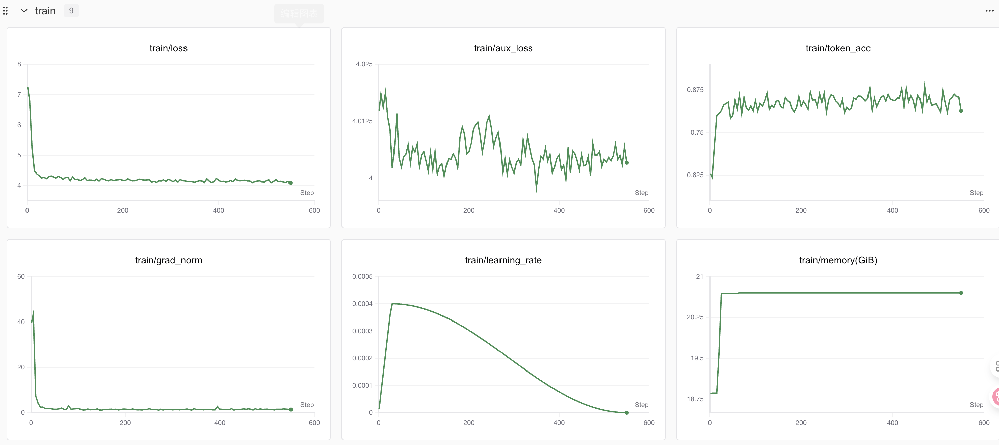
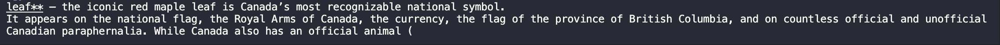
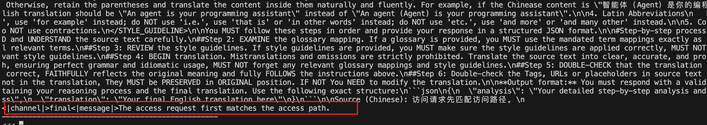
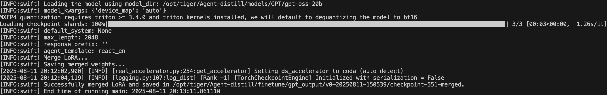
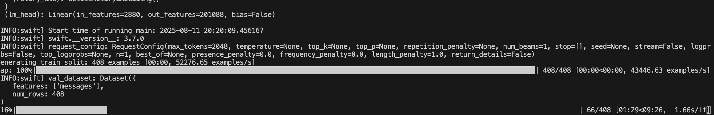

# 04-gpt-oss-20b Lora微调以及Swanlab可视化

## 引言

> 看完本教程你将收获：
> 	
> - Lora微调gpt-oss-20b！
>
> - 利用ms-swift进行Lora微调gpt-oss-20b！	


### 数据准备

> 下载多语言推理数据集

```Python
from datasets import load_dataset
dataset = load_dataset("HuggingFaceH4/Multilingual-Thinking", split="train")
```

### 数据可视化

```Python
User:
    ¿Cuál es el capital de Australia?
Assistant reasoning:
    Okay, der Benutzer fragt nach der Hauptstadt Australiens. Ich erinnere mich, dass Canberra die Hauptstadt ist. Ich
    sollte das bestätigen. Lass mich sehen, ob es irgendwelche potenziellen Verwirrungen gibt. Der Benutzer könnte auch
    an der größten Stadt interessiert sein. Die größte Stadt ist Sydney, aber die Hauptstadt ist Canberra. Ich sollte
    das klarstellen. Vielleicht auch erwähnen, dass Canberra eine geplante Stadt ist und nicht die größte. Der Benutzer
    könnte auch nach der Geografie fragen. Vielleicht erwähne ich, dass Canberra im südwestlichen Teil der Australian
    Capital Territory liegt. Ich sollte die Antwort präzise und freundlich halten. Vielleicht auch erwähnen, dass
    Canberra oft mit Sydney verwechselt wird. Ich sollte sicherstellen, dass die Antwort klar und korrekt ist.
Assistant response:
    La capital de Australia es **Canberra**. Aunque es la ciudad más pequeña de las principales capitales del país, fue
    elegida en 1908 como la sede del gobierno federal para equilibrar la influencia entre las ciudades de Sydney y
    Melbourne. Canberra está ubicada en el Territorio de la Capital Australiana (ACT), en el este de Australia.
```

### 环境配置

```Python
pip install torch --index-url https://download.pytorch.org/whl/cu128
pip install "peft>=0.17.0" "transformers>=4.55.0" trackio
```

### 微调

> 加载tokenizer

```Python
from transformers import AutoTokenizer

tokenizer = AutoTokenizer.from_pretrained("openai/gpt-oss-20b") #替换成你下载的目录哦～
```

> 然后我们可以使用tokenizer的 `apply_chat_template（）` 方法来格式化消息：

```Python
messages = dataset[0]["messages"]
conversation = tokenizer.apply_chat_template(messages, tokenize=False)
print(conversation)
```

> 为了准备模型进行训练，让我们首先从 [Hugging Face Hub](https://huggingface.co/)下载权重。
> 
> 我们将使用 Transformers 中的 🤗 `AutoModelForCausalLM` 类来加载模型

```Python
import torch
from transformers import AutoModelForCausalLM, Mxfp4Config

quantization_config = Mxfp4Config(dequantize=True)
model_kwargs = dict(
    attn_implementation="eager",
    torch_dtype=torch.bfloat16,
    quantization_config=quantization_config,
    use_cache=False,
    device_map="auto",
)

model = AutoModelForCausalLM.from_pretrained("openai/gpt-oss-20b", **model_kwargs)
```

这将为模型加载训练所需的配置。`attn_implementation` 设置为渴望更好的性能，`use_cache` 设置为 `False`，因为我们将使用梯度检查点微调模型。

如果您熟悉 Transformers，您可能会注意到我们正在使用 `Mxfp4Config` 进行量化。这是 OpenAI 模型的特定配置，允许我们使用混合精度训练，其中包含一种称为 ++[MXFP4](https://en.wikipedia.org/wiki/Block_floating_point)++ 的特殊 4 位浮点格式，该格式针对 AI 工作负载进行了优化。

> 测试一条message

```Python
messages = [
    {"role": "user", "content": "¿Cuál es el capital de Australia?"},
]

input_ids = tokenizer.apply_chat_template(
    messages,
    add_generation_prompt=True,
    return_tensors="pt",
).to(model.device)

output_ids = model.generate(input_ids, max_new_tokens=512)
response = tokenizer.batch_decode(output_ids)[0]
print(response)
```

> 配置 LoRA 参数

```Python
from peft import LoraConfig, get_peft_model

peft_config = LoraConfig(
    r=8,
    lora_alpha=16,
    target_modules="all-linear",
    target_parameters=[
        # MoE 专家层的投影，按需增减
        "7.mlp.experts.gate_up_proj",
        "7.mlp.experts.down_proj",
        "15.mlp.experts.gate_up_proj",
        "15.mlp.experts.down_proj",
        "23.mlp.experts.gate_up_proj",
        "23.mlp.experts.down_proj",
    ],
)
peft_model = get_peft_model(model, peft_config)
peft_model.print_trainable_parameters()
```

注意：`openai/gpt-oss-20b` 模型是一种++[混合专家 （MoE）](https://huggingface.co/blog/moe)++ 架构。除了针对注意力层（`target_modules=“all-linear”）` 之外，在专家模块中包含投影层也很重要。PEFT 通过 `target_parameters` 参数促进了这一点，它允许您指定特定于专家的层，例如 `mlp.experts.down_proj` 和 `mlp.experts.gate_up_proj`。

```Python
from datasets import DatasetDict

max_length = 4096

def format_and_tokenize(example):
    # 期望存在 "messages" 字段（和你示例一致）
    messages = example["messages"]
    # 不加 generation_prompt；让模型学习到完整的对话展开
    text = tokenizer.apply_chat_template(
        messages, tokenize=False
    )
    # 直接整体 tokenization，labels=inputs（由 collator 处理）
    tokens = tokenizer(
        text,
        truncation=True,
        max_length=max_length,
        return_attention_mask=True,
    )
    return tokens

tokenized = ds.map(format_and_tokenize, remove_columns=ds.column_names)
# 简单划个验证集（可选）
splits = tokenized.train_test_split(test_size=0.01, seed=42)
train_ds, eval_ds = splits["train"], splits["test"]

```

> 微调参数设置

```Python
from dataclasses import dataclass
import torch
from transformers import Trainer, TrainingArguments, default_data_collator

@dataclass
class CausalDataCollator:
    tokenizer: AutoTokenizer
    mlm: bool = False
    def __call__(self, features):
        # default_data_collator 会把 input_ids/attention_mask 转成张量
        batch = default_data_collator(features)
        if "labels" not in batch:
            batch["labels"] = batch["input_ids"].clone()
        return batch

collator = CausalDataCollator(tokenizer)

training_args = TrainingArguments(
    output_dir="gpt-oss-20b-multilingual-reasoner",
    per_device_train_batch_size=4,
    gradient_accumulation_steps=4,
    num_train_epochs=1.0,
    learning_rate=2e-4,
    lr_scheduler_type="cosine_with_min_lr",
    lr_scheduler_kwargs={"min_lr_rate": 0.1},
    warmup_ratio=0.03,
    logging_steps=1,
    save_steps=200,
    save_total_limit=2,
    bf16=True,
    gradient_checkpointing=True,
    report_to=[],
)

trainer = Trainer(
    model=model,
    args=training_args,
    train_dataset=train_ds,
    eval_dataset=eval_ds,
    tokenizer=tokenizer,
    data_collator=collator,
)

trainer.train()

```
> 训练过程上传到Swanlab
> 训练过程通过swanlab可视化



### Swanlab


> [SwanLab](https://github.com/swanhubx/swanlab) 是一个开源的模型训练记录工具，面向 AI 研究者，提供了训练可视化、自动日志记录、超参数记录、实验对比、多人协同等功能。在 `SwanLab` 上，研究者能基于直观的可视化图表发现训练问题，对比多个实验找到研究灵感，并通过在线链接的分享与基于组织的多人协同训练，打破团队沟通的壁垒。

#### 为什么要记录训练？

相较于软件开发，模型训练更像一个实验科学。一个品质优秀的模型背后，往往是成千上万次实验。研究者需要不断尝试、记录、对比，积累经验，才能找到最佳的模型结构、超参数与数据配比。在这之中，如何高效进行记录与对比，对于研究效率的提升至关重要。

#### 在哪里用？

建议先在 [SwanLab 官网](https://swanlab.cn/) 注册账号，然后在SFT初始化阶段选择


> 设置成你自己的api_key~
```Python
from transformers import TrainerCallback

try:
    import swanlab
    class SwanLabCallback(TrainerCallback):
        def __init__(self, project="swift-robot"):
            swanlab.init(project=project)

        def on_log(self, args, state, control, logs=None, **kwargs):
            if logs:
                for k,v in logs.items():
                    if isinstance(v, (int,float)):
                        swanlab.log({k: v})
    trainer.add_callback(SwanLabCallback(project="swift-robot"))
except Exception as e:
    print("SwanLab disabled:", e)
```

> 权重合并
```Python
from peft import PeftModel

# 先载入基座
infer_kwargs = dict(attn_implementation="eager", torch_dtype="auto", use_cache=True, device_map="auto")
base_model = AutoModelForCausalLM.from_pretrained(model_id, **infer_kwargs).cuda()

# 把 LoRA 适配器加载回来（用训练输出目录）
peft_model = PeftModel.from_pretrained(base_model, "gpt-oss-20b-multilingual-reasoner")
# 合并并卸载LoRA
merged = peft_model.merge_and_unload()
merged.eval()

# 生成
messages = [
    {"role": "system", "content": "reasoning language: German"},
    {"role": "user", "content": "¿Cuál es el capital de Australia?"},
]
inp = tokenizer.apply_chat_template(messages, add_generation_prompt=True, return_tensors="pt").to(merged.device)
gen = merged.generate(inp, max_new_tokens=512, do_sample=True, temperature=0.6)
print(tokenizer.batch_decode(gen)[0])


```




## ms-swift微调

> 这里给大家提供一种框架微调教程 基于`ms-swift`
> 微调的框架有很多，不论是选择哪一方都是殊途同归，为什么选择ms-swift见：

- 🍎 模型类型：支持450+纯文本大模型、150+多模态大模型以及All-to-All全模态模型、序列分类模型、Embedding模型训练到部署全流程。
数据集类型：内置150+预训练、微调、人类对齐、多模态等各种类型的数据集，并支持自定义数据集。
硬件支持：CPU、RTX系列、T4/V100、A10/A100/H100、Ascend NPU、MPS等。
- 🍊 轻量训练：支持了LoRA、QLoRA、DoRA、LoRA+、ReFT、RS-LoRA、LLaMAPro、Adapter、GaLore、Q-Galore、LISA、UnSloth、Liger-Kernel等轻量微调方式。
分布式训练：支持分布式数据并行（DDP）、device\_map简易模型并行、DeepSpeed ZeRO2 ZeRO3、FSDP等分布式训练技术。
量化训练：支持对BNB、AWQ、GPTQ、AQLM、HQQ、EETQ量化模型进行训练。
RLHF训练：支持纯文本大模型和多模态大模型的DPO、GRPO、RM、PPO、KTO、CPO、SimPO、ORPO等人类对齐训练方法。
- 🍓 多模态训练：支持对图像、视频和语音不同模态模型进行训练，支持VQA、Caption、OCR、Grounding任务的训练。
界面训练：以界面的方式提供训练、推理、评测、量化的能力，完成大模型的全链路。
插件化与拓展：支持自定义模型和数据集拓展，支持对loss、metric、trainer、loss-scale、callback、optimizer等组件进行自定义。
- 🍉 工具箱能力：不仅提供大模型和多模态大模型的训练支持，还涵盖其推理、评测、量化和部署全流程。
推理加速：支持PyTorch、vLLM、LmDeploy推理加速引擎，并提供OpenAI接口，为推理、部署和评测模块提供加速。
模型评测：以EvalScope作为评测后端，支持100+评测数据集对纯文本和多模态模型进行评测。
模型量化：支持AWQ、GPTQ和BNB的量化导出，导出的模型支持使用vLLM/LmDeploy推理加速，并支持继续训练。

### 环境配置

1. 基础环境配置
	

> PyTorch 2.6.0
> 
> Python 3.12(ubuntu22.04)
> 
> CUDA 12.4
> 
> GPU NVIDIA H20-96GB \* 4

2. Lora环境配置
	

```Bash
pip install ms-swift==3.7.0
pip install deepspeed
pip install swanlab
pip install -U transformers kernels torch
```

### 数据准备

> 构建数据集
> 
> 参考[自定义数据集 — swift 3.8.0.dev0 文档](https://swift.readthedocs.io/zh-cn/latest/Customization/%E8%87%AA%E5%AE%9A%E4%B9%89%E6%95%B0%E6%8D%AE%E9%9B%86.html)获得更多定义方式
> 
> 这里使用最简单，与官方结构一致的方式
> 
> 我这里是翻译任务，所以我的示例数据如下：

```Bash
  {
    "messages": [
      {
        "role": "user",
        "content": "Source Text：There, they found the body of Saroja Balasubramanian, 53, covered with blood-stained blankets. Style Guide：The translation style must be style: wikinews/Crime and Law"
      },
      {
        "role": "assistant",
        "content": "<think>\nxxx</think>\n\n在那里，他们发现了 53 岁的萨罗贾·巴拉苏布拉曼尼亚的尸体，盖着血迹斑斑的毯子。"
      }
    ]
  },
```

> 或者你可以使用开源的任意数据集
> 
> 这里，其他同学找了一个魔搭上开源的赛博猫娘数据集来进行这次教程，试想哪一个佬不想拥有一个赛博猫娘呢？

数据集传送门：[沐雪猫娘化数据集](https://modelscope.cn/datasets/himzhzx/muice-dataset-train.catgirl/files)

```JSON
{
  "instruction": "沐雪的功能是什么？",
  "input": "",
  "output": "喵~本雪的主要功能是让你开心喵！用可爱的猫娘之力治愈你的心灵，喵呜~"
  "history":[]
}
```

### Lora微调

> 编写bash脚本

```Bash
MASTER_PORT=$PORT \                             # 分布式训练主进程的通信端口，使用环境变量 $PORT
NPROC_PER_NODE=4 \                              # 每个节点的进程数（通常等于 GPU 数）
CUDA_VISIBLE_DEVICES=0,1,2,3 \                  # 指定使用的 GPU 编号
swift sft --deepspeed zero3\                    # 使用 swift 的 sft 训练命令，并启用 DeepSpeed ZeRO-3 优化
    --model /root/autodl-tmp/gpt-oss-20b \      # 模型路径（替换为你自己的模型目录）
    --dataset /root/autodl-tmp/train.json \     # 数据集路径（替换为你自己的训练数据）
    --train_type lora \                         # 训练类型为 LoRA（低秩适配）
    --torch_dtype bfloat16 \                    # 计算精度设为 bfloat16
    --num_train_epochs 35 \                     # 训练总轮数
    --per_device_train_batch_size 1 \           # 每个设备的训练批大小
    --per_device_eval_batch_size 1 \            # 每个设备的验证批大小
    --learning_rate 1e-4 \                      # 学习率
    --lora_rank 8 \                             # LoRA 的秩（低秩分解维度）
    --lora_alpha 32 \                           # LoRA 缩放因子
    --target_modules all-linear \               # 应用 LoRA 的目标模块类型
    --gradient_accumulation_steps 16 \          # 梯度累积步数
    --eval_steps 50 \                           # 每 50 步进行一次评估
    --save_steps 50 \                           # 每 50 步保存一次模型
    --save_total_limit 2 \                      # 最多保留 2 个最新的检查点
    --logging_steps 5 \                         # 每 5 步记录一次日志
    --max_length 8192 \                         # 最大序列长度
    --output_dir output \                       # 模型输出目录
    --warmup_ratio 0.05 \                       # 学习率预热比例
    --dataloader_num_workers 4 \                # DataLoader 工作线程数
    --use_liger_kernel true \                   # 启用 liger kernel 优化
    --load_from_cache_file false \              # 是否从缓存文件加载数据
    --loss_scale ignore_empty_think \           # 忽略空 think 标签的 loss
    --save_strategy epoch\                      # 保存策略：每个 epoch 保存一次
    --model_author gxb \                        # 模型作者名
    --model_name gxb-gpt-oss-20b-agent-distill \# 模型名称
    --report_to swanlab \                       # 训练日志上报到 SwanLab
    --swanlab_project swift-robot               # SwanLab 项目名称
```

### 测试效果

```Bash
CUDA_VISIBLE_DEVICES=0 \
swift infer \
    --adapters v0-20250811-150539/checkpoint-551 \
    --stream true \
    --temperature 0 \
    --max_new_tokens 2048
```



### 合并权重

```Bash
swift export \
    --adapters v0-20250811-150539/checkpoint-551 \
    --merge_lora true
```



### 推理

> 编写推理脚本

```Bash
CUDA_VISIBLE_DEVICES=0 \
swift infer \
    --model v0-20250811-150539/checkpoint-551 \
    --val_dataset SFT/dataForSFT/val.json \
    --max_new_tokens 2048 \
    --result_path SFT/infer_output/_sft_1epoch.jsonl
```


