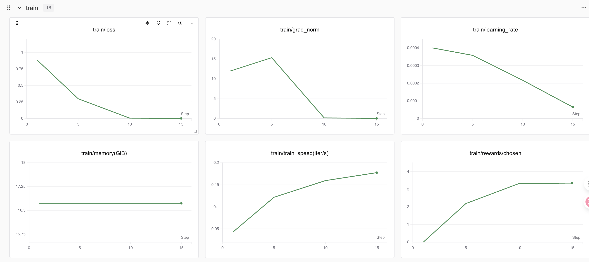
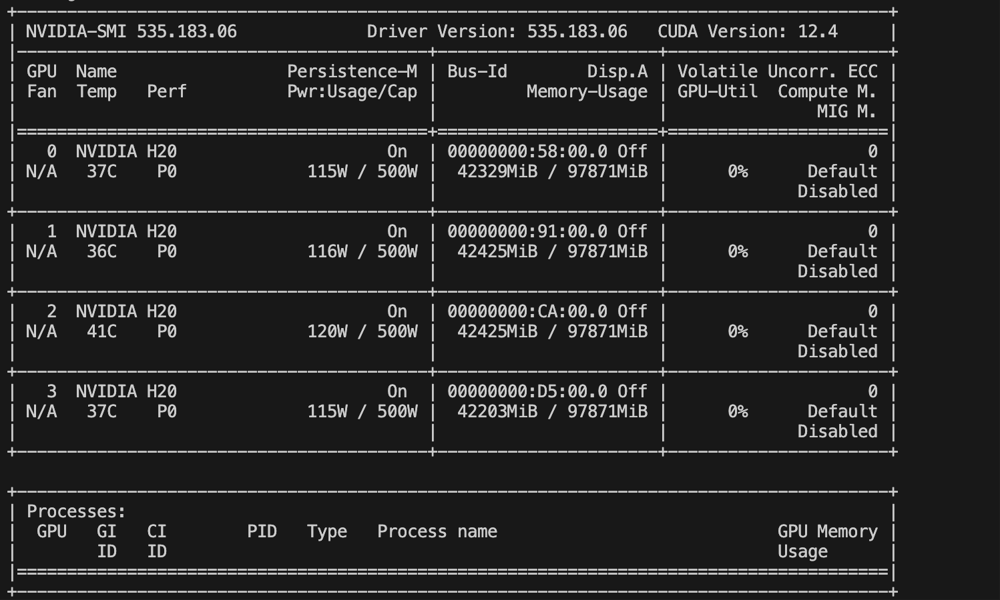

# 05-gpt-oss-20b DPO微调以及Swanlab可视化

## 引言

> 看完本教程你将收获，构造DPO数据，利用ms-swift对gpt-oss-20b进行微调！

## 为什么要做DPO？

在大模型微调中，通常先做 SFT（有监督微调）再做 DPO（直接偏好优化），因为 SFT 用高质量标注数据让模型先学会任务的基本能力和输出格式，而 DPO 用成对的优劣答案引导模型更符合人类偏好。若直接做 DPO，模型可能还不会生成合格答案，偏好信号噪声大，难以收敛；先 SFT 再 DPO 则能在“会做”的基础上优化到“做得好”。

## 环境配置

1. 基础环境配置
	

> PyTorch 2.6.0
> 
> Python 3.12(ubuntu22.04)
> 
> CUDA 12.4
> 
> GPU NVIDIA H20-96GB \* 4

2. Lora环境配置
	

```Bash
pip install ms-swift==3.7.0
pip install deepspeed
pip install swanlab
pip install -U transformers kernels torch
```

## 数据准备

> 构建数据集，示例数据如下
> 
> 参考[自定义数据集 — swift 3.8.0.dev0 文档](https://swift.readthedocs.io/zh-cn/latest/Customization/%E8%87%AA%E5%AE%9A%E4%B9%89%E6%95%B0%E6%8D%AE%E9%9B%86.html)获得更多定义方式
> 
> 这里使用最简单，与官方结构一致的方式
> 
> 示例数据如下【结构中应包含一个正样本一个负样本】：

```JSON
{"messages": [{"role": "system", "content": "你是个有用无害的助手"}, {"role": "user", "content": "告诉我明天的天气"}, {"role": "assistant", "content": "明天天气晴朗"}], "rejected_response": "我不知道"}
{"messages": [{"role": "system", "content": "你是个有用无害的数学计算器"}, {"role": "user", "content": "1+1等于几"}, {"role": "assistant", "content": "等于2"}, {"role": "user", "content": "再加1呢"}, {"role": "assistant", "content": "等于3"}], "rejected_response": "我不知道"}
```

在翻译任务上的数据：

```JSON
    {
        "messages": [
            {"role": "system", "content": "You are an expert machine translation specialist in the field of Technical Writing, highly proficient in translating from Chinese to English."}, 
            {"role": "user", "content": "Translate the following Chinese text to English: 步骤一：添加域名"}, 
            {"role": "assistant", "content": "Step 1: Add a domain name"}], 
        "rejected_response": "Step 1: Adding domain names"
    }
```

## 微调

> 构造dpo脚本

```Bash
MASTER_PORT=$PORT \
NPROC_PER_NODE=4 \
CUDA_VISIBLE_DEVICES=0,1,2,3 \
swift rlhf --rlhf_type dpo \
    --deepspeed zero3 \
    --model models/gpt-oss-20b \ #替换成你自己的模型路径
    --dataset  dpo_data.json \ #替换成你自己的数据路径
    --train_type lora \
    --torch_dtype bfloat16 \
    --num_train_epochs 1 \
    --per_device_train_batch_size 2 \
    --per_device_eval_batch_size 1 \
    --learning_rate 4e-4 \
    --lora_rank 8 \
    --lora_alpha 32 \
    --target_modules all-linear \
    --gradient_accumulation_steps 4 \
    --save_strategy epoch \
    --save_total_limit 5 \
    --logging_steps 5 \
    --max_length 8192 \
    --output_dir /opt/tiger/Agent-distill/finetune/gpt_output \
    --warmup_ratio 0.05 \
    --dataloader_num_workers 4 \
    --use_liger_kernel true \
    --load_from_cache_file false \
    --loss_scale ignore_empty_think \
    --save_strategy epoch\
    --model_author gxb \
    --model_name gxb-gpt-oss-20b-dpo \
    --report_to swanlab \ #使用swanlab记录实验
    --swanlab_project swift-robot
```

> 训练过程可视化



> 显存占用情况



### Swanlab


> [SwanLab](https://github.com/swanhubx/swanlab) 是一个开源的模型训练记录工具，面向 AI 研究者，提供了训练可视化、自动日志记录、超参数记录、实验对比、多人协同等功能。在 `SwanLab` 上，研究者能基于直观的可视化图表发现训练问题，对比多个实验找到研究灵感，并通过在线链接的分享与基于组织的多人协同训练，打破团队沟通的壁垒。

#### 为什么要记录训练？

相较于软件开发，模型训练更像一个实验科学。一个品质优秀的模型背后，往往是成千上万次实验。研究者需要不断尝试、记录、对比，积累经验，才能找到最佳的模型结构、超参数与数据配比。在这之中，如何高效进行记录与对比，对于研究效率的提升至关重要。

#### 在哪里用？

建议先在 [SwanLab 官网](https://swanlab.cn/) 注册账号，然后在SFT和GRPO训练初始化阶段选择
`--report_to swanlab \ # 训练日志上报到 SwanLab`

### 合并权重

> 后续步骤与SFT保持一致

```Bash
swift export \
    --adapters v0-20250812-150539/checkpoint-20 \
    --merge_lora true
```

### 推理

> 编写推理脚本

```Bash
CUDA_VISIBLE_DEVICES=0 \
swift infer \
    --model v0-20250812-150539/checkpoint-20-merged \
    --val_dataset val.json \
    --max_new_tokens 2048 \
    --result_path dpo_1epoch.jsonl
```
