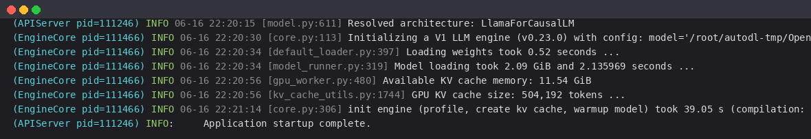
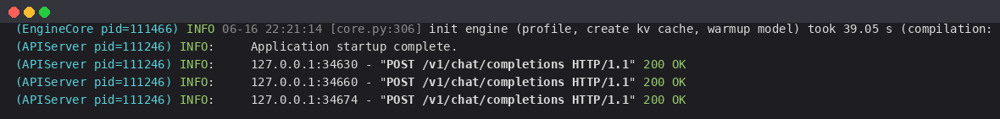

# 01-MiniCPM5-1B vLLM 部署调用

## vLLM 简介

`vLLM` 框架是一个高效的大语言模型**推理和部署服务系统**，具备以下特性：

- **高效的内存管理**：通过 `PagedAttention` 算法，`vLLM` 实现了对 `KV` 缓存的高效管理，减少了内存浪费，优化了模型的运行效率。
- **高吞吐量**：`vLLM` 支持异步处理和连续批处理请求，显著提高了模型推理的吞吐量。
- **易用性**：`vLLM` 与 `HuggingFace` 模型无缝集成，兼容 `OpenAI` 的 `API` 服务器。
- **开源共享**：`vLLM` 开源，社区活跃。

> `MiniCPM5-1B` 采用**标准 `LlamaForCausalLM` 架构**，主流推理引擎可直接加载——无需自定义算子、无需模型代码 fork。本教程使用 `vLLM` 部署，**文中启动日志与接口返回均为实测真实输出**。

## 关于 MiniCPM5-1B

`MiniCPM5-1B` 是面壁智能（ModelBest）/ OpenBMB 发布的 1B 稠密 Transformer，面向端侧、本地部署与资源受限场景，具备：

- **同尺寸开源 SOTA**：在 Agentic 工具调用、代码生成、高难推理上优势明显。
- **双模式推理（Hybrid Reasoning）**：内置 `<think>` chat template，可通过 `enable_thinking` 在「思考」与「非思考」模式间切换，同一份权重既是快速助手也是深度推理器。
- **原生长上下文**：支持最长 128K 上下文。
- **架构**：`LlamaForCausalLM`，24 层，hidden_size 1536，GQA（16 注意力头 / 2 KV 头），rope_theta=5000000。

## 环境准备

本文实测基础环境如下：

```
----------------
ubuntu 22.04
python 3.12
NVIDIA 驱动 580.105.08
GPU: RTX 4090 D (24G)
torch 2.11.0+cu128
vllm 0.23.0
----------------
```

> 本文默认学习者已配置好 `Pytorch (cuda)` 环境，如未配置请先自行安装。

```bash
python -m pip install --upgrade pip
pip config set global.index-url https://pypi.tuna.tsinghua.edu.cn/simple

pip install modelscope
pip install "transformers>=5.6"
pip install "vllm>=0.21"
pip install openai
```

> 若启动时报 `ModuleNotFoundError: No module named 'flash_attn.ops'`，通常是环境里装了 `flash-attn-4`（会留下一个空的 `flash_attn` 命名空间包），而 vLLM 的 rotary 模块检测到 `flash_attn` 后会尝试导入其 `.ops` 子模块。解决：`pip uninstall flash-attn-4`，并删除残留的空目录 `rm -rf $(python -c "import site;print(site.getsitepackages()[0])")/flash_attn`，vLLM 会自动回退到自带实现。

## 模型下载

使用 modelscope 中的 `snapshot_download` 函数下载模型。

新建 `model_download.py`：

```python
# model_download.py
from modelscope import snapshot_download

model_dir = snapshot_download('OpenBMB/MiniCPM5-1B', cache_dir='/root/autodl-tmp')
print(f"模型下载完成，保存路径为：{model_dir}")
```

然后执行 `python model_download.py`。

> 注意：记得修改 `cache_dir` 为你的模型下载路径哦~

## 创建兼容 OpenAI API 接口的服务器

`MiniCPM5-1B` 兼容 `OpenAI API` 协议。常用启动参数：

- `--host` / `--port`：地址与端口
- `--model`：模型路径
- `--served-model-name`：服务对外的模型名称
- `--max-model-len`：最大上下文长度（1B 模型在 24G 显存上可设 `4096` 或更大）
- `--gpu-memory-utilization`：显存占用比例（1B 模型很小，0.6 即可）
- `--trust-remote-code`：信任远程代码

```bash
vllm serve /root/autodl-tmp/OpenBMB/MiniCPM5-1B \
    --served-model-name MiniCPM5-1B \
    --max-model-len 4096 \
    --gpu-memory-utilization 0.6 \
    --trust-remote-code \
    --host 0.0.0.0 --port 8000
```

实测启动日志如下（vLLM 识别为 `LlamaForCausalLM`，1B 权重加载仅 0.52s）：



```bash
(APIServer) INFO [model.py:611] Resolved architecture: LlamaForCausalLM
(EngineCore) INFO [core.py:113] Initializing a V1 LLM engine (v0.23.0) ...
(EngineCore) INFO [default_loader.py:397] Loading weights took 0.52 seconds
(EngineCore) INFO [model_runner.py:319] Model loading took 2.09 GiB and 2.14 seconds
(EngineCore) INFO [gpu_worker.py:480] Available KV cache memory: 11.54 GiB
(EngineCore) INFO [kv_cache_utils.py:1744] GPU KV cache size: 504,192 tokens
(EngineCore) INFO [core.py:306] init engine (profile, create kv cache, warmup model) took 39.05 s (compilation: 18.97 s)
(APIServer) INFO:     Application startup complete.
```

> 首次启动会触发 `torch.compile` 编译（约 19s），编译结果会缓存，后续启动更快。出现 `Application startup complete.` 即说明服务成功启动。

- 查看 `curl http://localhost:8000/v1/models`：

```json
{
  "object": "list",
  "data": [
    {
      "id": "MiniCPM5-1B",
      "object": "model",
      "owned_by": "vllm",
      "root": "/root/autodl-tmp/OpenBMB/MiniCPM5-1B",
      "max_model_len": 4096
    }
  ]
}
```

### 思考模式与非思考模式

`MiniCPM5-1B` 内置 `<think>` 模板，可通过 `chat_template_kwargs.enable_thinking` 按**请求**级别控制：

- **思考模式**（`enable_thinking=true`，推荐 `temperature=0.9, top_p=0.95`）：先输出 `<think> ... </think>` 推理过程，再给出答案
- **非思考模式**（`enable_thinking=false`，推荐 `temperature=0.7, top_p=0.95`）：不强制思考，直接回答

| 模式 | 推荐参数 | enable_thinking |
| --- | --- | --- |
| Think | `temperature=0.9, top_p=0.95` | `True` |
| No Think | `temperature=0.7, top_p=0.95` | `False` |

### 用 curl 测试 Chat Completions（非思考模式）

```bash
curl http://localhost:8000/v1/chat/completions \
    -H "Content-Type: application/json" \
    -d '{
        "model": "MiniCPM5-1B",
        "messages": [
            {"role": "user", "content": "你是谁？用一句话介绍自己。"}
        ],
        "temperature": 0.7,
        "top_p": 0.95,
        "max_tokens": 256,
        "extra_body": {"chat_template_kwargs": {"enable_thinking": false}}
    }'
```

实测返回值如下（`content` 中先是简短的 `<think>` 思考，其后是最终回答，`finish_reason` 为 `stop`）：

```json
{
  "id": "chatcmpl-9c66165de8661ff3",
  "object": "chat.completion",
  "model": "MiniCPM5-1B",
  "choices": [
    {
      "index": 0,
      "message": {
        "role": "assistant",
        "content": "<think>\n嗯，用户让我介绍自己，需要一句话说明身份。MiniCPM系列模型是由面壁智能和OpenBMB社区开发的，所以应该直接说明这一点。\n</think>\n\n我是MiniCPM系列模型，由面壁智能（ModelBest）和OpenBMB开源社区开发。"
      },
      "finish_reason": "stop"
    }
  ],
  "usage": {
    "prompt_tokens": 15,
    "completion_tokens": 57,
    "total_tokens": 72
  }
}
```

> 实测发现：`MiniCPM5-1B` 即便在非思考模式下，也常在 `content` 开头先输出一段简短的 `<think> ... </think>` 再给出回答（这是该模型后训练形成的习惯）。若需要纯粹的非思考输出，可适当调大 `max_tokens`。

### 用 Python 脚本请求（思考模式）

```python
# vllm_openai_chat_completions.py
from openai import OpenAI

client = OpenAI(
    api_key="sk-xxx",                       # 随便填写，只是为了通过接口参数校验
    base_url="http://localhost:8000/v1",
)

# 思考模式：模型会先输出推理过程
chat_outputs = client.chat.completions.create(
    model="MiniCPM5-1B",
    messages=[{"role": "user", "content": "5的阶乘是多少？"}],
    temperature=0.9,
    top_p=0.95,
    extra_body={"chat_template_kwargs": {"enable_thinking": True}},
)
print(chat_outputs.choices[0].message.content)
```

输出包含 `<think> ... </think>` 思考过程与最终答案：

```
<think>
5 的阶乘记作 5!，等于 5 × 4 × 3 × 2 × 1 ...
</think>

5 的阶乘（5!）= 5 × 4 × 3 × 2 × 1 = 120。
```

### 运行时日志

在请求处理过程中，`API` 后端会持续打印日志与统计信息，便于观测服务状态。实测运行时日志如下：



```bash
(EngineCore) INFO [core.py:306] init engine (profile, create kv cache, warmup model) took 39.05 s (compilation: 18.97 s)
(APIServer) INFO:     Application startup complete.
(APIServer) INFO:     127.0.0.1:34630 - "POST /v1/chat/completions HTTP/1.1" 200 OK
(APIServer) INFO:     127.0.0.1:34660 - "POST /v1/chat/completions HTTP/1.1" 200 OK
```

## 工具调用（Tool Calling）

`MiniCPM5-1B` 原生支持 XML 风格的工具调用。在 vLLM 中可配合 `--tool-call-parser` 使用（vLLM 较新版本支持 `minicpm5` 解析器），将模型输出的 `<function ... </function>` 转换为 OpenAI 兼容的 `tool_calls`。具体用法可参考 MiniCPM 官方 cookbook。
