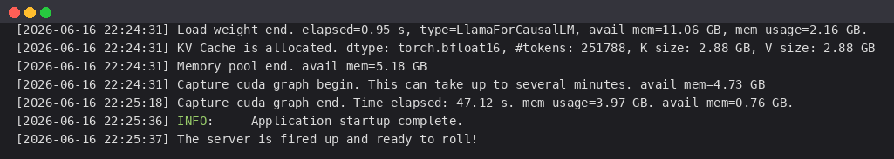
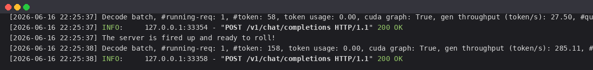

# 02-MiniCPM5-1B SGLang 部署调用

## SGLang 简介

`SGLang` 是一款专为大语言模型/多模态模型设计的高性能推理与服务框架：

- **后端一键启动**：一条命令完成环境适配与服务发布。
- **前端无缝对接**：直接沿用 `OpenAI SDK` 或标准 `HTTP` 调用。
- **高性能**：支持 `RadixAttention`（前缀复用）、连续批处理、CUDA Graph 等加速技术。

> `MiniCPM5-1B` 采用**标准 `LlamaForCausalLM` 架构**，SGLang 可直接加载，无需自定义算子。本教程使用 `SGLang` 部署，**文中启动日志与接口返回均为实测真实输出**。

> 官方提示：工具调用（Tool Calling）场景下，**SGLang 是推荐后端**——MiniCPM5-1B 输出 XML 风格工具调用，SGLang 内置的 `minicpm5` 解析器可将其原生转换为 OpenAI 兼容的 `tool_calls`。

## 关于 MiniCPM5-1B

`MiniCPM5-1B` 是面壁智能 / OpenBMB 的 1B 稠密 Transformer，面向端侧与本地部署：标准 `LlamaForCausalLM` 架构（24 层，GQA，128K 上下文），内置 `<think>` 模板支持「思考 / 非思考」双模式（通过 `enable_thinking` 切换）。

## 环境准备

本文实测基础环境如下：

```
----------------
ubuntu 22.04
python 3.12
NVIDIA 驱动 580.105.08
GPU: RTX 4090 D (24G, sm89)
torch 2.11.0+cu128
sglang 0.5.13.post1
----------------
```

> 本文默认学习者已配置好 `Pytorch (cuda)` 环境，如未配置请先自行安装。

```bash
python -m pip install --upgrade pip
pip config set global.index-url https://pypi.tuna.tsinghua.edu.cn/simple

pip install modelscope
pip install "transformers>=5.6"
pip install openai

# 安装 sglang（官方建议 sglang[srt]>=0.5.12）
pip install "sglang[srt]>=0.5.12"
```

> 若在 RTX 4090（sm89）上启动报 `Could not load any common_ops library! Expected variant: SM89`，说明默认装的 `sglang-kernel` 是 CUDA 13 / sm90+ 构建，需要换成 sm89 兼容版本：
> ```bash
> pip install sglang-kernel --index-url https://docs.sglang.ai/whl/cu129/
> ```

## 模型下载

新建 `model_download.py`：

```python
# model_download.py
from modelscope import snapshot_download

model_dir = snapshot_download('OpenBMB/MiniCPM5-1B', cache_dir='/root/autodl-tmp')
print(f"模型下载完成，保存路径为：{model_dir}")
```

执行 `python model_download.py`。

> 注意：记得修改 `cache_dir` 为你的模型下载路径哦~

## 启动 SGLang 服务

`MiniCPM5-1B` 为 1B 模型，单张 24G 显卡绰绰有余，无需张量并行。

### 命令行直接启动

```bash
python3 -m sglang.launch_server \
  --model-path /root/autodl-tmp/OpenBMB/MiniCPM5-1B \
  --served-model-name MiniCPM5-1B \
  --host 0.0.0.0 \
  --port 8000 \
  --mem-fraction-static 0.6 \
  --context-length 4096 \
  --trust-remote-code
```

> 新版 SGLang 推荐使用 `sglang serve ...` 入口（与 `python -m sglang.launch_server` 等价）。
> 若需工具调用，加上 `--tool-call-parser minicpm5`（或 `--tool-call-parser auto`）。

常用参数：

- `--model-path`：模型路径
- `--served-model-name`：服务对外的模型名称
- `--mem-fraction-static`：静态显存占用比例（1B 模型很小，0.6 即可）
- `--context-length`：最大上下文长度
- `--tp-size`：张量并行数，单卡无需设置
- `--trust-remote-code`：信任远程代码

实测启动日志如下（SGLang 识别为 `LlamaForCausalLM`，权重加载 0.95s）：



```bash
[22:24:31] Load weight end. elapsed=0.95 s, type=LlamaForCausalLM, avail mem=11.06 GB, mem usage=2.16 GB.
[22:24:31] KV Cache is allocated. dtype: torch.bfloat16, #tokens: 251788, K size: 2.88 GB, V size: 2.88 GB
[22:24:31] Memory pool end. avail mem=5.18 GB
[22:24:31] Capture cuda graph begin. This can take up to several minutes. avail mem=4.73 GB
[22:25:18] Capture cuda graph end. Time elapsed: 47.12 s. mem usage=3.97 GB. avail mem=0.76 GB.
[22:25:36] INFO:     Application startup complete.
[22:25:37] The server is fired up and ready to roll!
```

> 首次启动会进行 CUDA graph 捕获（约 47s），完成后出现 `The server is fired up and ready to roll!` 即说明服务成功启动。

### Python 启动脚本

```python
# start_server.py
from sglang.utils import launch_server_cmd, wait_for_server

cmd = (
    "python3 -m sglang.launch_server "
    "--model-path /root/autodl-tmp/OpenBMB/MiniCPM5-1B "
    "--served-model-name MiniCPM5-1B "
    "--host 0.0.0.0 --port 8000 "
    "--mem-fraction-static 0.6 --context-length 4096 "
    "--trust-remote-code"
)

server_process, port = launch_server_cmd(cmd, port=8000)
wait_for_server(f"http://127.0.0.1:{port}")
print(f"SGLang Server started: http://127.0.0.1:{port}")
```

## 调用示例

### 查看模型列表

```bash
curl http://localhost:8000/v1/models
```

实测返回值（`owned_by` 为 `sglang`）：

```json
{
  "object": "list",
  "data": [
    {
      "id": "MiniCPM5-1B",
      "object": "model",
      "owned_by": "sglang",
      "root": "MiniCPM5-1B",
      "max_model_len": 4096
    }
  ]
}
```

### 聊天对话（思考模式）

`MiniCPM5-1B` 内置 `<think>` 模板，通过 `chat_template_kwargs.enable_thinking` 控制模式：

| 模式 | 推荐参数 | enable_thinking |
| --- | --- | --- |
| Think | `temperature=0.9, top_p=0.95` | `True` |
| No Think | `temperature=0.7, top_p=0.95` | `False` |

```python
# test_chat.py
from openai import OpenAI

client = OpenAI(api_key="EMPTY", base_url="http://localhost:8000/v1")

# 思考模式：先输出 <think> ... </think>，再给答案
response = client.chat.completions.create(
    model="MiniCPM5-1B",
    messages=[{"role": "user", "content": "5的阶乘是多少？"}],
    temperature=0.9,
    top_p=0.95,
    max_tokens=768,
    extra_body={"chat_template_kwargs": {"enable_thinking": True}},
)
print(response.choices[0].message.content)
```

实测输出包含完整推理与最终答案（`finish_reason: stop`）：

```
<think>
5 的阶乘记作 5!，等于 5 × 4 × 3 × 2 × 1 = 120 ...
</think>

5 的阶乘（5!）等于 5 × 4 × 3 × 2 × 1 = 120。
```

### 非思考模式

```python
response = client.chat.completions.create(
    model="MiniCPM5-1B",
    messages=[{"role": "user", "content": "你是谁？用一句话介绍自己。"}],
    temperature=0.7,
    top_p=0.95,
    extra_body={"chat_template_kwargs": {"enable_thinking": False}},
)
print(response.choices[0].message.content)
```

> 实测发现：`MiniCPM5-1B` 即便在非思考模式下，也常在 `content` 开头先输出一段简短的 `<think> ... </think>` 再给出回答，这是该模型后训练形成的习惯。

### 运行时日志

请求处理时，SGLang 后端会持续打印解码批次的统计信息。实测运行时日志如下：



```bash
[22:25:36] INFO:     Application startup complete.
[22:25:37] The server is fired up and ready to roll!
[22:25:37] INFO:     127.0.0.1:xxxxx - "POST /v1/chat/completions HTTP/1.1" 200 OK
```

### 工具调用（Tool Calling）

SGLang 是 MiniCPM5-1B 工具调用的推荐后端。启动时加 `--tool-call-parser minicpm5`，即可把模型输出的 XML 风格 `<function ... </function>` 原生转换为 OpenAI 兼容的 `tool_calls`：

```bash
python3 -m sglang.launch_server --model-path /root/autodl-tmp/OpenBMB/MiniCPM5-1B \
    --served-model-name MiniCPM5-1B --port 8000 --tool-call-parser minicpm5
```

```python
tools = [{
    "type": "function",
    "function": {
        "name": "get_weather",
        "description": "获取指定城市的天气",
        "parameters": {
            "type": "object",
            "properties": {"city": {"type": "string", "description": "城市名"}},
            "required": ["city"],
        },
    },
}]
response = client.chat.completions.create(
    model="MiniCPM5-1B",
    messages=[{"role": "user", "content": "北京今天天气怎么样？"}],
    tools=tools,
)
print(response.choices[0].message.tool_calls)
```

## 小结

`MiniCPM5-1B` 作为标准 `LlamaForCausalLM` 架构的 1B 模型，在 `vLLM` 与 `SGLang` 中均可一键部署，无需任何特殊算子。结合其「思考/非思考」双模式与原生工具调用能力，非常适合端侧助手、coding agent 与工具调用场景。
