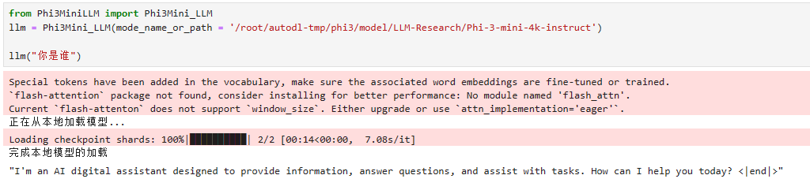
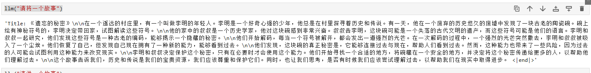

# Phi-3-mini-4k-instruct langchain 接入

## 环境准备

在 autodl 平台中租赁一个 3090 等 24G 显存的显卡机器，如下图所示镜像选择 PyTorch-->2.0.0-->3.8(ubuntu20.04)-->11.8 。

接下来打开刚刚租用服务器的 JupyterLab，并且打开其中的终端开始环境配置、模型下载和运行演示。  


### 创建工作目录

创建本次phi3实践的工作目录`/root/autodl-tmp/phi3`

```bash
# 创建工作目录
mkdir -p /root/autodl-tmp/phi3
```

### 安装依赖

```bash
# 升级pip
python -m pip install --upgrade pip
# 更换 pypi 源加速库的安装
pip config set global.index-url https://pypi.tuna.tsinghua.edu.cn/simple

pip install fastapi==0.104.1
pip install uvicorn==0.24.0.post1
pip install requests==2.25.1
pip install modelscope==1.9.5
pip install streamlit==1.24.0
pip install sentencepiece==0.1.99
pip install accelerate==0.24.1
pip install langchain==0.1.15
```

由于phi3要求的transformers的版本为`4.41.0.dev0版本`。

各位可以先通过下面命令查看你的Transformers包的版本

```bash
pip list |grep transformers
```

如果版本不对，可以通过下面命令升级

```bash
# phi3升级transformers为4.41.0.dev0版本
pip uninstall -y transformers && pip install git+https://github.com/huggingface/transformers
```


## 模型下载

使用 modelscope 中的`napshot_download`函数下载模型，第一个参数为模型名称，参数`cache_dir`为模型的下载路径。

在 /root/autodl-tmp 路径下新建`download.py` 文件并在其中输入以下内容，粘贴代码后记得保存文件，如下图所示。并运行`python /root/autodl-tmp/download.py`执行下载，模型大小为 8 GB，下载模型大概需要 10~15 分钟

```python
#模型下载
from modelscope import snapshot_download
model_dir = snapshot_download('LLM-Research/Phi-3-mini-4k-instruct', cache_dir='/root/autodl-tmp/phi3', revision='master')
```

## 代码准备

为便捷构建 LLM 应用，我们需要基于本地部署的 Phi-3-mini-4k-instruct，自定义一个 LLM 类，将  Phi-3-mini-4k-instruct 接入到 LangChain 框架中。完成自定义 LLM 类之后，可以以完全一致的方式调用 LangChain 的接口，而无需考虑底层模型调用的不一致。

基于本地部署的  Phi-3-mini-4k-instruct 自定义 LLM 类并不复杂，我们只需从 LangChain.llms.base.LLM 类继承一个子类，并重写构造函数与 _call 函数即可。

我们新建一个py文件`Phi3MiniLLM.py`，写入以下内容：

```python
from langchain.llms.base import LLM
from typing import Any, List, Optional
from langchain.callbacks.manager import CallbackManagerForLLMRun
from transformers import AutoTokenizer, AutoModelForCausalLM, GenerationConfig
import torch

class Phi3Mini_LLM(LLM):
    # 基于本地 Phi-3-mini 自定义 LLM 类
    tokenizer: AutoTokenizer = None
    model: AutoModelForCausalLM = None
        
    def __init__(self, mode_name_or_path :str):

        super().__init__()
        print("正在从本地加载模型...")
        self.tokenizer = AutoTokenizer.from_pretrained(mode_name_or_path, use_fast=False)
        self.model = AutoModelForCausalLM.from_pretrained(mode_name_or_path, device_map="cuda", 
        torch_dtype="auto", 
        trust_remote_code=True,)
        self.model.generation_config = GenerationConfig.from_pretrained(mode_name_or_path)
        self.model.generation_config.pad_token_id = self.model.generation_config.eos_token_id
        self.model = self.model.eval()
    
        print("完成本地模型的加载")

   
    
    def _call(self, prompt : str, stop: Optional[List[str]] = None,
                run_manager: Optional[CallbackManagerForLLMRun] = None,
                **kwargs: Any):
        messages = [
             {"role": "user", "content": prompt}
                    ]
          # 调用模型进行对话生成
        input_ids = self.tokenizer.apply_chat_template(conversation=messages, tokenize=True, add_generation_prompt=True, return_tensors='pt')
        output_ids = self.model.generate(input_ids.to('cuda'),max_new_tokens=2048)
   
        response = self.tokenizer.decode(output_ids[0][input_ids.shape[1]:], skip_special_tokens=True)
        return response
        
    @property
    def _llm_type(self) -> str:
        return "Phi3Mini_LLM"
```

## 代码运行

然后就可以像使用任何其他的langchain大模型功能一样使用了。在jupyter上运行

```python
from Phi3MiniLLM import Phi3Mini_LLM
llm = Phi3Mini_LLM(mode_name_or_path = '/root/autodl-tmp/phi3/model/LLM-Research/Phi-3-mini-4k-instruct')
print(llm("你是谁"))
```

到这里，其实就已经把Phi-3-mini-4k-instruct 模型接入langchain了



通过langchain调用phi3-mini-4k-instruct 模型讲个故事



## TODO

构建本地知识库数据。通过langchain搭建本地知识库小助手。