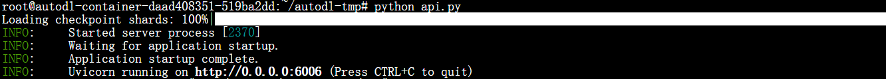
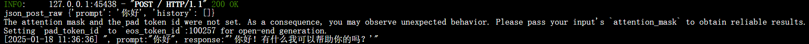
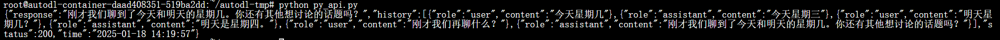
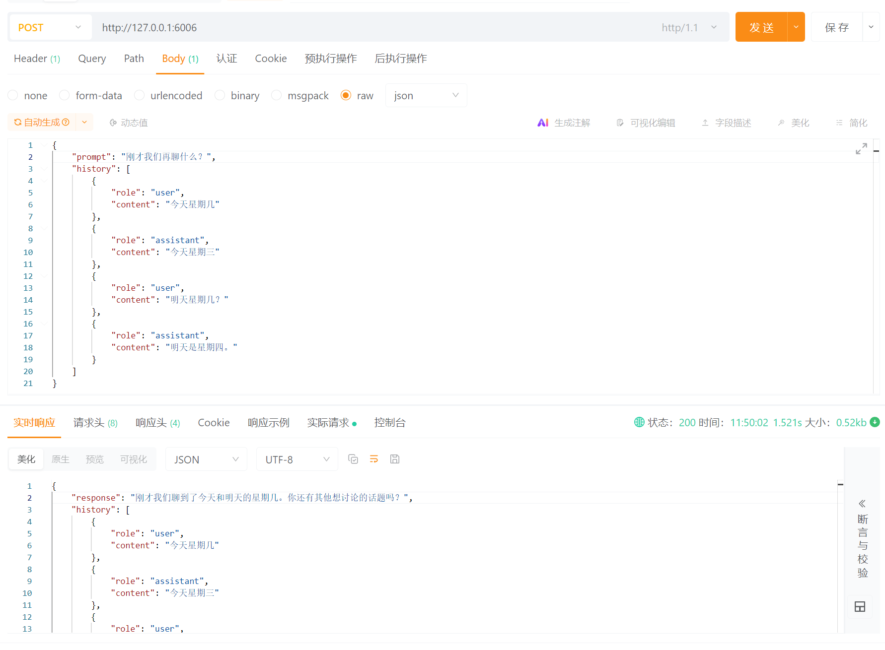

# Phi-4 FastApi 部署调用

## 环境准备

本文基础环境如下：

```
----------------
ubuntu 22.04
python 3.12
cuda 12.1
pytorch 2.3.0
----------------
```

> 本文默认学习者已安装好以上 Pytorch(cuda) 环境，如未安装请自行安装。

pip 换源加速下载并安装依赖包

```bash
# 升级pip
python -m pip install --upgrade pip
# 更换 pypi 源加速库的安装
pip config set global.index-url https://pypi.tuna.tsinghua.edu.cn/simple

pip install transformers==4.44.2
pip install huggingface-hub==0.25.0
pip install accelerate==0.34.2
pip install modelscope==1.18.0
pip install fastapi==0.115.1
pip install uvicorn==0.30.6
```

>考虑到部分同学配置环境可能会遇到一些问题，我们在AutoDL平台准备了Phi-4的环境镜像，点击下方链接并直接创建Autodl示例即可。 ***https://www.codewithgpu.com/i/datawhalechina/self-llm/self-llm-phi4***

## 模型下载

使用魔搭社区中的 `modelscope` 中的 `snapshot_download` 函数下载模型，第一个参数为模型名称（如何找到该名称？可以在魔搭社区搜该模型，如下图中所框），参数 `cache_dir` 为模型的下载路径，参数`revision`一般默认为`master`。

在`/root/autodl-tmp` 新建 `model_download.py` 文件并在其中输入以下内容，粘贴代码后记得保存文件，如下所示。并运行 `python model_download.py` 执行下载，模型大小为 28 GB左右，下载模型大概需要10到 20 分钟。

```python
import torch
from modelscope import snapshot_download, AutoModel, AutoTokenizer
import os
model_dir = snapshot_download('LLM-Research/phi-4', cache_dir='/root/autodl-tmp', revision='master')
```

> 注意：记得修改 `cache_dir` 为你的模型下载路径哦~

## 代码准备  

在 /root/autodl-tmp 路径下新建 api.py 文件并在其中输入以下内容，粘贴代码后请及时保存文件。
下面的代码有很详细的注释，大家如有不理解的地方，欢迎提出 issue。  

```python
from fastapi import FastAPI, Request
from transformers import AutoTokenizer, AutoModelForCausalLM
import uvicorn
import json
import datetime
import torch

# 创建FastAPI应用
app = FastAPI()

# 处理POST请求的端点
@app.post("/")
async def create_item(request: Request):
    global model, tokenizer  # 声明全局变量以便在函数内部使用模型和分词器
    json_post_raw = await request.json()  # 获取POST请求的JSON数据
    print("json_post_raw", json_post_raw)
    
    prompt = json_post_raw.get('prompt')  # 获取请求中的提示
    history = json_post_raw.get('history', [])  # 获取请求中的历史消息，默认为空列表

    # 构建消息列表，包括历史消息和当前提示
    messages = history + [{"role": "user", "content": prompt}]

    # 调用模型进行对话生成
    input_ids = tokenizer.apply_chat_template(messages, tokenize=False, add_generation_prompt=True)
    model_inputs = tokenizer([input_ids], return_tensors="pt").to(model.device)
    generated_ids = model.generate(model_inputs.input_ids, max_new_tokens=512)
    generated_ids = [
        output_ids[len(input_ids):] for input_ids, output_ids in zip(model_inputs.input_ids, generated_ids)
    ]
    response = tokenizer.batch_decode(generated_ids, skip_special_tokens=True)[0]

    # 更新历史消息，将当前对话添加到历史中
    updated_history = messages + [{"role": "assistant", "content": response}]

    now = datetime.datetime.now()  # 获取当前时间
    time = now.strftime("%Y-%m-%d %H:%M:%S")  # 格式化时间为字符串

    # 构建响应JSON
    answer = {
        "response": response,
        "history": updated_history,  # 返回更新后的历史消息
        "status": 200,
        "time": time
    }

    # 构建日志信息
    log = "[" + time + "] " + '", prompt:"' + prompt + '", response:"' + repr(response) + '"'
    print(log)  # 打印日志
    return answer  # 返回响应

# 主函数入口
if __name__ == '__main__':
    # 加载预训练的分词器和模型
    model_name_or_path = '/root/autodl-tmp/LLM-Research/phi-4'
    tokenizer = AutoTokenizer.from_pretrained(model_name_or_path, use_fast=False)
    tokenizer.pad_token_id = tokenizer.eos_token_id = 100265
    model = AutoModelForCausalLM.from_pretrained(model_name_or_path, device_map="auto", torch_dtype=torch.bfloat16)

    # 启动FastAPI应用
    # 用6006端口可以将autodl的端口映射到本地，从而在本地使用api
    uvicorn.run(app, host='0.0.0.0', port=6006, workers=1)  # 在指定端口和主机上启动应用
```

## Api 部署  

#### 启动api服务
在终端输入以下命令
```shell  
cd /root/autodl-tmp
python api.py
```  

```shell
python /root/api.py
```  

默认部署在 6006 端口，加载完毕后出现如下信息说明成功。


#### （可选）AutoDL平台-SSH端口映射

```bash
ssh -CNg -L 6006:127.0.0.1:6006 -p 【你的autodl机器的ssh端口】 root@[你的autodl机器地址]
ssh -CNg -L 6006:127.0.0.1:6006 -p 36494 root@region-45.autodl.pro
```

## 调用Api

### 方式1：Curl 调用  
通过 POST 方法进行调用，可以使用 curl 调用，如下所示：  

```shell
curl -X POST "http://127.0.0.1:6006" -H "Content-Type: application/json" -d "{\"prompt\": \"你好\", \"history\": []}"
```  



### 方式2：Python requests库调用

#### 代码准备

在`/root/autodl-tmp`路径下新建 `py_api.py` 文件并在其中输入以下内容，粘贴代码后记得保存文件。

```python
import requests

url = "http://127.0.0.1:6006/"
# 参数history可以为空列表，即[]，此时代表没有历史对话
payload = {
    "prompt": "刚才我们再聊什么？",
    "history": [
        {
            "role": "user",
            "content": "今天星期几"
        },
        {
            "role": "assistant",
            "content": "今天星期三"
        },
        {
            "role": "user",
            "content": "明天星期几？"
        },
        {
            "role": "assistant",
            "content": "明天是星期四。"
        }
    ]
}
headers = {
    "Content-Type": "application/json",
    "Accept": "*/*",
    "Accept-Encoding": "gzip, deflate, br",
    "User-Agent": "Mozilla/5.0 (Windows NT 10.0; Win64; x64) AppleWebKit/537.36 (KHTML, like Gecko) Chrome/122.0.6261.94 Safari/537.37",
    "Connection": "keep-alive"
}

response = requests.request("POST", url, json=payload, headers=headers)

print(response.text)
```

#### 运行代码

在终端输入以下命令运行代码：

```shell
python /root/autodl-tmp/py_api.py
```

#### 调用结果：



### 方式3：ApiPost 调用
使用 ApiPost软件 测试 history 的用法：

#### Header 参数：
```
Content-Type: application/json
```

#### Json 参数：

```json
{
    "prompt": "刚才我们再聊什么？",
    "history": [
		{
			"role": "user",
			"content": "今天星期几"
		},
		{
			"role": "assistant",
			"content": "今天星期三"
		},
		{
			"role": "user",
			"content": "明天星期几？"
		},
		{
			"role": "assistant",
			"content": "明天是星期四。"
		}
	]
}
```

图示效果：



