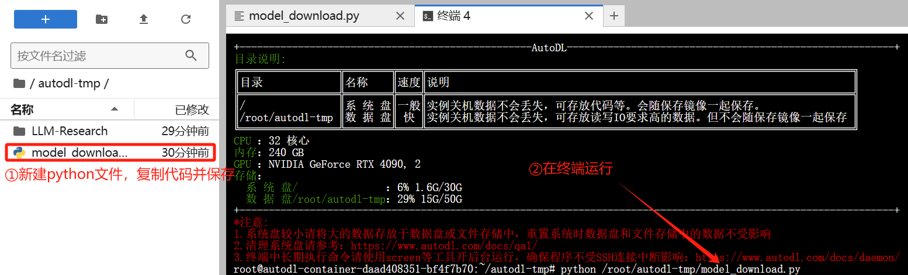
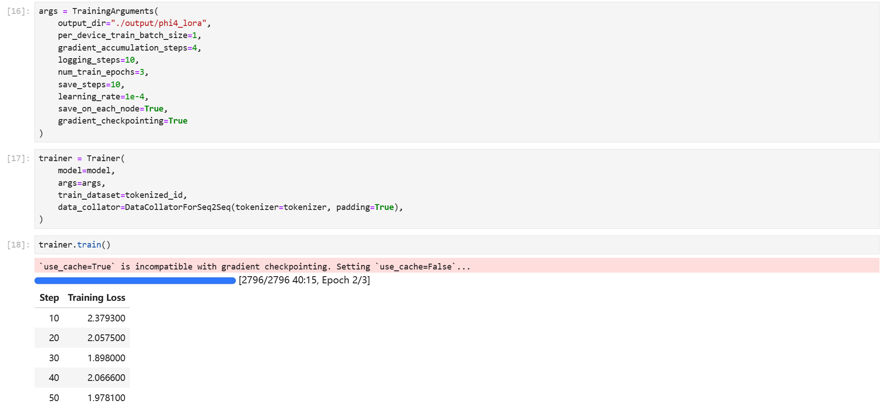

# Phi-4 Lora 微调

本节我们简要介绍如何基于 transformers、peft 等框架，对 Phi-4 模型进行 Lora 微调。Lora 是一种高效微调方法，深入了解其原理可参见博客：[知乎|深入浅出 Lora](https://zhuanlan.zhihu.com/p/650197598)。

这个教程会在同目录下给大家提供一个 [nodebook](04-Phi-4-Lora.ipynb) 文件，来让大家更好的学习。

## 环境配置

本文基础环境如下：

```
----------------
ubuntu 22.04
Python 3.12.3
cuda 12.1
pytorch 2.3.0
----------------
```
> 本文默认学习者已安装好以上 Pytorch(cuda) 环境，如未安装请自行安装。

首先 `pip` 换源加速下载并安装依赖包：

```shell
# 升级pip
python -m pip install --upgrade pip
# 更换 pypi 源加速库的安装
pip config set global.index-url https://pypi.tuna.tsinghua.edu.cn/simple

pip install modelscope==1.22.0  # 用于模型下载和管理
pip install transformers==4.47.1  # Hugging Face 的模型库，用于加载和训练模型
pip install streamlit==1.41.1
pip install sentencepiece==0.2.0
pip install accelerate==0.34.2  # 用于分布式训练和混合精度训练
pip install datasets==2.20.0  # 用于加载和处理数据集
pip install peft==0.11.1  # 用于 LoRA 微调

```

> 考虑到部分同学配置环境可能会遇到一些问题，我们在 AutoDL 平台准备了 Phi-4 的环境镜像，点击下方链接并直接创建 Autodl 示例即可。
> ***https://www.codewithgpu.com/i/datawhalechina/self-llm/Qwen2.5-self-llm***

在本节教程里，我们将微调数据集放置在根目录 [/dataset](../dataset/huanhuan.json)。

## 环境准备

在 Autodl 平台中租赁一个GPU型号为 `RTX 4090*2卡` 的显卡，镜像选择 `phi4`，点击 `立即创建` 创建实例，如下图所示。接下来打开刚刚租用服务器的 JupyterLab，并且打开其中的终端开始环境配置、模型下载和运行演示。


## 模型下载

`modelscope` 是一个模型管理和下载工具，支持从 Hugging Face 等平台快速下载模型。

这里使用 `modelscope` 中的 `snapshot_download` 函数下载模型，第一个参数为模型名称，第二个参数 `cache_dir` 为模型的下载路径，第三个参数 `revision` 为模型的版本号。

在 `/root/autodl-tmp` 路径下新建 `model_download.py` 文件并在其中输入以下内容，粘贴代码后请及时保存文件。并在终端运行 `python /root/autodl-tmp/model_download.py` 执行下载，模型大小为 15GB，下载模型大概需要 5 分钟。

> 注意不要在notebook中直接运行，要不然会出现如下图的情况:

```python
import torch
from modelscope import snapshot_download, AutoModel, AutoTokenizer
import os
model_dir = snapshot_download('LLM-Research/phi-4', cache_dir='/root/autodl-tmp', revision='master')
```
> 注意：记得修改 cache_dir 为你的模型下载路径哦~

## 指令集构建

LLM 的微调一般指指令微调过程。所谓指令微调，是说我们使用的微调数据形如：

```json
{
  "instruction": "回答以下用户问题，仅输出答案。",
  "input": "1+1等于几?",
  "output": "2"
}
```

其中，`instruction` 是用户指令，告知模型其需要完成的任务；`input` 是用户输入，是完成用户指令所必须的输入内容；`output` 是模型应该给出的输出。

即我们的核心训练目标是让模型具有理解并遵循用户指令的能力。因此，在指令集构建时，我们应针对我们的目标任务，针对性构建任务指令集。例如，在本节我们使用由笔者合作开源的 [Chat-甄嬛](https://github.com/KMnO4-zx/huanhuan-chat) 项目作为示例，我们的目标是构建一个能够模拟甄嬛对话风格的个性化 LLM，因此我们构造的指令形如：

```json
{
  "instruction": "你是谁？",
  "input": "",
  "output": "家父是大理寺少卿甄远道。"
}
```

我们所构造的全部指令数据集在根目录下。

## 数据格式化

`Lora` 训练的数据是需要经过格式化、编码之后再输入给模型进行训练的，如果是熟悉 `Pytorch` 模型训练流程的同学会知道，我们一般需要将输入文本编码为 `input_ids`，将输出文本编码为 `labels`，编码之后的结果都是多维的向量。在这里我们首先定义一个预处理函数，这个函数用于对每一个样本，编码其输入、输出文本并返回一个编码后的字典，方便模型使用：

```python
def process_func(example):
    MAX_LENGTH = 384    # Llama分词器会将一个中文字切分为多个token，因此需要放开一些最大长度，保证数据的完整性
    input_ids, attention_mask, labels = [], [], []
    # 构建指令部分的输入
    instruction = tokenizer(
        f"<|im_start|>system\n现在你要扮演皇帝身边的女人--甄嬛<|im_end|>\n" 
        f"<|im_start|>user\n{example['instruction'] + example['input']}<|im_end|>\n"  
        f"<|im_start|>assistant\n",  
        add_special_tokens=False   
    )
    # 构建模型回复部分的输入
    response = tokenizer(
        f"{example['output']}",
        add_special_tokens=False 
    )
    # 拼接指令和回复部分的 input_ids
    input_ids = instruction["input_ids"] + response["input_ids"] + [tokenizer.pad_token_id]
    # 拼接指令和回复部分的 attention_mask
    attention_mask = instruction["attention_mask"] + response["attention_mask"] + [1]  # 因为 EOS token 也需要关注，所以补充为 1
    # 构建标签
    labels = [-100] * len(instruction["input_ids"]) + response["input_ids"] + [tokenizer.pad_token_id]  # 对于指令部分，使用 -100 忽略其损失计算；对于回复部分，保留其 input_ids 作为标签
    # 如果总长度超过最大长度，进行截断
    if len(input_ids) > MAX_LENGTH: 
        input_ids = input_ids[:MAX_LENGTH]
        attention_mask = attention_mask[:MAX_LENGTH]
        labels = labels[:MAX_LENGTH]
    return {
        "input_ids": input_ids,
        "attention_mask": attention_mask,
        "labels": labels
    }
```

`Qwen2` 采用的 `Prompt Template`格式如下：

```text
<|im_start|>system
You are a helpful assistant.<|im_end|>
<|im_start|>user
你是谁？<|im_end|>
<|im_start|>assistant
我是一个有用的助手。<|im_end|>
```

## 加载 tokenizer 和半精度模型

`tokenizer` 是将文本转换为模型能理解的数字的工具，`model` 是根据这些数字生成文本的核心部分。

`model` 以半精度形式加载, 如果你的显卡比较新的话，可以用 `torch.bfolat` 形式加载。对于自定义模型，必须指定 `trust_remote_code=True` ，以确保加载自定义代码时不会报错。

```python
tokenizer = AutoTokenizer.from_pretrained('/root/autodl-tmp/qwen/Qwen2.5-7B-Instruct/', use_fast=False, trust_remote_code=True)

model = AutoModelForCausalLM.from_pretrained('/root/autodl-tmp/qwen/Qwen2.5-7B-Instruct/', device_map="auto",torch_dtype=torch.bfloat16)
```
> 注意：此处要记得修改为自己的模型路径哦~

## 定义 LoraConfig

`LoraConfig`这个类中可以设置很多参数，但主要的参数没多少，简单讲一讲，感兴趣的同学可以直接看源码。

- `task_type`：模型类型
- `target_modules`：需要训练的模型层的名字，主要就是 `attention`部分的层，不同的模型对应的层的名字不同，可以传入数组，也可以字符串，也可以正则表达式。
- `r`：`lora`的秩，具体可以看 `Lora`原理。
- `lora_alpha`：`Lora alaph` ，具体作用参见 `Lora` 原理。
- `lora_dropout`: `Lora` 层的 `Dropout` 比例，用于防止过拟合，具体作用参见 `Lora` 原理。 

`Lora`的缩放是啥嘞？当然不是 `r`（秩），这个缩放就是 `lora_alpha/r`, 在这个 `LoraConfig`中缩放就是 4 倍。

```python
config = LoraConfig(
    task_type=TaskType.CAUSAL_LM,
    target_modules=["q_proj", "k_proj", "v_proj", "o_proj", "gate_proj", "up_proj", "down_proj"], 
    inference_mode=False, # 训练模式
    r=8, # Lora 秩
    lora_alpha=32, # Lora alaph，具体作用参见 Lora 原理
    lora_dropout=0.1# Dropout 比例
)
```

`target_modules` 参数用于指定需要微调的模型层，选择不同的层可以针对性地优化模型的行为。以下是常见层的功能：
- `q_proj` , `k_proj` , `v_proj`：查询、键、值投影层，注意力机制的核心部分，分别生成查询 `Query`、键 `Key` 和值 `Value` 向量。
- `o_proj`：输出投影层，将注意力机制的输出映射回模型的隐藏维度。
- `gate_proj`：门控投影层：在 `MLP` 中控制信息流动，通常与激活函数 `SwiGLU` 结合使用。
- `up_proj` 和 `down_proj`：上投影层和下投影层，`MLP` 的一部分，分别将输入映射到高维度和从高维度映射回原始维度。

通用任务一般选择`target_modules = ["q_proj", "k_proj", "v_proj", "o_proj"]`；如果是复杂任务，则选择`target_modules = ["q_proj", "k_proj", "v_proj", "o_proj", "gate_proj", "up_proj", "down_proj"]`。

## 自定义 TrainingArguments 参数

`TrainingArguments`这个类的源码也介绍了每个参数的具体作用，当然大家可以来自行探索，这里就简单说几个常用的。

- `output_dir`：模型的输出路径
- `per_device_train_batch_size`：顾名思义 `batch_size`，批量大小
- `gradient_accumulation_steps`: 梯度累加，如果你的显存比较小，那可以把 `batch_size` 设置小一点，梯度累加增大一些。
- `logging_steps`：多少步，输出一次 `log`
- `num_train_epochs`：顾名思义 `epoch`，训练轮次
- `gradient_checkpointing`：梯度检查，这个一旦开启，模型就必须执行 `model.enable_input_require_grads()`，这个原理大家可以自行探索，这里就不细说了。

```python
args = TrainingArguments(
    output_dir="./output/Qwen2.5_instruct_lora",
    per_device_train_batch_size=4,
    gradient_accumulation_steps=4,
    logging_steps=10,
    num_train_epochs=3,
    save_steps=100,  # 为了快速演示，这里设置10，建议你设置成100
    learning_rate=1e-4,
    save_on_each_node=True,
    gradient_checkpointing=True
)
```

## 使用 Trainer 训练

我们使用 `Trainer` 类来管理训练过程。`TrainingArguments` 用于设置训练参数，`Trainer` 则负责实际的训练逻辑。

```python
trainer = Trainer(
    model=model,  # 要训练的模型
    args=args,  # 训练参数
    train_dataset=tokenized_id,  # 训练数据集
    data_collator=DataCollatorForSeq2Seq(tokenizer=tokenizer, padding=True),  # 数据整理器
)
trainer.train()  # 开始训练
```

## 加载 lora 权重推理

训练好了之后可以使用如下方式加载 `lora`权重进行推理：

```python
from transformers import AutoModelForCausalLM, AutoTokenizer
import torch
from peft import PeftModel  

model_path = '/root/autodl-tmp/qwen/Qwen2.5-7B-Instruct/'
lora_path = 'lora_path'

# 加载tokenizer
tokenizer = AutoTokenizer.from_pretrained(model_path)

# 加载模型
model = AutoModelForCausalLM.from_pretrained(model_path, device_map="auto",torch_dtype=torch.bfloat16)

# 加载lora权重
model = PeftModel.from_pretrained(model, model_id=lora_path, config=config)

# 定义用户输入
prompt = "你是谁？"

# 构建对话上下文
messages = [
    {"role": "system", "content": "现在你要扮演皇帝身边的女人--甄嬛"},
    {"role": "user", "content": prompt}
]

# 应用对话模板，将对话上下文格式化为模型能理解的输入文本
text = tokenizer.apply_chat_template(messages, tokenize=False, add_generation_prompt=True)

# 将格式化后的文本编码为模型输入
model_inputs = tokenizer([text], return_tensors="pt").to('cuda')

# 生成回复
generated_ids = model.generate(
    model_inputs.input_ids,
    max_new_tokens=512
)

# 截取生成的回复（去掉输入部分）
generated_ids = [
    output_ids[len(input_ids):] for input_ids, output_ids in zip(model_inputs.input_ids, generated_ids)
]

# 将生成的 token 解码为文本
response = tokenizer.batch_decode(generated_ids, skip_special_tokens=True)[0]

print(response)
```
> 注意修改为自己的模型路径和 `Lora` 权重路径哦~

