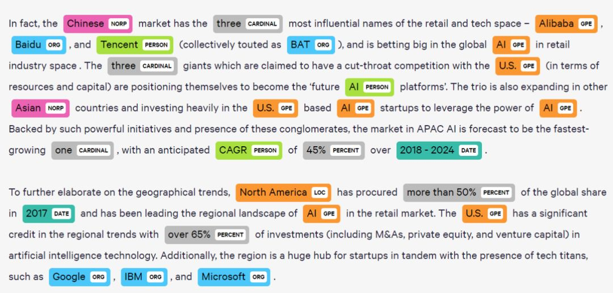
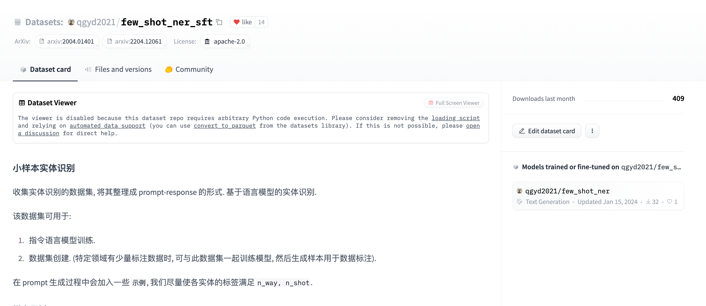
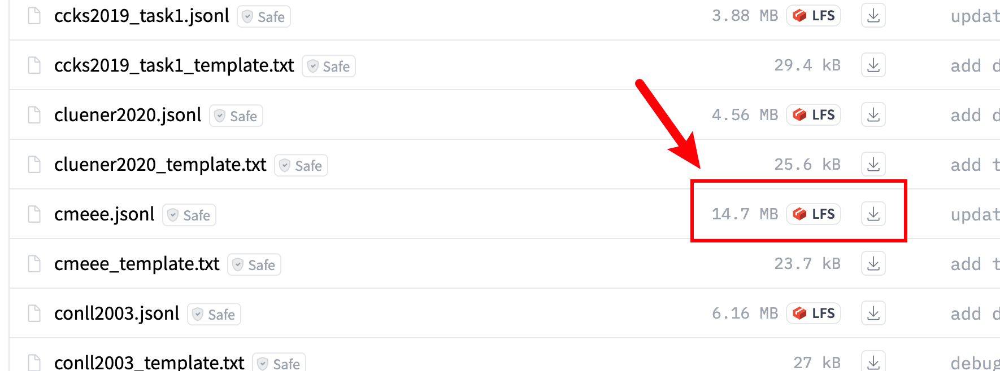
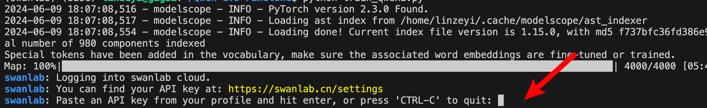
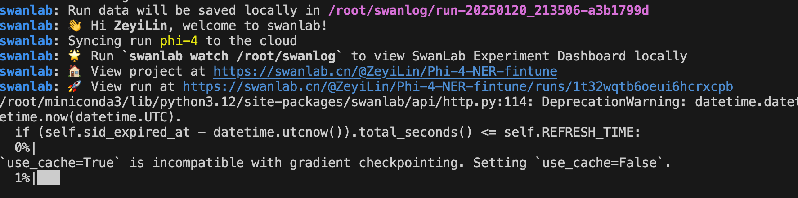
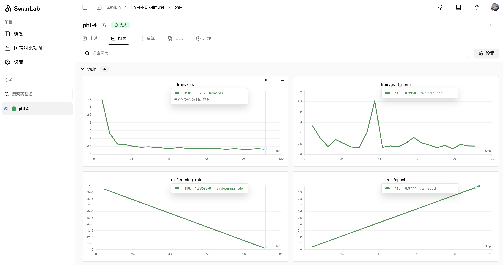
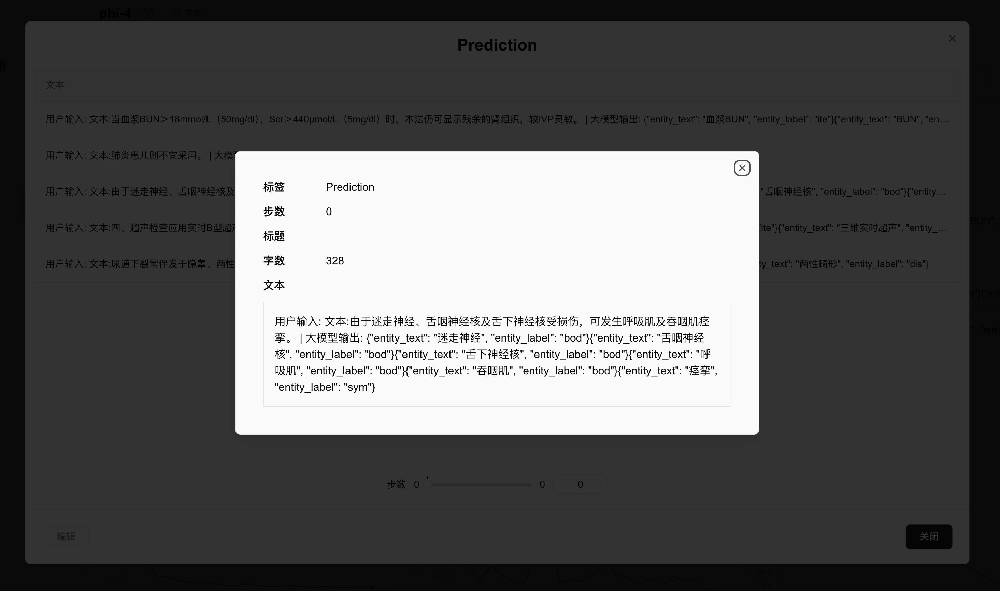

# Phi-4 Lora 微调 命名实体识别任务 SwanLab 可视化记录版

本节我们简要介绍如何基于 transformers、peft 等框架，对 Phi-4 模型进行 Lora 微调，并将其应用于命名实体识别（NER）任务，同时使用 [SwanLab](https://github.com/swanhubx/swanlab) 监控训练过程与评估模型效果。


Lora 是一种高效微调方法，深入了解其原理可参见博客：[知乎|深入浅出 Lora](https://zhuanlan.zhihu.com/p/650197598)。

这个教程会在同目录下给大家提供一个 [nodebook](04-Phi-4-Lora.ipynb) 文件，来让大家更好的学习。

- 代码：文本的完整微调代码部分，或本目录下的`05-Phi-4-Lora-Ner.py`
- 可视化训练过程：[ZeyiLin/Phi-4-Lora-Ner](https://swanlab.cn/@ZeyiLin/Phi-4-NER-fintune/runs/mygq7su87kms6f8bqlzdi/chart)
- 模型：[Phi-4](https://modelscope.cn/models/LLM-Research/phi-4)
- 数据集：[few_shot_ner_sft](https://huggingface.co/datasets/qgyd2021/few_shot_ner_sft)
- 显存需求：约33GB，如显存不足，请调低per_device_train_batch_size

<br>

## 目录

- [知识点：什么是命名实体识别?](#知识点什么是命名实体识别)
- [SwanLab简介](#swanlab简介) 
- [1. 环境配置](#1-环境配置)
- [2. 准备数据集](#2-准备数据集)
- [3. 加载模型](#3-加载模型)
- [4. 配置LoRA](#4-配置lora)
- [5. 配置SwanLab可视化工具](#5-配置swanlab可视化工具)
- [6. 完整微调代码](#6-完整微调代码)
- [7. 训练结果演示](#7-训练结果演示)
- [8. 推理训练好的模型](#8-推理训练好的模型)
- [9. 相关链接](#9-相关链接)

<br>

## 知识点：什么是命名实体识别?

命名实体识别 (NER) 是一种NLP技术，主要用于识别和分类文本中提到的重要信息（关键词）。这些实体可以是人名、地名、机构名、日期、时间、货币值等等。 NER 的目标是将文本中的非结构化信息转换为结构化信息，以便计算机能够更容易地理解和处理。



NER 也是一项非常实用的技术，包括在互联网数据标注、搜索引擎、推荐系统、知识图谱、医疗保健等诸多领域有广泛应用。

<br>

## SwanLab简介


SwanLab 是一个开源的模型训练记录工具，常被称为"中国版 Weights&Biases + Tensorboard"。SwanLab面向AI研究者，提供了训练可视化、自动日志记录、超参数记录、实验对比、多人协同等功能。在SwanLab上，研究者能基于直观的可视化图表发现训练问题，对比多个实验找到研究灵感，并通过在线链接的分享与基于组织的多人协同训练，打破团队沟通的壁垒。

官网: https://swanlab.cn/

Github: https://github.com/swanhubx/swanlab

**为什么要记录训练？**

相较于软件开发，模型训练更像一个实验科学。一个品质优秀的模型背后，往往是成千上万次实验。研究者需要不断尝试、记录、对比，积累经验，才能找到最佳的模型结构、超参数与数据配比。在这之中，如何高效进行记录与对比，对于研究效率的提升至关重要。

**可视化的价值在哪里？**

机器学习模型训练往往伴随着大量的超参数、指标、日志等数据，很多关键信息往往存在于实验的中间而非结尾，如果不对连续的指标通过图表进行可视化，往往会错失发现问题的最佳时机，甚至错过关键信息。同时不进行可视化，也难以对比多个实验之间的差异。 可视化也为AI研究者提供了良好的交流基础，研究者们可以基于图表进行沟通、分析与优化，而非以往看着枯燥的终端打印。这打破了团队沟通的壁垒，提高了整体的研发效率。

<br>

## 1. 环境配置

本文基础环境如下：

```
----------------
ubuntu 22.04
Python 3.12.3
cuda 12.1
pytorch 2.3.0
----------------
```
> 本文默认学习者已安装好以上 Pytorch(cuda) 环境，如未安装请自行安装。

首先 `pip` 换源加速下载并安装依赖包：

```shell
# 升级pip
python -m pip install --upgrade pip
# 更换 pypi 源加速库的安装
pip config set global.index-url https://pypi.tuna.tsinghua.edu.cn/simple

pip install modelscope==1.22.2  # 用于模型下载和管理
pip install transformers==4.48.0  # Hugging Face 的模型库，用于加载和训练模型
pip install sentencepiece==0.2.0
pip install accelerate==1.3.0  # 用于分布式训练和混合精度训练
pip install datasets==3.2.0  # 用于加载和处理数据集
pip install peft==0.14.0  # 用于 LoRA 微调
pip install swanlab==0.4.3  # 用于监控训练过程与评估模型效果
```

<br>

## 2. 准备数据集

本节使用的是HuggingFace上的 [few_shot_ner_sft](https://huggingface.co/datasets/qgyd2021/few_shot_ner_sft) 数据集，该数据集主要被用于训练命名实体识别模型。



few_shot_ner_sft由不同来源、不同类型的几十万条数据组成，应该是我见过收录最齐全的中文NER数据集。

这次训练我们不需要用到它的全部数据，只取其中的cmeee数据集的前5000条进行训练，该数据集主要被用于医学实体识别任务，包含dis（疾病）、sym（临床表现）、pro（医疗程序）、equ（医疗设备）、dru（药物）、ite（医学检测项目）、bod（身体）、dep（科室）和mic（微生物类）这九种实体类型标注，每条数据的例子如下：

```json
{
    "text": 
    "（5）房室结消融和起搏器植入作为反复发作或难治性心房内折返性心动过速的替代疗法。",
    "entities": [
        {"start_idx": 3, "end_idx": 6, "entity_text": "房室结消融", "entity_label": "pro"},
        {"start_idx": 9, "end_idx": 12, "entity_text": "起搏器植入", "entity_label": "pro"},
        {"start_idx": 16, "end_idx": 32, "entity_text": "反复发作或难治性心房内折返性心动过速", "entity_label": "dis"}, {"start_idx": 35, "end_idx": 37, "entity_text": "替代疗法", "entity_label": "pro"}],
    "data_source": "cmeee",
    "split": "train"
}
```

其中`text`是输入的文本，`entities`是文本抽取出的实体。我们的目标是希望微调后的大模型能够根据由text组成的提示词，预测出一个json格式的实体信息：

```
输入：非持续性室上性心动过速，不需其他治疗和（或）症状轻微。
大模型输出：{"entity_text":"非持续性室上性心动过速", "entity_label":"dis"}
```

---

现在我们将数据集下载到本地目录。下载方式是前往[qgyd2021/few_shot_ner_sft - huggingface](https://huggingface.co/datasets/qgyd2021/few_shot_ner_sft/tree/main/data)下载cmeee.jsonl到项目根目录下即可：



<br>

## 3. 加载模型

这里我们使用modelscope下载Phi-4模型（modelscope在国内，所以直接用下面的代码自动下载即可，不用担心速度和稳定性问题），然后把它加载到Transformers中进行训练：

```python
from modelscope import snapshot_download, AutoTokenizer
from transformers import AutoModelForCausalLM, TrainingArguments, Trainer, DataCollatorForSeq2Seq
import torch

model_id = "LLM-Research/phi-4"    
model_dir = "/root/autodl-tmp/LLM-Research/phi-4/"

# 在modelscope上下载GLM4模型到本地目录下
model_dir = snapshot_download(model_id, cache_dir="/root/autodl-tmp/", revision="master")

# Transformers加载模型权重
tokenizer = AutoTokenizer.from_pretrained(model_dir, use_fast=False, trust_remote_code=True)
model = AutoModelForCausalLM.from_pretrained(model_dir, device_map="auto", torch_dtype=torch.bfloat16, trust_remote_code=True)
model.enable_input_require_grads()  # 开启梯度检查点时，要执行该方法
```

<br>

## 4. 配置LoRA

```python
from peft import LoraConfig, TaskType, get_peft_model

config = LoraConfig(
    task_type=TaskType.CAUSAL_LM,
    target_modules=["q_proj", "k_proj", "v_proj", "o_proj", "gate_proj", "up_proj", "down_proj"],
    inference_mode=False,  # 训练模式
    r=64,  # Lora 秩
    lora_alpha=16,  # Lora alaph，具体作用参见 Lora 原理
    lora_dropout=0.1,  # Dropout 比例
)

model = get_peft_model(model, config)
```

<br>

## 5. 配置SwanLab可视化工具

SwanLab与Transformers已经做好了集成，用法是在Trainer的callbacks参数中添加SwanLabCallback实例，就可以自动记录超参数和训练指标，简化代码如下：

```python
from swanlab.integration.transformers import SwanLabCallback
from transformers import Trainer

swanlab_callback = SwanLabCallback()

trainer = Trainer(
    ...
    callbacks=[swanlab_callback],
)
```

首次使用SwanLab，需要先在[官网](https://swanlab.cn/)注册一个账号，然后在[用户设置](https://swanlab.cn/settings)页面复制你的API Key，然后在训练开始提示登录时粘贴即可，后续无需再次登录：



<br>

## 6. 完整微调代码

开始训练时的目录结构：

```
|--- train.py
|--- cmeee.jsonl
```

下面是`train.py`的完整代码，直接复制粘贴，然后运行`python train.py`：

```python
import json
import pandas as pd
import torch
from datasets import Dataset
from modelscope import snapshot_download, AutoTokenizer
from swanlab.integration.huggingface import SwanLabCallback
from peft import LoraConfig, TaskType, get_peft_model
from transformers import AutoModelForCausalLM, TrainingArguments, Trainer, DataCollatorForSeq2Seq
import os
import swanlab


def dataset_jsonl_transfer(origin_path, new_path):
    """
    将原始数据集转换为大模型微调所需数据格式的新数据集
    """
    messages = []

    # 读取旧的JSONL文件
    with open(origin_path, "r") as file:
        for line in file:
            # 解析每一行的json数据
            data = json.loads(line)
            input_text = data["text"]
            entities = data["entities"]

            entity_sentence = ""
            for entity in entities:
                entity_json = dict(entity)
                entity_text = entity_json["entity_text"]
                entity_label = entity_json["entity_label"]

                entity_sentence += f"""{{"entity_text": "{entity_text}", "entity_label": "{entity_label}"}}"""

            if entity_sentence == "":
                entity_sentence = "没有找到任何实体"

            message = {
                "instruction": """
                你是一个文本实体识别领域的专家，你需要从给定的句子中提取
                - mic
                - dru
                - pro
                - ite
                - dis
                - sym
                - equ
                - bod
                - dep
                这些实体. 以 json 格式输出, 如 {"entity_text": "房室结消融", "entity_label": "procedure"} 
                注意: 
                1. 输出的每一行都必须是正确的 json 字符串. 
                2. 找不到任何实体时, 输出"没有找到任何实体". 
                """,
                "input": f"{input_text}",
                "output": entity_sentence,
            }

            messages.append(message)

    # 保存重构后的JSONL文件
    with open(new_path, "w", encoding="utf-8") as file:
        for message in messages:
            file.write(json.dumps(message, ensure_ascii=False) + "\n")


def process_func(example):
    """
    将数据集进行预处理
    """

    MAX_LENGTH = 384 
    input_ids, attention_mask, labels = [], [], []
    instruction = tokenizer(
        f"<|im_start|><im_sep>{example['instruction']}<|im_end|><|im_start|>user<im_sep>{example['input']}<|im_end|><|im_start|>assistant<im_sep>",
        add_special_tokens=False,
    )
    response = tokenizer(f"{example['output']}", add_special_tokens=False)
    input_ids = instruction["input_ids"] + response["input_ids"] + [tokenizer.pad_token_id]
    attention_mask = (
        instruction["attention_mask"] + response["attention_mask"] + [1]
    )
    labels = [-100] * len(instruction["input_ids"]) + response["input_ids"] + [tokenizer.pad_token_id]
    if len(input_ids) > MAX_LENGTH:  # 做一个截断
        input_ids = input_ids[:MAX_LENGTH]
        attention_mask = attention_mask[:MAX_LENGTH]
        labels = labels[:MAX_LENGTH]
    return {"input_ids": input_ids, "attention_mask": attention_mask, "labels": labels}   


def predict(messages, model, tokenizer):
    device = "cuda"
    text = tokenizer.apply_chat_template(
        messages,
        tokenize=False,
        add_generation_prompt=True
    )
    model_inputs = tokenizer([text], return_tensors="pt").to(device)

    generated_ids = model.generate(
        model_inputs.input_ids,
        max_new_tokens=512
    )
    generated_ids = [
        output_ids[len(input_ids):] for input_ids, output_ids in zip(model_inputs.input_ids, generated_ids)
    ]

    response = tokenizer.batch_decode(generated_ids, skip_special_tokens=True)[0]

    print(response)

    return response


model_id = "LLM-Research/phi-4"    
model_dir = "/root/autodl-tmp/LLM-Research/phi-4"

# 在modelscope上下载Phi-4模型到本地目录下
model_dir = snapshot_download(model_id, cache_dir="/root/autodl-tmp/", revision="master")

# Transformers加载模型权重
tokenizer = AutoTokenizer.from_pretrained(model_dir, use_fast=False, trust_remote_code=True)
model = AutoModelForCausalLM.from_pretrained(model_dir, device_map="auto", torch_dtype=torch.bfloat16)
model.enable_input_require_grads()  # 开启梯度检查点时，要执行该方法

# 加载、处理数据集和测试集
train_dataset_path = "cmeee.jsonl"
train_jsonl_new_path = "cmeee_train.jsonl"

if not os.path.exists(train_jsonl_new_path):
    dataset_jsonl_transfer(train_dataset_path, train_jsonl_new_path)

# 得到训练集
total_df = pd.read_json(train_jsonl_new_path, lines=True)[:2000]  # 只取2000条数据
train_df = total_df[int(len(total_df) * 0.1):]
train_ds = Dataset.from_pandas(train_df)
train_dataset = train_ds.map(process_func, remove_columns=train_ds.column_names)


lora_rank = 64
lora_alpha = 16
lora_dropout = 0.1

config = LoraConfig(
    task_type=TaskType.CAUSAL_LM,
    target_modules=["q_proj", "k_proj", "v_proj", "o_proj", "gate_proj", "up_proj", "down_proj"],
    inference_mode=False,  # 训练模式
    r=lora_rank,  # Lora 秩
    lora_alpha=lora_alpha,  # Lora alaph，具体作用参见 Lora 原理
    lora_dropout=lora_dropout,  # Dropout 比例
)

model = get_peft_model(model, config)

args = TrainingArguments(
    output_dir="./output/Phi4-NER",
    per_device_train_batch_size=4,
    per_device_eval_batch_size=4,
    gradient_accumulation_steps=4,
    logging_steps=5,
    num_train_epochs=1,
    save_steps=100,
    learning_rate=1e-4,
    save_on_each_node=True,
    gradient_checkpointing=True,
    report_to="none",
)

swanlab_callback = SwanLabCallback(
    project="Phi-4-NER-fintune",
    experiment_name="phi-4",
    description="使用Phi-4模型在qgyd2021/few_shot_ner_sft - cmeee.jsonl数据集上的前5000条数据进行微调，实现关键实体识别任务(医疗领域)。",
    config={
        "model": model_id,
        "model_dir": model_dir,
        "dataset": "https://huggingface.co/datasets/qgyd2021/few_shot_ner_sft",
        "sub_dataset": "cmeee.jsonl",
        "lora_rank": lora_rank,
        "lora_alpha": lora_alpha,
        "lora_dropout": lora_dropout,
    },
)

trainer = Trainer(
    model=model,
    args=args,
    train_dataset=train_dataset,
    data_collator=DataCollatorForSeq2Seq(tokenizer=tokenizer, padding=True),
    callbacks=[swanlab_callback],
)

trainer.train()

# 用测试集的随机20条，测试模型
# 得到测试集
test_df = total_df[:int(len(total_df) * 0.1)].sample(n=5)

test_text_list = []
for index, row in test_df.iterrows():
    instruction = row['instruction']
    input_value = row['input']

    messages = [
        {"role": "system", "content": f"{instruction}"},
        {"role": "user", "content": f"{input_value}"}
    ]

    response = predict(messages, model, tokenizer)
    result_text = f"用户输入: {input_value} | 大模型输出: {response}"
    test_text_list.append(swanlab.Text(result_text))

swanlab.log({"Prediction": test_text_list})
swanlab.finish()
```

看到下面的进度条即代表训练开始：



<br>

## 7. 训练结果演示

访问可视化训练过程：[ZeyiLin/Phi-4-Lora-Ner](https://swanlab.cn/@ZeyiLin/Phi-4-NER-fintune/runs/mygq7su87kms6f8bqlzdi/chart)

在SwanLab上查看最终的训练结果：

可以看到在1个epoch之后，微调后的Phi-4的loss降低到了不错的水平。



可以看到在一些测试样例上，微调后的Phi-4能够给出准确的NER结果：



至此，你已经完成了Phi-4 Lora微调的训练！如果需要加强微调效果，可以尝试增加训练的数据量。

<br>

## 8. 推理训练好的模型

训好的Lora模型默认被保存在`./output/Phi4-NER/`目录下，你可以使用下面的代码进行推理：

```python
import torch
from transformers import AutoModelForCausalLM, AutoTokenizer
from peft import PeftModel

def predict(messages, model, tokenizer):
    device = "cuda"

    text = tokenizer.apply_chat_template(messages, tokenize=False, add_generation_prompt=True)
    model_inputs = tokenizer([text], return_tensors="pt").to(device)

    generated_ids = model.generate(model_inputs.input_ids, max_new_tokens=512)
    generated_ids = [output_ids[len(input_ids):] for input_ids, output_ids in zip(model_inputs.input_ids, generated_ids)]
    response = tokenizer.batch_decode(generated_ids, skip_special_tokens=True)[0]

    return response

model_dir = "/root/autodl-tmp/LLM-Research/phi-4"
lora_dir = "./output/Phi4-NER/checkpoint-112"

# 加载原下载路径的tokenizer和model
tokenizer = AutoTokenizer.from_pretrained(model_dir, use_fast=False, trust_remote_code=True)
model = AutoModelForCausalLM.from_pretrained(model_dir, device_map="auto", torch_dtype=torch.bfloat16)

# 加载训练好的Lora模型
model = PeftModel.from_pretrained(model, model_id=lora_dir)

input_text = "肾静态显像观察到急性肾盂肾炎患儿肾瘢痕的阳性率达50%左右，瘢痕征的表现为肾影中单个或多个局部放射性缺损或减低区，多位于上下极，典型者呈楔形，宽面向外，使整个肾影变形。"
test_texts = {
    "instruction": """
                你是一个文本实体识别领域的专家，你需要从给定的句子中提取
                - mic
                - dru
                - pro
                - ite
                - dis
                - sym
                - equ
                - bod
                - dep
                这些实体. 以 json 格式输出, 如 {"entity_text": "房室结消融", "entity_label": "procedure"} 
                注意: 
                1. 输出的每一行都必须是正确的 json 字符串. 
                2. 找不到任何实体时, 输出"没有找到任何实体". 
                """,
    "input": f"{input_text}"
}

instruction = test_texts['instruction']
input_value = test_texts['input']

messages = [
    {"role": "system", "content": f"{instruction}"},
    {"role": "user", "content": f"{input_value}"}
]

response = predict(messages, model, tokenizer)
print(response)
```

输出结果为：

```
{"entity_text": "肾静态显像", "entity_label": "pro"}
{"entity_text": "急性肾盂肾炎", "entity_label": "dis"}
{"entity_text": "肾瘢痕", "entity_label": "sym"}
{"entity_text": "肾影中单个或多个局部放射性缺损或减低区", "entity_label": "sym"}
{"entity_text": "肾影", "entity_label": "sym"}
{"entity_text": "肾", "entity_label": "bod"}
```

<br>

## 9. 相关链接

- 代码：文本的完整微调代码部分，或本目录下的`05-Phi-4-Lora-Ner.py`
- SwanLab：[官网](https://swanlab.cn/)、[Github](https://github.com/swanhubx/swanlab)
- 可视化训练过程：[ZeyiLin/Phi-4-Lora-Ner](https://swanlab.cn/@ZeyiLin/Phi-4-NER-fintune/runs/mygq7su87kms6f8bqlzdi/chart)
- 模型：[Phi-4](https://modelscope.cn/models/LLM-Research/phi-4)
- 数据集：[few_shot_ner_sft](https://huggingface.co/datasets/qgyd2021/few_shot_ner_sft)
- 显存需求：约33GB，如显存不足，请调低per_device_train_batch_size