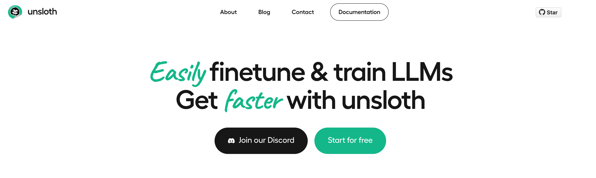
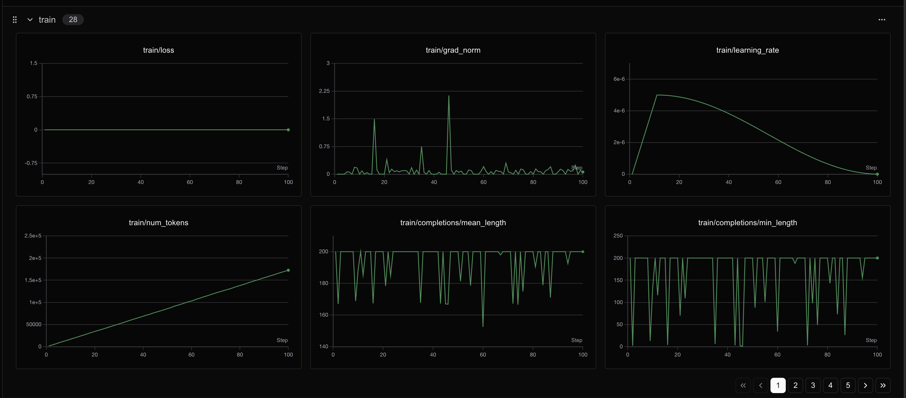

# Gemma3-4B GRPO微调教程

> 话不多说，直接开始！

本文使用的测试环境为单张 A100，显存 80GB，可根据需求切换不同参数量的模型，实测4B 24G显存 is enough！
使用的框架为 Unsloth

Unsloth 是一个极其强调资源节省的框架，把所有的资源节省做到了极致，具体来讲Unsloth能够将 Llama-3、Mistral、Phi-4 和 Gemma 等大型语言模型的微调速度提升 2 倍，内存占用减少 70%，并且准确率没有任何下降！
官方文档非常全面，详细指导了如何训练自己的定制模型。其中涵盖了安装和更新 Unsloth、创建数据集、运行和部署模型等基本要素。 Unsloth 让大家在本地或在 Google Colab 和 Kaggle 等平台上训练像 Llama 3 这样的模型变得极其简单。Unsloth简化了整个训练工作流程，包括模型加载、量化、训练、评估、运行、保存、导出，以及与 Ollama、llama.cpp 和 vLLM 等推理引擎的集成。
Unsloth定期与 Hugging Face、Google 和 Meta 的团队合作，以修复 LLM 训练和模型中的错误。因此，当使用 Unsloth 进行训练或使用模型时，可以期待获得最准确的结果。 Unsloth 具有高度可定制性，允许更改聊天模板或数据集格式等内容。Unsloth还为视觉、文本转语音 (TTS)、BERT、强化学习 (RL) 等提供了预构建的脚本！此外，Unsloth支持所有训练方法和所有基于 Transformer 的模型。

unsloth使Phi-4微调速度提高2倍，VRAM使用减少70%，并且比所有使用Flash Attention 2的环境支持长8倍的上下文长度。使用unsloth，Phi-4模型可以舒适地在仅24GB VRAM的环境中运行。
unsloth为Phi-4提供了Dynamic 2.0量化方法，在5-shot MMLU和KL散度基准测试中提供最佳性能。这意味着可以运行和微调量化后的Phi-4 LLM，同时保持最小的精度损失。
unsloth还上传了支持原生长上下文的Phi-4版本。

## 教程概览

本教程将指导您完成 **Phi-4（14B） 模型的 GRPO（Group Relative Policy Optimization）微调**，这是一种先进的强化学习技术，专门用于提升大语言模型在特定任务上的表现。

### 什么是GRPO？

GRPO（Group Relative Policy Optimization）是一种强化学习优化技术，通过设计多个奖励函数来评估模型输出的不同方面，从而指导模型学习期望的行为模式。在数学推理任务中，GRPO可以帮助模型：

- 学会按照特定格式输出答案
- 提高推理过程的逻辑性
- 增强答案的准确性
- 改善输出的结构化程度

### 本教程的学习内容

1. **环境设置**: 安装Unsloth和相关依赖
2. **模型加载**: 加载Phi-4（14B）预训练模型
3. **LoRA配置**: 设置高效的参数微调
4. **数据处理**: 处理GSM8K数学推理数据集
5. **格式设计**: 定义结构化的输出格式
6. **奖励函数**: 设计多维度评估体系
7. **GRPO训练**: 执行强化学习微调
8. **效果验证**: 测试微调后的模型
9. **模型保存**: 保存训练结果
10. **可视化监控**: 使用SwanLab跟踪训练过程

# Phi-4 GRPO 强化学习训练及 SwanLab 可视化教程

## 概述
本教程将展示如何使用 GRPO (Generalized Reward-based Policy Optimization) 算法对 Phi-4 模型进行强化学习训练，并使用 SwanLab 进行训练过程的可视化监控。

GRPO 是一种基于奖励的策略优化方法，能够帮助模型学习更好的推理能力和格式化输出。

## 第一步：环境准备和依赖安装

首先需要安装必要的依赖包，包括 Unsloth 和 vLLM。


```python
# 安装必要的依赖包
# unsloth: 用于快速模型训练和推理的优化库
# vllm: 高性能的大语言模型推理引擎
# pip install unsloth vllm
```
## 第二步：模型加载和 LoRA 配置

在这一步中，我们将：
1. 加载预训练的 Phi-4 模型
2. 配置 LoRA (Low-Rank Adaptation) 参数用于高效微调
3. 设置模型的基本训练参数

LoRA 是一种参数高效的微调方法，只训练少量参数就能获得良好的性能。


```python
# 导入必要的库
from unsloth import FastLanguageModel, is_bfloat16_supported
import torch

# 模型配置参数
max_seq_length = 512  # 最大序列长度，可以增加以支持更长的推理链
lora_rank = 16  # LoRA 秩，更大的秩会让模型更聪明但训练更慢

# 加载预训练模型和分词器
model, tokenizer = FastLanguageModel.from_pretrained(
    model_name = "unsloth/Phi-4",  # Phi-4 模型路径，使用量化模型以节省内存
    max_seq_length = max_seq_length,  # 设置最大序列长度
    load_in_4bit = True,  # 启用 4bit 量化以减少内存使用，设为 False 则使用 16bit LoRA
    fast_inference = True,  # 启用 vLLM 快速推理引擎
    max_lora_rank = lora_rank,  # 设置最大 LoRA 秩
    gpu_memory_utilization = 0.7,  # GPU 内存使用率，如果内存不足可以减少
)

# 配置 PEFT (Parameter-Efficient Fine-Tuning) 模型
model = FastLanguageModel.get_peft_model(
    model,
    r = lora_rank,  # LoRA 秩，建议值：8, 16, 32, 64, 128
    target_modules = ["gate_proj", "up_proj", "down_proj"],  # 目标模块，这些是 MLP 层的关键组件
    lora_alpha = lora_rank,  # LoRA alpha 参数，通常设为与秩相同的值
    use_gradient_checkpointing = "unsloth",  # 启用梯度检查点以支持长上下文微调
    random_state = 3407,  # 随机种子，确保结果可复现
)
```
    🦥 Unsloth: Will patch your computer to enable 2x faster free finetuning.
    🦥 Unsloth Zoo will now patch everything to make training faster!
    INFO 07-02 17:05:40 [__init__.py:239] Automatically detected platform cuda.
    ==((====))==  Unsloth 2025.6.12: Fast Llama patching. Transformers: 4.52.4. vLLM: 0.8.2.
       \\   /|    NVIDIA A100-SXM4-80GB. Num GPUs = 1. Max memory: 79.151 GB. Platform: Linux.
    O^O/ \_/ \    Torch: 2.6.0+cu124. CUDA: 8.0. CUDA Toolkit: 12.4. Triton: 3.2.0
    \        /    Bfloat16 = TRUE. FA [Xformers = 0.0.29.post2. FA2 = True]
     "-____-"     Free license: http://github.com/unslothai/unsloth
    Unsloth: Fast downloading is enabled - ignore downloading bars which are red colored!
    Unsloth: vLLM loading /opt/tiger/test0/Phi-4 with actual GPU utilization = 69.6%
    Unsloth: Your GPU has CUDA compute capability 8.0 with VRAM = 79.15 GB.
    Unsloth: Using conservativeness = 1.0. Chunked prefill tokens = 512. Num Sequences = 320.
    Unsloth: vLLM's KV Cache can use up to 27.66 GB. Also swap space = 6 GB.
    INFO 07-02 17:07:52 [config.py:585] This model supports multiple tasks: {'classify', 'generate', 'embed', 'score', 'reward'}. Defaulting to 'generate'.
    WARNING 07-02 17:07:52 [arg_utils.py:1854] --quantization bitsandbytes is not supported by the V1 Engine. Falling back to V0. 
    Unsloth: vLLM Bitsandbytes config using kwargs = {'load_in_8bit': False, 'load_in_4bit': True, 'bnb_4bit_compute_dtype': 'bfloat16', 'bnb_4bit_quant_storage': 'uint8', 'bnb_4bit_quant_type': 'fp4', 'bnb_4bit_use_double_quant': False, 'llm_int8_enable_fp32_cpu_offload': False, 'llm_int8_has_fp16_weight': False, 'llm_int8_skip_modules': [], 'llm_int8_threshold': 6.0}
    INFO 07-02 17:07:52 [llm_engine.py:241] Initializing a V0 LLM engine (v0.8.2) with config: model='/opt/tiger/test0/Phi-4', speculative_config=None, tokenizer='/opt/tiger/test0/Phi-4', skip_tokenizer_init=False, tokenizer_mode=auto, revision=None, override_neuron_config=None, tokenizer_revision=None, trust_remote_code=False, dtype=torch.bfloat16, max_seq_len=512, download_dir=None, load_format=LoadFormat.BITSANDBYTES, tensor_parallel_size=1, pipeline_parallel_size=1, disable_custom_all_reduce=False, quantization=bitsandbytes, enforce_eager=False, kv_cache_dtype=auto,  device_config=cuda:0, decoding_config=DecodingConfig(guided_decoding_backend='xgrammar', reasoning_backend=None), observability_config=ObservabilityConfig(show_hidden_metrics=False, otlp_traces_endpoint=None, collect_model_forward_time=False, collect_model_execute_time=False), seed=0, served_model_name=/opt/tiger/test0/Phi-4, num_scheduler_steps=1, multi_step_stream_outputs=True, enable_prefix_caching=True, chunked_prefill_enabled=False, use_async_output_proc=True, disable_mm_preprocessor_cache=False, mm_processor_kwargs=None, pooler_config=None, compilation_config={"level":0,"backend":"inductor","splitting_ops":[],"use_inductor":true,"compile_sizes":[],"inductor_compile_config":{"debug":false,"dce":true,"coordinate_descent_tuning":true,"trace.enabled":false,"trace.graph_diagram":false,"triton.cudagraphs":true,"compile_threads":48,"max_autotune":false,"disable_progress":false,"verbose_progress":true,"enable_auto_functionalized_v2":false},"use_cudagraph":true,"cudagraph_num_of_warmups":1,"cudagraph_capture_sizes":[320,312,304,296,288,280,272,264,256,248,240,232,224,216,208,200,192,184,176,168,160,152,144,136,128,120,112,104,96,88,80,72,64,56,48,40,32,24,16,8,4,2,1],"max_capture_size":320}, use_cached_outputs=False, 
    INFO 07-02 17:07:53 [cuda.py:291] Using Flash Attention backend.
    INFO 07-02 17:07:53 [parallel_state.py:954] rank 0 in world size 1 is assigned as DP rank 0, PP rank 0, TP rank 0
    INFO 07-02 17:07:53 [model_runner.py:1110] Starting to load model /opt/tiger/test0/Phi-4...
    INFO 07-02 17:07:53 [loader.py:1155] Loading weights with BitsAndBytes quantization. May take a while ...


    Loading safetensors checkpoint shards:   0% Completed | 0/6 [00:00<?, ?it/s]


    INFO 07-02 17:08:01 [punica_selector.py:18] Using PunicaWrapperGPU.
    INFO 07-02 17:08:01 [model_runner.py:1146] Model loading took 8.6253 GB and 7.670299 seconds
    INFO 07-02 17:08:07 [worker.py:267] Memory profiling takes 5.35 seconds
    INFO 07-02 17:08:07 [worker.py:267] the current vLLM instance can use total_gpu_memory (79.15GiB) x gpu_memory_utilization (0.70) = 55.09GiB
    INFO 07-02 17:08:07 [worker.py:267] model weights take 8.63GiB; non_torch_memory takes 0.09GiB; PyTorch activation peak memory takes 1.16GiB; the rest of the memory reserved for KV Cache is 45.21GiB.
    INFO 07-02 17:08:07 [executor_base.py:111] # cuda blocks: 14815, # CPU blocks: 1966
    INFO 07-02 17:08:07 [executor_base.py:116] Maximum concurrency for 512 tokens per request: 462.97x
    INFO 07-02 17:08:12 [model_runner.py:1442] Capturing cudagraphs for decoding. This may lead to unexpected consequences if the model is not static. To run the model in eager mode, set 'enforce_eager=True' or use '--enforce-eager' in the CLI. If out-of-memory error occurs during cudagraph capture, consider decreasing `gpu_memory_utilization` or switching to eager mode. You can also reduce the `max_num_seqs` as needed to decrease memory usage.


    Capturing CUDA graph shapes: 100%|██████████| 43/43 [00:58<00:00,  1.37s/it]

    INFO 07-02 17:09:11 [model_runner.py:1570] Graph capturing finished in 59 secs, took 1.12 GiB
    INFO 07-02 17:09:11 [llm_engine.py:447] init engine (profile, create kv cache, warmup model) took 70.01 seconds


    


    Unsloth: Just some info: will skip parsing ['pre_feedforward_layernorm', 'k_norm', 'q_norm', 'post_feedforward_layernorm']
    Unsloth: Just some info: will skip parsing ['pre_feedforward_layernorm', 'k_norm', 'q_norm', 'post_feedforward_layernorm']


    Not an error, but Unsloth cannot patch Attention layers with our manual autograd engine since either LoRA adapters
    are not enabled or a bias term (like in Qwen) is used.
    Not an error, but Unsloth cannot patch O projection layer with our manual autograd engine since either LoRA adapters
    are not enabled or a bias term (like in Qwen) is used.
    Unsloth 2025.6.12 patched 40 layers with 0 QKV layers, 0 O layers and 40 MLP layers.


## 第三步：数据集准备和奖励函数定义

在这一步中，我们将：
1. 加载和预处理 GSM8K 数学问题数据集
2. 定义系统提示词和输出格式
3. 创建多个奖励函数来指导模型学习

奖励函数是 GRPO 训练的核心，它们会评估模型输出的质量并给出反馈。


```python
import re
from datasets import load_dataset, Dataset

# Load and prep dataset
SYSTEM_PROMPT = """
Respond in the following format:
<reasoning>
...
</reasoning>
<answer>
...
</answer>
"""

XML_COT_FORMAT = """\
<reasoning>
{reasoning}
</reasoning>
<answer>
{answer}
</answer>
"""

def extract_xml_answer(text: str) -> str:
    answer = text.split("<answer>")[-1]
    answer = answer.split("</answer>")[0]
    return answer.strip()

def extract_hash_answer(text: str) -> str | None:
    if "####" not in text:
        return None
    return text.split("####")[1].strip()

# uncomment middle messages for 1-shot prompting
def get_gsm8k_questions(split = "train") -> Dataset:
    data = load_dataset('openai/gsm8k', 'main')[split] # type: ignore
    data = data.map(lambda x: { # type: ignore
        'prompt': [
            {'role': 'system', 'content': SYSTEM_PROMPT},
            {'role': 'user', 'content': x['question']}
        ],
        'answer': extract_hash_answer(x['answer'])
    }) # type: ignore
    return data # type: ignore

dataset = get_gsm8k_questions()

# Reward functions
def correctness_reward_func(prompts, completions, answer, **kwargs) -> list[float]:
    responses = [completion[0]['content'] for completion in completions]
    q = prompts[0][-1]['content']
    extracted_responses = [extract_xml_answer(r) for r in responses]
    print('-'*20, f"Question:\n{q}", f"\nAnswer:\n{answer[0]}", f"\nResponse:\n{responses[0]}", f"\nExtracted:\n{extracted_responses[0]}")
    return [2.0 if r == a else 0.0 for r, a in zip(extracted_responses, answer)]

def int_reward_func(completions, **kwargs) -> list[float]:
    responses = [completion[0]['content'] for completion in completions]
    extracted_responses = [extract_xml_answer(r) for r in responses]
    return [0.5 if r.isdigit() else 0.0 for r in extracted_responses]

def strict_format_reward_func(completions, **kwargs) -> list[float]:
    """Reward function that checks if the completion has a specific format."""
    pattern = r"^<reasoning>\n.*?\n</reasoning>\n<answer>\n.*?\n</answer>\n$"
    responses = [completion[0]["content"] for completion in completions]
    matches = [re.match(pattern, r) for r in responses]
    return [0.5 if match else 0.0 for match in matches]

def soft_format_reward_func(completions, **kwargs) -> list[float]:
    """Reward function that checks if the completion has a specific format."""
    pattern = r"<reasoning>.*?</reasoning>\s*<answer>.*?</answer>"
    responses = [completion[0]["content"] for completion in completions]
    matches = [re.match(pattern, r) for r in responses]
    return [0.5 if match else 0.0 for match in matches]

def count_xml(text) -> float:
    count = 0.0
    if text.count("<reasoning>\n") == 1:
        count += 0.125
    if text.count("\n</reasoning>\n") == 1:
        count += 0.125
    if text.count("\n<answer>\n") == 1:
        count += 0.125
        count -= len(text.split("\n</answer>\n")[-1])*0.001
    if text.count("\n</answer>") == 1:
        count += 0.125
        count -= (len(text.split("\n</answer>")[-1]) - 1)*0.001
    return count

def xmlcount_reward_func(completions, **kwargs) -> list[float]:
    contents = [completion[0]["content"] for completion in completions]
    return [count_xml(c) for c in contents]
```


```python
from trl import GRPOConfig, GRPOTrainer
training_args = GRPOConfig(
    use_vllm = True, # use vLLM for fast inference!
    learning_rate = 5e-6,
    adam_beta1 = 0.9,
    adam_beta2 = 0.99,
    weight_decay = 0.1,
    warmup_ratio = 0.1,
    lr_scheduler_type = "cosine",
    optim = "paged_adamw_8bit",
    logging_steps = 1,
    per_device_train_batch_size = 1,
    gradient_accumulation_steps = 1, # Increase to 4 for smoother training
    num_generations = 6, # Decrease if out of memory
    max_prompt_length = 256,
    max_completion_length = 200,
    # num_train_epochs = 1, # Set to 1 for a full training run
    max_steps = 100,
    save_steps = 250,
    max_grad_norm = 0.1,
    report_to = "swanlab", # Can use Weights & Biases
    output_dir = "outputs",
)
```
    Unsloth: We now expect `per_device_train_batch_size` to be a multiple of `num_generations`.
    We will change the batch size of 1 to the `num_generations` of 6


And let's run the trainer! If you scroll up, you'll see a table of rewards. The goal is to see the `reward` column increase!

You might have to wait 150 to 200 steps for any action. You'll probably get 0 reward for the first 100 steps. Please be patient!

| Step | Training Loss | reward    | reward_std | completion_length | kl       |
|------|---------------|-----------|------------|-------------------|----------|
| 1    | 0.000000      | 0.125000  | 0.000000   | 200.000000        | 0.000000 |
| 2    | 0.000000      | 0.072375  | 0.248112   | 200.000000        | 0.000000 |
| 3    | 0.000000      | -0.079000 | 0.163776   | 182.500000        | 0.000005 |

```python
trainer = GRPOTrainer(
    model = model,
    processing_class = tokenizer,
    reward_funcs = [
        xmlcount_reward_func,
        soft_format_reward_func,
        strict_format_reward_func,
        int_reward_func,
        correctness_reward_func,
    ],
    args = training_args,
    train_dataset = dataset,
)
trainer.train()
```

    Detected kernel version 5.4.143, which is below the recommended minimum of 5.5.0; this can cause the process to hang. It is recommended to upgrade the kernel to the minimum version or higher.
    ==((====))==  Unsloth - 2x faster free finetuning | Num GPUs used = 1
       \\   /|    Num examples = 7,473 | Num Epochs = 1 | Total steps = 100
    O^O/ \_/ \    Batch size per device = 6 | Gradient accumulation steps = 1
    \        /    Data Parallel GPUs = 1 | Total batch size (6 x 1 x 1) = 6
     "-____-"     Trainable parameters = 44,236,800 of 7,888,000,000 (0.56% trained)


    swanlab: Tracking run with swanlab version 0.6.4                                   
    swanlab: Run data will be saved locally in /opt/tiger/test0/swanlog/run-20250702_170943-0e8cd89d
    swanlab: 👋 Hi twosugar, welcome to swanlab!
    swanlab: Syncing run outputs to the cloud
    swanlab: 🏠 View project at https://swanlab.cn/@twosugar/test0
    swanlab: 🚀 View run at https://swanlab.cn/@twosugar/test0/runs/rnvceekqy652of27de2o9
```python
text = tokenizer.apply_chat_template([
    {"role" : "user", "content" : "Which is bigger? 9.11 or 9.9?"},
], tokenize = False, add_generation_prompt = True)

from vllm import SamplingParams
sampling_params = SamplingParams(
    temperature = 0.8,
    top_p = 0.95,
    max_tokens = 1024,
)
output = model.fast_generate(
    [text],
    sampling_params = sampling_params,
    lora_request = None,
)[0].outputs[0].text

output
```

    Processed prompts: 100%|██████████| 1/1 [00:16<00:00, 16.59s/it, est. speed input: 1.27 toks/s, output: 9.89 toks/s]


    '9.11 is bigger than 9.9. When comparing decimal numbers, you look at the digits from left to right. Both numbers have the same whole number part (9), so you compare the digits in the tenths place next. In 9.11, the tenths place is 1, and in 9.9, the tenths place is 9. Since 1 is less than 9, you might initially think 9.9 is larger, but you also need to consider the hundredths place in 9.11, which is 1. When you express 9.9 as 9.90 for comparison, you see that 9.11 is greater than 9.90. Therefore, 9.11 is bigger than 9.9.'


```python
model.save_lora("grpo_saved_lora")
```


```python
text = tokenizer.apply_chat_template([
    {"role" : "system", "content" : SYSTEM_PROMPT},
    {"role" : "user", "content" : "Which is bigger? 9.11 or 9.9?"},
], tokenize = False, add_generation_prompt = True)

from vllm import SamplingParams
sampling_params = SamplingParams(
    temperature = 0.8,
    top_p = 0.95,
    max_tokens = 1024,
)
output = model.fast_generate(
    text,
    sampling_params = sampling_params,
    lora_request = model.load_lora("grpo_saved_lora"),
)[0].outputs[0].text

output
```

    Processed prompts: 100%|██████████| 1/1 [00:27<00:00, 27.72s/it, est. speed input: 1.70 toks/s, output: 10.03 toks/s]


    '<reasoning>\nTo determine which number is bigger between 9.11 and 9.9, we should compare the two numbers digit by digit from left to right. \n\n1. First, compare the digits in the units place:\n   - Both numbers have a 9 in the units place.\n\n2. Next, compare the digits in the tenths place:\n   - The number 9.11 has a 1 in the tenths place.\n   - The number 9.9 has a 9 in the tenths place.\n\nSince 1 is less than 9, the number 9.11 is less than 9.9 based on the tenths place comparison.\n\n3. For thoroughness, consider the hundredths place:\n   - The number 9.11 has a 1 in the hundredths place.\n   - The number 9.9 can be written as 9.90, which has a 0 in the hundredths place.\n\nEven if we compare the hundredths place, 1 is greater than 0, but this is irrelevant since the comparison in the tenths place already determines that 9.11 is smaller than 9.9.\n\nTherefore, 9.9 is greater than 9.11.\n</reasoning>\n\n<answer>\n9.9 is bigger than 9.11.\n</answer>'


```python
print(output)
```

    <reasoning>
    To determine which number is bigger between 9.11 and 9.9, we should compare the two numbers digit by digit from left to right. 
    
    1. First, compare the digits in the units place:
       - Both numbers have a 9 in the units place.
    
    2. Next, compare the digits in the tenths place:
       - The number 9.11 has a 1 in the tenths place.
       - The number 9.9 has a 9 in the tenths place.
    
    Since 1 is less than 9, the number 9.11 is less than 9.9 based on the tenths place comparison.
    
    3. For thoroughness, consider the hundredths place:
       - The number 9.11 has a 1 in the hundredths place.
       - The number 9.9 can be written as 9.90, which has a 0 in the hundredths place.
    
    Even if we compare the hundredths place, 1 is greater than 0, but this is irrelevant since the comparison in the tenths place already determines that 9.11 is smaller than 9.9.
    
    Therefore, 9.9 is greater than 9.11.
    </reasoning>
    
    <answer>
    9.9 is bigger than 9.11.
    </answer>


Our reasoning model is much better - it's not always correct, since we only trained it for an hour or so - it'll be better if we extend the sequence length and train for longer!


```python
# Merge to 16bit
if False: model.save_pretrained_merged("model", tokenizer, save_method = "merged_16bit",)
if False: model.push_to_hub_merged("hf/model", tokenizer, save_method = "merged_16bit", token = "")

# Merge to 4bit
if False: model.save_pretrained_merged("model", tokenizer, save_method = "merged_4bit",)
if False: model.push_to_hub_merged("hf/model", tokenizer, save_method = "merged_4bit", token = "")

# Just LoRA adapters
if False:
    model.save_pretrained("model")
    tokenizer.save_pretrained("model")
if False:
    model.push_to_hub("hf/model", token = "")
    tokenizer.push_to_hub("hf/model", token = "")

```


```python
# Save to 8bit Q8_0
if False: model.save_pretrained_gguf("model", tokenizer,)
# Remember to go to https://huggingface.co/settings/tokens for a token!
# And change hf to your username!
if False: model.push_to_hub_gguf("hf/model", tokenizer, token = "")

# Save to 16bit GGUF
if False: model.save_pretrained_gguf("model", tokenizer, quantization_method = "f16")
if False: model.push_to_hub_gguf("hf/model", tokenizer, quantization_method = "f16", token = "")

# Save to q4_k_m GGUF
if False: model.save_pretrained_gguf("model", tokenizer, quantization_method = "q4_k_m")
if False: model.push_to_hub_gguf("hf/model", tokenizer, quantization_method = "q4_k_m", token = "")

# Save to multiple GGUF options - much faster if you want multiple!
if False:
    model.push_to_hub_gguf(
        "hf/model", # Change hf to your username!
        tokenizer,
        quantization_method = ["q4_k_m", "q8_0", "q5_k_m",],
        token = "",
    )
```


## Swanlab


> ++[SwanLab](https://github.com/swanhubx/swanlab)++ 是一个开源的模型训练记录工具，面向 AI 研究者，提供了训练可视化、自动日志记录、超参数记录、实验对比、多人协同等功能。在 `SwanLab` 上，研究者能基于直观的可视化图表发现训练问题，对比多个实验找到研究灵感，并通过在线链接的分享与基于组织的多人协同训练，打破团队沟通的壁垒。

### 为什么要记录训练？

相较于软件开发，模型训练更像一个实验科学。一个品质优秀的模型背后，往往是成千上万次实验。研究者需要不断尝试、记录、对比，积累经验，才能找到最佳的模型结构、超参数与数据配比。在这之中，如何高效进行记录与对比，对于研究效率的提升至关重要。

### 在哪里用？

建议先在 ++[SwanLab 官网](https://swanlab.cn/)++ 注册账号，然后在GRPO训练初始化阶段选择

```Python
from trl import GRPOConfig, GRPOTrainer
training_args = GRPOConfig(
    # 优化器参数
    learning_rate = 5e-6,           # 学习率：GRPO通常使用较小的学习率
    adam_beta1 = 0.9,               # Adam优化器的beta1参数
    adam_beta2 = 0.99,              # Adam优化器的beta2参数
    weight_decay = 0.1,             # 权重衰减，防止过拟合
    optim = "adamw_torch_fused",    # 使用融合的AdamW优化器，更高效
    
    # 学习率调度
    warmup_ratio = 0.1,             # 学习率预热比例
    lr_scheduler_type = "cosine",   # 余弦学习率调度
    
    # 训练批次设置
    per_device_train_batch_size = 1,        # 每个设备的批次大小
    gradient_accumulation_steps = 1,        # 梯度累积步数（可以增加到4获得更平滑的训练）
    num_generations = 4,                    # 每个提示生成的候选数量（显存不足时可减少）
    
    # 序列长度控制
    max_prompt_length = max_prompt_length,                      # 提示的最大长度
    max_completion_length = max_seq_length - max_prompt_length, # 完成文本的最大长度
    
    # 训练控制
    max_steps = 50,                 # 最大训练步数（演示用，实际训练建议更多）
    save_steps = 50,                # 保存模型的步数间隔
    max_grad_norm = 0.1,            # 梯度裁剪阈值
    
    # 日志和监控
    logging_steps = 1,              # 日志记录间隔
    report_to = "swanlab",          # 这里改成swanlab
    output_dir = "outputs",         # 输出目录
)
```

### 本试验的试验记录

#### GRPO阶段


400个step之后loss会有明显变化

## 教程总结

🎉 恭喜！你已经成功完成了Phi-4（14B）的GRPO微调教程。

### 本教程涵盖的核心概念：

1. **GRPO微调**: 使用奖励函数指导模型学习特定输出格式
2. **LoRA技术**: 高效的参数微调方法，节省显存和时间
3. **奖励函数设计**: 多层次评估体系，从格式到内容的全面评价
4. **结构化输出**: 训练模型按照特定格式输出推理过程和答案
5. **SwanLab监控**: 实时跟踪训练进度和指标变化

### 学到的技能：

- ✅ 设置GRPO训练环境
- ✅ 设计多维度奖励函数
- ✅ 配置LoRA参数进行高效微调
- ✅ 处理数学推理数据集
- ✅ 监控和分析训练过程
- ✅ 保存和部署微调模型

### 进一步探索：

1. **调整奖励函数**: 设计更复杂的评估机制
2. **扩展数据集**: 使用更大或不同类型的数据集
3. **优化参数**: 尝试不同的LoRA配置和训练参数
4. **模型评估**: 在测试集上系统评估模型性能
5. **应用部署**: 将模型集成到实际应用中

### 注意事项：

- 本教程使用了较少的训练步数作为演示，实际应用中建议使用更多步数
- 可以根据显存情况调整批次大小和生成数量
- SwanLab提供了丰富的可视化功能，建议深入探索

感谢你的学习！如果有任何问题，欢迎查看SwanLab的实验记录或重新运行代码。

# 总结

Congratulations！看到了这，你已经初步实现了一个简单的RL实战，掌握了使用 Unsloth 对 Phi-4（14B） 这类大模型进行 GRPO 微调的具体操作步骤，更能体会到 Unsloth 在大幅提升训练速度、显著降低显存占用方面的强大优势，从而使在有限资源下进行复杂强化学习实验成为可能！如果支持我们的工作希望得到你的star！！这是我们持续更新的最大动力！！！

# 相关链接

- 完整可运行的代码：[Github](https://github.com/datawhalechina/self-llm/blob/master/models/phi4/06-Phi-4-GRPO及swanlab可视化.ipynb)
- 综述：https://arxiv.org/abs/2001.06921
- deepseek-r1：https://arxiv.org/abs/2501.12948
- 数学原理：https://blog.csdn.net/weixin\_38991876/article/details/146474767
- Unsloth：https://docs.unsloth.ai/
