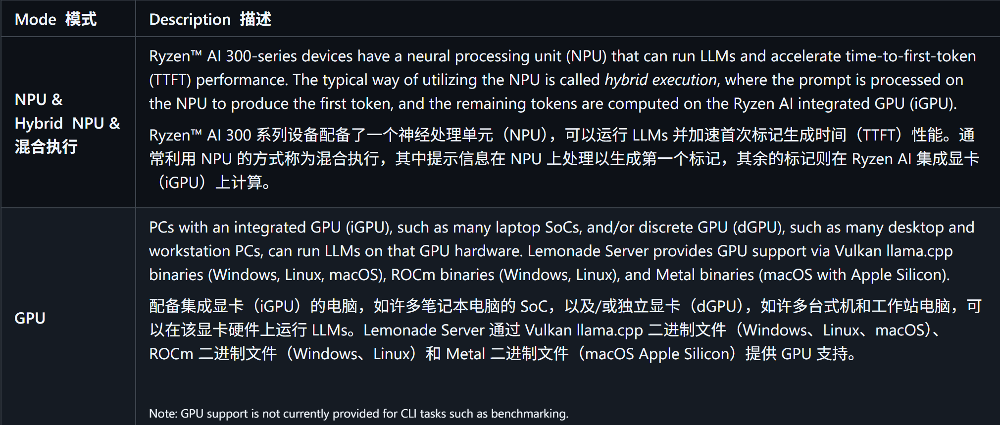
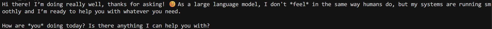

# 8-gemma3-4b-it 模型服务部署

## 基础环境准备

本文基础环境如下：

```
----------------
Windows11
CPU AI 395
内存 128G
----------------
```

> 请确定AMD芯片的版本，目前支持AI 395和 AI 370

下载 lemonade-server 进行安装

> NPU 需要配备 AMD Ryzen AI 300 系列的 Windows 11 电脑及驱动安装。请先下载并安装 NPU 驱动程序，再继续操作,请参考 7-gemma3-4b-itAMD环境部署.md


首先 `pip` 换源加速下载并安装依赖包

```shell
# 升级pip
python -m pip install --upgrade pip
# 更换 pypi 源加速库的安装
pip config set global.index-url https://pypi.tuna.tsinghua.edu.cn/simple

pip install -U huggingface_hub
pip install lemonade-sdk[dev]
```


## 模型下载

在 Windows Powershell 下输入以下配置镜像站
 > $env:HF_ENDPOINT = "https://hf-mirror.com"

使用 `huggingface_hub` 中的 `snapshot_download` 函数下载模型，第一个参数为模型名称，参数 `cache_dir` 为模型的下载路径。

新建 `model_download.py` 文件并在其中输入以下内容，粘贴代码后请及时保存文件，如下图所示。并运行 `python download_model.py ggml-org/gemma-3-4b-it-GGUF "C:\Users\aup\.cache\huggingface\hub\gemma-3-4b-it-GGUF"` 执行下载。

```python
#!/usr/bin/env python
"""
使用 Python API 下载 Hugging Face 模型
"""
import os
from huggingface_hub import snapshot_download

def download_model(repo_id: str, local_dir: str = None, resume_download: bool = True):
    """
    下载 Hugging Face 模型
    
    Args:
        repo_id: 模型仓库ID，例如 "ggml-org/gemma-3-4b-it-GGUF"
        local_dir: 本地保存目录，如果为None则使用默认缓存目录
        resume_download: 是否支持断点续传
    """
    print(f"开始下载模型: {repo_id}")
    print(f"保存位置: {local_dir if local_dir else '默认缓存目录'}")
    
    try:
        # 如果指定了本地目录，使用它；否则使用默认缓存
        if local_dir:
            cache_dir = os.path.dirname(local_dir) if os.path.dirname(local_dir) else None
            local_dir_use = local_dir
        else:
            cache_dir = None
            local_dir_use = None
        
        # 下载模型
        downloaded_path = snapshot_download(
            repo_id=repo_id,
            local_dir=local_dir_use,
            cache_dir=cache_dir,
            resume_download=resume_download,
            local_files_only=False
        )
        
        print(f"\n✓ 模型下载完成！")
        print(f"保存路径: {downloaded_path}")
        return downloaded_path
        
    except Exception as e:
        print(f"\n✗ 下载失败: {str(e)}")
        raise

if __name__ == "__main__":
    import sys
    
    # 默认下载的模型
    repo_id = "ggml-org/gemma-3-4b-it-GGUF"
    
    # 如果提供了命令行参数，使用它作为模型ID
    if len(sys.argv) > 1:
        repo_id = sys.argv[1]
    
    # 可选：指定本地保存目录
    local_dir = None
    if len(sys.argv) > 2:
        local_dir = sys.argv[2]
    
    download_model(repo_id, local_dir)


```
## 支持的硬件加速器


## 支持的推理引擎


## 启动服务
> 在菜单栏里输入 Lemonade Server 启动，点击菜单里中对应的图标


然后选中对应的模型即可启动，可以对外输出兼容OpenAI的服务接口


## 服务测试

新建 `test.py` 文件并在其中输入以下内容，粘贴代码后请及时保存文件。以下代码有很详细的注释，大家如有不理解的地方，欢迎提出 issue 。
```python
# Client library provided by OpenAI to automate request
# and response processing with the server
from openai import OpenAI

# The base_url points to an LLM server, which can either be
# local (localhost address) or cloud-based (web address)
base_url = f"http://localhost:8000/api/v1"

# The `client` instance here provides APIs to request
# LLM invocations from the server
client = OpenAI(
    base_url=base_url,
    api_key="lemonade",  # required, but unused in Lemonade
)

# The `messages` list provides the history of messages from
# the system, assistant, and user roles
messages = [
    {"role":"system", "content":"You are a helpful assistant."},
    {"role":"user", "content":"Hi, how are you?"},
]

# This is the API call that sends the `messages` history to
# the server's specific LLM `model`
# It returns a `completion`, which is OpenAI's way of referring
# to the LLM's reponse to the messages
completion = client.chat.completions.create(
    model="Gemma-3-4b-it-GGUF",
    messages=messages,
)

# This code gets the LLM's response from the `completion`
# and prints it to the screen
response = completion.choices[0].message.content
print(response)

```
返回结果如下



