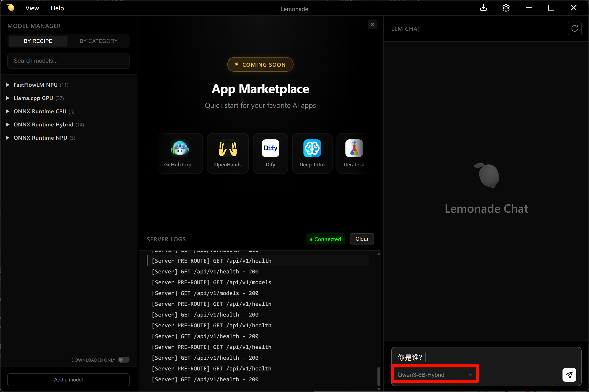

# Qwen3-8B 模型lemonade SDK 部署调用

## 基础环境准备

本文基础环境如下：

```
----------------
Windows11
CPU AI 395
内存 128G
----------------
```

> 请确定AMD芯片的版本，目前支持AI 395和 AI 370

下载 lemonade-server 进行安装

> NPU 需要配备 AMD Ryzen AI 300 系列的 Windows 11 电脑及驱动安装。请先下载并安装 NPU 驱动程序，再继续操作


首先 `pip` 换源加速下载并安装依赖包

```shell
# 升级pip
python -m pip install --upgrade pip
# 更换 pypi 源加速库的安装
pip config set global.index-url https://pypi.tuna.tsinghua.edu.cn/simple

pip install -U huggingface_hub
pip install lemonade-sdk[dev]
```


## 模型下载

在 Windows Powershell 下输入以下配置镜像站
 > $env:HF_ENDPOINT = "https://hf-mirror.com"

使用 `huggingface_hub` 中的 `snapshot_download` 函数下载模型，第一个参数为模型名称，参数 `cache_dir` 为模型的下载路径。

新建 `model_download.py` 文件并在其中输入以下内容，粘贴代码后请及时保存文件，如下图所示。并运行 `python download_model.py amd/Qwen3-8B-awq-quant-onnx-hybrid "C:\Users\aup\.cache\huggingface\hub\models--amd--Qwen3-8B-awq-quant-onnx-hybrid"` 执行下载。

```python
#!/usr/bin/env python
"""
使用 Python API 下载 Hugging Face 模型
"""
import os
from huggingface_hub import snapshot_download

def download_model(repo_id: str, local_dir: str = None, resume_download: bool = True):
    """
    下载 Hugging Face 模型
    
    Args:
        repo_id: 模型仓库ID，例如 "amd/Qwen3-8B-awq-quant-onnx-hybrid"
        local_dir: 本地保存目录，如果为None则使用默认缓存目录
        resume_download: 是否支持断点续传
    """
    print(f"开始下载模型: {repo_id}")
    print(f"保存位置: {local_dir if local_dir else '默认缓存目录'}")
    
    try:
        # 如果指定了本地目录，使用它；否则使用默认缓存
        if local_dir:
            cache_dir = os.path.dirname(local_dir) if os.path.dirname(local_dir) else None
            local_dir_use = local_dir
        else:
            cache_dir = None
            local_dir_use = None
        
        # 下载模型
        downloaded_path = snapshot_download(
            repo_id=repo_id,
            local_dir=local_dir_use,
            cache_dir=cache_dir,
            resume_download=resume_download,
            local_files_only=False
        )
        
        print(f"\n✓ 模型下载完成！")
        print(f"保存路径: {downloaded_path}")
        return downloaded_path
        
    except Exception as e:
        print(f"\n✗ 下载失败: {str(e)}")
        raise

if __name__ == "__main__":
    import sys
    
    # 默认下载的模型
    repo_id = "amd/Qwen3-8B-awq-quant-onnx-hybrid"
    
    # 如果提供了命令行参数，使用它作为模型ID
    if len(sys.argv) > 1:
        repo_id = sys.argv[1]
    
    # 可选：指定本地保存目录
    local_dir = None
    if len(sys.argv) > 2:
        local_dir = sys.argv[2]
    
    download_model(repo_id, local_dir)


```


## 启动服务
> 在菜单栏里输入 Lemonade Server 启动，点击菜单里中对应的图标


然后选中对应的模型即可启动，可以对外输出兼容OpenAI的服务接口




## 服务测试

新建 `test.py` 文件并在其中输入以下内容，粘贴代码后请及时保存文件。以下代码有很详细的注释，大家如有不理解的地方，欢迎提出 issue 。
```python
#!/usr/bin/env python
"""
简洁版本的 API 测试脚本
完全模仿 curl 请求
"""
import requests

# 发送 POST 请求（完全对应 curl 命令）
response = requests.post(
    "http://localhost:8000/api/v1/chat/completions",
    headers={"Content-Type": "application/json"},
    json={
        "model": "Qwen3-8B-Hybrid",
        "messages": [{"role": "user", "content": "Hello!"}]
    }
)

# 打印响应
print(f"Status: {response.status_code}")
print(f"Response: {response.json()}")


```
返回结果如下


## 代码准备

我们可也可以使用Lemonade API 构建API服务给其他应用调用服务，新建 `api.py` 文件并在其中输入以下内容，粘贴代码后请及时保存文件。以下代码有很详细的注释，大家如有不理解的地方，欢迎提出 issue 。
```python
from fastapi import FastAPI, Request
from contextlib import asynccontextmanager
from threading import Thread, Event
from transformers import StoppingCriteriaList
from lemonade.tools.server.serve import StopOnEvent
from lemonade.api import from_pretrained
from lemonade.tools.oga.utils import OrtGenaiStreamer
import uvicorn
import json
import datetime
import logging
import queue
import uuid
import asyncio

# 配置日志
logging.basicConfig(level=logging.INFO)
logger = logging.getLogger(__name__)

# 全局模型变量
model = None
tokenizer = None

# 任务队列和结果字典
task_queue = queue.Queue()
result_dict = {}
worker_thread = None
worker_running = False

# --- 模型加载逻辑 ---
def load_models():
    global model, tokenizer
    try:
        logger.info("正在加载模型...")
        model, tokenizer = from_pretrained(
            "amd/Qwen3-8B-awq-quant-onnx-hybrid",
            recipe="oga-hybrid",
        )
        logger.info("模型加载完成")
    except Exception as e:
        logger.error(f"模型加载失败: {str(e)}")
        raise

# --- 工作线程函数 ---
def worker_thread_func():
    """长期运行的工作线程，从队列中获取任务并处理"""
    global model, tokenizer, task_queue, result_dict, worker_running
    
    logger.info("工作线程已启动")
    worker_running = True
    
    while worker_running:
        try:
            # 从队列中获取任务（阻塞等待）
            task = task_queue.get(timeout=1.0)
            
            if task is None:  # 收到停止信号
                break
            
            task_id, prompt_text, max_new_tokens = task
            
            try:
                # 使用 chat.py 中的推理方式
                input_ids = tokenizer(prompt_text, return_tensors="pt").input_ids
                
                # 使用流式生成器收集完整响应
                streamer = OrtGenaiStreamer(tokenizer)
                stop_event = Event()
                stopping_criteria = StoppingCriteriaList([StopOnEvent(stop_event)])
                
                generation_kwargs = {
                    "input_ids": input_ids,
                    "streamer": streamer,
                    "max_new_tokens": max_new_tokens,
                    "stopping_criteria": stopping_criteria,
                }
                
                # 在工作线程中创建子线程来运行 generate
                # streamer 需要在另一个线程中读取，而 generate 在子线程中运行
                generate_thread = Thread(target=model.generate, kwargs=generation_kwargs)
                generate_thread.start()
                
                # 在工作线程中收集完整响应（从 streamer 读取）
                response = ""
                for new_text in streamer:
                    response += new_text
                
                # 等待生成线程完成
                generate_thread.join()
                
                # 将结果存入结果字典
                result_dict[task_id] = {
                    "success": True,
                    "response": response
                }
                
            except Exception as e:
                logger.error(f"处理任务 {task_id} 时出错: {str(e)}")
                result_dict[task_id] = {
                    "success": False,
                    "error": str(e)
                }
            
            # 标记任务完成
            task_queue.task_done()
            
        except queue.Empty:
            # 队列为空，继续循环
            continue
        except Exception as e:
            logger.error(f"工作线程错误: {str(e)}")
            continue
    
    logger.info("工作线程已停止")

# --- FastAPI应用 ---
@asynccontextmanager
async def lifespan(app: FastAPI):
    global worker_thread, worker_running
    
    try:
        load_models()
        
        # 启动工作线程
        worker_thread = Thread(target=worker_thread_func, daemon=True)
        worker_thread.start()
        logger.info("工作线程已启动")
        
        yield
        
    except Exception as e:
        logger.error(f"服务初始化失败: {str(e)}")
        raise
    finally:
        # 停止工作线程
        worker_running = False
        if worker_thread and worker_thread.is_alive():
            task_queue.put(None)  # 发送停止信号
            worker_thread.join(timeout=5)
            logger.info("工作线程已停止")

app = FastAPI(lifespan=lifespan)

# 处理POST请求的端点
@app.post("/")
async def create_item(request: Request):
    global task_queue, result_dict  # 声明全局变量
    
    json_post_raw = await request.json()  # 获取POST请求的JSON数据
    json_post = json.dumps(json_post_raw)  # 将JSON数据转换为字符串
    json_post_list = json.loads(json_post)  # 将字符串转换为Python对象
    prompt = json_post_list.get('prompt')  # 获取请求中的提示
    history = json_post_list.get('history', [])  # 获取请求中的历史记录
    max_new_tokens = json_post_list.get('max_new_tokens', 1024)  # 获取最大token数，默认1024

    # 构建提示文本（处理历史记录）
    if history:
        conversation_text = ""
        for item in history:
            if isinstance(item, list) and len(item) == 2:
                user_msg, assistant_msg = item
                conversation_text += f"User: {user_msg}\nAssistant: {assistant_msg}\n"
        prompt_text = f"{conversation_text}User: {prompt}\nAssistant:"
    else:
        prompt_text = prompt

    try:
        # 生成唯一任务ID
        task_id = str(uuid.uuid4())
        
        # 将任务放入队列
        task_queue.put((task_id, prompt_text, max_new_tokens))
        logger.info(f"任务 {task_id} 已加入队列")
        
        # 等待结果（轮询检查结果字典）
        max_wait_time = 300  # 最大等待时间（秒）
        wait_interval = 0.1  # 轮询间隔（秒）
        elapsed_time = 0
        
        while task_id not in result_dict:
            if elapsed_time >= max_wait_time:
                raise TimeoutError(f"任务 {task_id} 超时")
            await asyncio.sleep(wait_interval)
            elapsed_time += wait_interval
        
        # 获取结果
        result = result_dict.pop(task_id)
        
        if result["success"]:
            response = result["response"]
            now = datetime.datetime.now()  # 获取当前时间
            time = now.strftime("%Y-%m-%d %H:%M:%S")  # 格式化时间为字符串
            # 构建响应JSON
            answer = {
                "response": response,
                "status": 200,
                "time": time
            }
            # 构建日志信息
            log = "[" + time + "] " + '", prompt:"' + prompt_text + '", response:"' + repr(response) + '"'
            logger.info(log)  # 打印日志
            return answer  # 返回响应
        else:
            raise Exception(result.get("error", "未知错误"))
        
    except Exception as e:
        logger.error(f"处理请求时出错: {str(e)}")
        now = datetime.datetime.now()
        time = now.strftime("%Y-%m-%d %H:%M:%S")
        return {
            "response": f"错误: {str(e)}",
            "status": 500,
            "time": time
        }

# 主函数入口
if __name__ == '__main__':
    # 模型加载在 lifespan 中自动完成
    # 启动FastAPI应用
    # 用6006端口可以将autodl的端口映射到本地，从而在本地使用api
    uvicorn.run(app, host='0.0.0.0', port=6006, workers=1)  # 在指定端口和主机上启动应用
```

