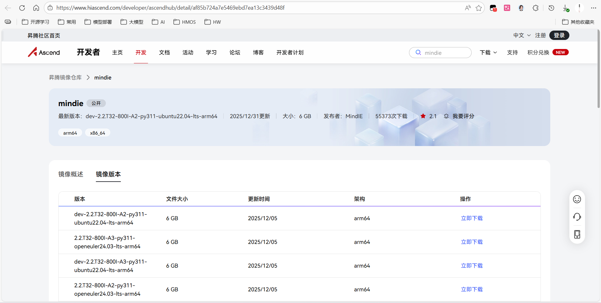
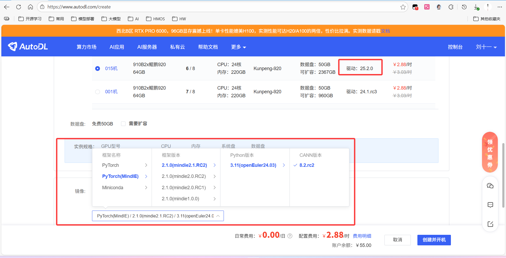
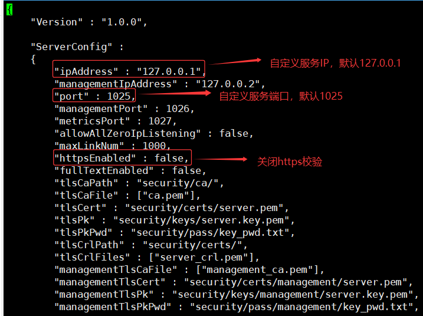
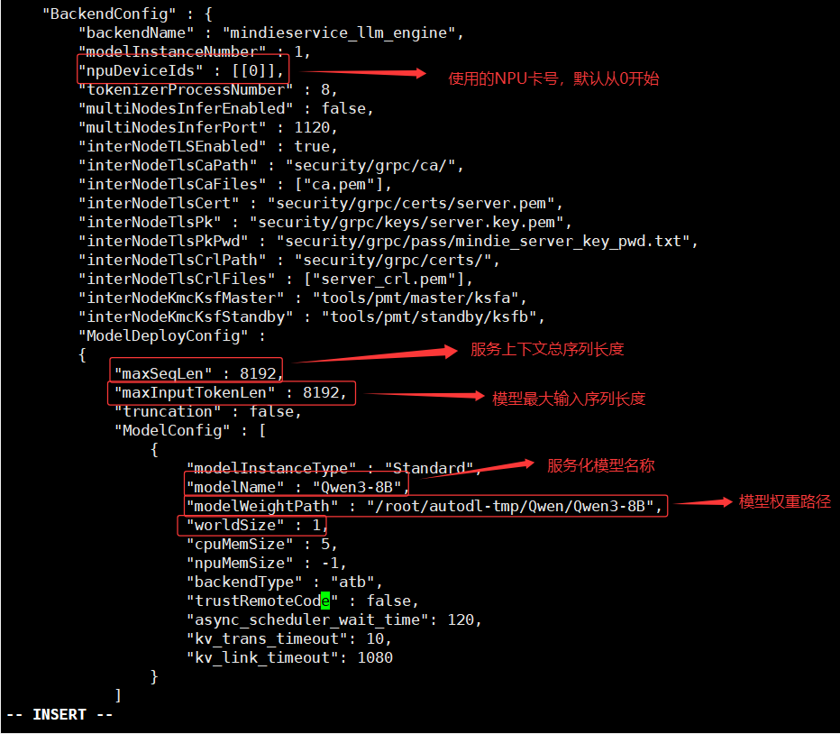
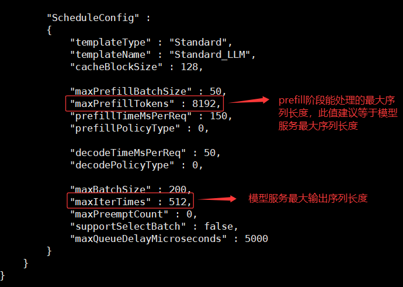
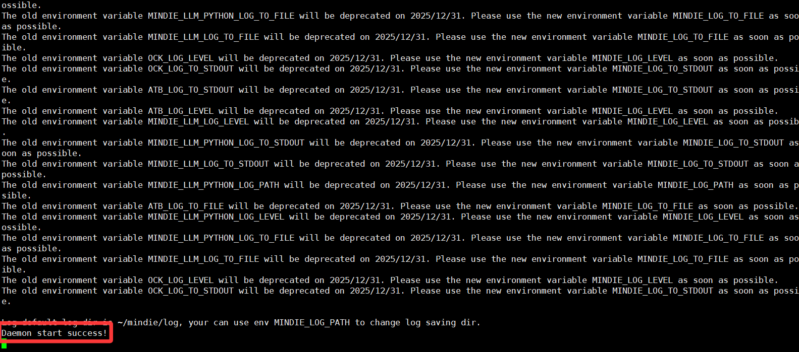

# Qwen3-8B MindIE 部署调用
## **MindIE 简介**

昇腾 `MindIE` 推理引擎面向推理执行部署，使能应用高效落地。昇腾推理引擎，基于昇腾硬件的运行加速、调试调优、快速迁移部署的高性能深度学习推理框架，分层开放满足各类需求，统一接口使能极简开发，沉淀能力构筑极致性能。

## 基础环境准备

本文基础环境如下：

```
----------------
openEuler 24.03
NPU驱动 25.2.0
python 3.11
cann 8.2.RC2
torch 2.1.0
torch-npu 2.1.0
----------------
```

> 请确定昇腾NPU芯片的版本，目前支持A2、A3和310P系列产品。

裸金属服务器或物理机可以通过[昇腾镜像仓库](https://www.hiascend.com/developer/ascendhub/detail/af85b724a7e5469ebd7ea13c3439d48f)获取设备对应镜像(使用AutoDL平台条跳过此步骤)



> 考虑到部分同学配置环境可能会遇到一些问题，AutoDL 平台准备了MindIE推理引擎在昇腾设备运行的环境镜像，在租用实例时直接选择即可。
⚠️注意：建议驱动版本选择25.2.0或以上版本，否则可能会遇到一些问题。



首先 `pip` 换源加速下载并安装依赖包

```shell
# 升级pip
python -m pip install --upgrade pip
# 更换 pypi 源加速库的安装
pip config set global.index-url https://pypi.tuna.tsinghua.edu.cn/simple

pip install modelscope
```


## 模型下载

使用 modelscope 中的 snapshot_download 函数下载模型，第一个参数为模型名称，参数 cache_dir 为模型的下载路径。

新建 `model_download.py` 文件并在其中输入以下内容，粘贴代码后记得保存文件。

```python
from modelscope import snapshot_download

model_dir = snapshot_download('Qwen/Qwen3-8B', cache_dir='/root/autodl-tmp', revision='master')
```

然后在终端中输入 `python model_download.py` 执行下载，这里需要耐心等待一段时间直到模型下载完成。

> 注意：记得修改 `cache_dir` 为你的模型下载路径哦~


## 模型服务部署
### 启动镜像（使用AutoDL平台此步骤跳过）
昇腾设备镜像启动方式有别于普通的docker镜像启动，需要额外配置一些参数，以下启动命令可供参考：
```shell
docker run -it -d --net=host --shm-size=512g \
    --privileged \
    --name Qwen3-8B \
    --device=/dev/davinci_manager \
    --device=/dev/hisi_hdc \
    --device=/dev/devmm_svm \
    -v /usr/local/Ascend/driver:/usr/local/Ascend/driver:ro \
    -v /usr/local/sbin:/usr/local/sbin:ro \
    -v /data:/data \
   swr.cn-south-1.myhuaweicloud.com/ascendhub/mindie:2.1.RC2-800I-A2-py311-openeuler24.03-lts /bin/bash

docker exec -it Qwen3-8B bash
```

### 修改配置文件
```bash
# 进入MindIE默认安装路径
cd /usr/local/Ascend/mindie/latest/mindie-service
# 修改配置文件，按照截图中的指引配置模型服务参数
vim conf/config.json
```



> 更详细的配置参数说明请参考[MindIE 配置参数说明（服务化）](https://www.hiascend.com/document/detail/zh/mindie/21RC2/mindiellm/llmdev/mindie_llm0004.html)

修改完成以后，按:wq保存配置文件。

### 启动模型服务
```bash
# 进入MindIE默认安装路径
cd /usr/local/Ascend/mindie/latest/mindie-service
# 配置环境变量
source /usr/local/Ascend/ascend-toolkit/set_env.sh
source /usr/local/Ascend/nnal/atb/set_env.sh
source /usr/local/Ascend/atb-models/set_env.sh
source /usr/local/Ascend/mindie/set_env.sh
# 启动模型服务
./bin/mindieservice_daemon
```
等待3-5分钟，终端显示`Daemon start success!`字样表明服务启动成功。



## 模型服务测试
通过昇腾 MindIE 大模型推理引擎启动的模型服务兼容 OpenAI、TGI、vLLM等格式的接口，用户可以直接使用例如 OpenAI 等各兼容格式的请求方式调用模型服务，实现大模型推理业务场景在昇腾硬件上的无缝迁移部署。
> 更详细的接口兼容情况请参考[MindIE 接口兼容说明](https://www.hiascend.com/document/detail/zh/mindie/21RC2/mindieservice/servicedev/mindie_service0062.html)

- 通过 `curl` 命令查看当前的模型列表

```bash
curl http://127.0.0.1:1025/v1/models
```

​ 得到的返回值如下所示

```json
{
    "object":"list",
    "data":[
        {
            "id":"Qwen3-8B",
            "object":"model",
            "created":1767448547,
            "owned_by":"MindIE Server"
        }
    ]
}
```
- 用 `curl` 命令测试 `OpenAI Chat Completions API`

```bash
curl http://127.0.0.1:1025/v1/chat/completions \
    -H "Content-Type: application/json" \
    -d '{
        "model": "Qwen3-8B",
        "messages": [
            {"role": "user", "content": "我想问你，5的阶乘是多少？<think>\n"}
        ]
    }'
```

得到的返回值如下所示

```json
{
    "id":"endpoint_common_0",
    "object":"chat.completion",
    "created":1767449274,
    "model":"Qwen3-8B",
    "choices":[
        {
            "index":0,
            "message":{
                "role":"assistant",
                "content":"<think>\n嗯，用户问的是5的阶乘是多少。首先，我需要确认阶乘的定义。阶乘是指一个正整数n乘以所有小于它的正整数的乘积，也就是n! = n × (n-1) × ... × 1。所以，5的阶乘就是5×4×3×2×1。\n\n接下来，我应该一步步计算。先算5乘以4，得到20。然后20乘以3，得到60。接着60乘以2，是120。最后，120乘以1，结果还是120。所以5!应该是120。\n\n不过，可能用户对阶乘不太熟悉，或者想确认一下计算过程是否正确。我需要确保每一步都正确，避免计算错误。比如，有时候可能会在乘法过程中出错，比如把5×4算成25而不是20，或者中间步骤有误。但这里每一步都是正确的，所以结果应该是120。\n\n另外，用户可能是在学习数学，或者需要这个结果用于某个项目、考试题目等。也有可能用户只是好奇，或者想测试我的知识。不管怎样，给出准确的答案并解释清楚过程会更好。所以，我应该明确写出计算步骤，让用户能够理解并验证结果。\n</think>\n\n5的阶乘（5!）是5×4×3×2×1，计算过程如下：\n\n1. **5 × 4 = 20**  \n2. **20 × 3 = 60**  \n3. **60 × 2 = 120**  \n4. **120 × 1 = 120**  \n\n因此，**5! = 120**。",
                "tool_calls":null
            },
            "logprobs":null,
            "finish_reason":"stop"
        }
    ],
    "usage":{
        "prompt_tokens":20,
        "completion_tokens":373,
        "total_tokens":393,
        "batch_size":[1,1,1,1,1,1,1,1,1,1,1,1,1,1,1,1,1,1,1,1,1,1,1,1,1,1,1,1,1,1,1,1,1,1,1,1,1,1,1,1,1,1,1,1,1,1,1,1,1,1,1,1,1,1,1,1,1,1,1,1,1,1,1,1,1,1,1,1,1,1,1,1,1,1,1,1,1,1,1,1,1,1,1,1,1,1,1,1,1,1,1,1,1,1,1,1,1,1,1,1,1,1,1,1,1,1,1,1,1,1,1,1,1,1,1,1,1,1,1,1,1,1,1,1,1,1,1,1,1,1,1,1,1,1,1,1,1,1,1,1,1,1,1,1,1,1,1,1,1,1,1,1,1,1,1,1,1,1,1,1,1,1,1,1,1,1,1,1,1,1,1,1,1,1,1,1,1,1,1,1,1,1,1,1,1,1,1,1,1,1,1,1,1,1,1,1,1,1,1,1,1,1,1,1,1,1,1,1,1,1,1,1,1,1,1,1,1,1,1,1,1,1,1,1,1,1,1,1,1,1,1,1,1,1,1,1,1,1,1,1,1,1,1,1,1,1,1,1,1,1,1,1,1,1,1,1,1,1,1,1,1,1,1,1,1,1,1,1,1,1,1,1,1,1,1,1,1,1,1,1,1,1,1,1,1,1,1,1,1,1,1,1,1,1,1,1,1,1,1,1,1,1,1,1,1,1,1,1,1,1,1,1,1,1,1,1,1,1,1,1,1,1,1,1,1,1,1,1,1,1,1,1,1,1,1,1,1,1,1,1,1,1,1,1,1,1,1,1,1,1,1,1,1,1,1,1,1,1,1,1,1,1,1,1,1,1,1,1,1,1,1,1,1],
        "queue_wait_time":[5245,60,34,24,22,20,19,19,19,18,18,354,34,26,28,24,23,39,33,37,32,26,22,22,21,20,20,20,69,20,19,20,84,26,24,23,21,21,35,22,21,22,21,21,36,25,23,22,23,23,23,21,25,23,40,27,24,23,23,22,21,22,23,24,22,22,32,25,24,23,22,21,23,21,52,29,30,23,23,20,18,19,19,21,18,20,18,19,25,23,21,28,20,19,20,18,20,17,18,17,17,21,117,29,24,23,23,22,22,26,22,22,21,22,23,22,22,22,24,24,22,25,24,23,23,24,22,22,54,31,25,22,22,23,22,22,24,66,35,41,29,24,22,22,21,20,29,23,21,21,20,20,20,20,22,22,22,41,22,20,19,19,19,18,19,20,18,19,19,17,18,29,24,22,20,18,20,19,18,44,18,25,23,20,20,19,18,19,18,17,19,32,28,25,26,27,25,23,21,19,20,19,20,21,43,28,29,27,30,28,34,30,28,28,29,38,41,23,23,29,26,26,32,29,26,27,26,44,41,23,21,22,21,21,22,22,22,40,31,30,27,27,25,26,24,24,24,22,26,30,35,29,29,29,27,31,33,30,93,40,36,30,31,34,36,33,35,128,35,24,22,22,20,19,20,21,20,19,19,30,22,22,21,21,19,23,22,27,23,25,23,23,31,24,23,24,22,23,20,19,19,19,18,18,50,24,20,21,19,21,20,19,21,20,19,46,26,23,25,24,24,21,22,20,24,23,22,43,29,28,28,28,25,24,23,25,23,23,23,35,27,23,25,23,23,25,22,23,23,33,25,24,24,24,23,22,23,23,23,23,23,59,38,25,23,25,23,24,27,24,25,23,36]},
        "prefill_time":47,
        "decode_time_arr":[30,17,17,17,17,17,17,17,17,17,17,17,17,17,17,17,17,17,17,17,17,17,17,17,17,17,17,17,17,17,17,17,17,17,17,17,17,17,17,17,17,17,17,17,17,17,17,17,17,17,17,17,17,17,17,17,17,17,17,17,17,17,17,17,17,17,17,17,17,17,17,17,17,17,17,17,17,17,17,17,17,17,17,17,17,17,17,17,17,17,17,17,17,17,17,17,17,17,17,17,17,17,17,17,17,17,17,17,17,17,17,17,17,17,17,17,17,17,17,17,17,17,17,17,17,17,17,17,17,17,17,17,17,17,17,17,17,17,17,17,17,17,17,17,17,17,17,17,17,17,17,17,17,17,17,17,17,17,17,17,17,17,17,17,27,17,17,17,17,17,17,17,17,17,17,17,17,17,17,17,17,17,17,17,17,17,17,17,17,17,17,17,17,17,17,17,17,17,17,17,17,17,17,17,17,22,17,17,17,17,17,17,17,17,17,17,17,17,17,17,17,17,17,17,17,17,17,17,17,17,17,17,17,17,17,17,17,17,17,17,17,17,17,17,17,17,17,17,17,17,17,17,17,17,17,17,17,17,17,17,17,17,17,17,17,17,17,17,17,17,17,17,17,17,17,17,17,17,17,17,17,17,17,17,17,17,17,17,17,17,17,17,17,17,17,17,17,17,17,17,17,17,17,17,17,17,17,17,17,17,17,17,17,17,17,17,17,17,17,17,17,17,17,17,17,17,17,17,17,17,17,17,17,17,17,17,17,17,17,19,17,17,17,17,17,17,17,17,17,17,17,17,17,17,17,17,17,17,17,17,17,17,17,17,17,17,17,17,17,17,17,17]
}
```

- 用 `Python` 脚本请求 `OpenAI Chat Completions API`

```python
# mindie_openai_chat_completions.py
from openai import OpenAI
openai_api_key = "sk-xxx" # 随便填写，只是为了通过接口参数校验
openai_api_base = "http://127.0.0.1:1025/v1"

client = OpenAI(
    api_key=openai_api_key,
    base_url=openai_api_base,
)

chat_outputs = client.chat.completions.create(
    model="Qwen3-8B",
    messages=[
        {"role": "user", "content": "什么是深度学习？"},
    ]
)
print(chat_outputs)
```

```shell
python vllm_openai_chat_completions.py
```

得到的返回值如下所示

```
ChatCompletion(id='endpoint_common_1', choices=[Choice(finish_reason='length', index=0, logprobs=None, message=ChatCompletionMessage(content='<think>\n嗯，用户问的是“什么是深度学习？”，我需要先理解这个问题。首先，深度学习是机器学习的一个分支，但可能用户不太清楚具体的定义和应用场景。我应该从基本概念开始，比如神经网络、层次结构，然后解释它和传统机器学习的区别。\n\n用户可能对技术术语不太熟悉，所以需要用简单的语言。比如，提到神经网络时，可以类比人脑的神经元，但不要太过复杂。还要说明深度学习的应用领域，比如图像识别、语音识别，这样用户能联想到实际例子。\n\n另外，用户可能想知道深度学习为什么重要，或者它的优势在哪里。需要提到它处理复杂模式的能力，以及需要大量数据。可能还要提到深度学习的挑战，比如数据需求大、计算资源高，这样回答更全面。\n\n还要考虑用户可能的背景。如果他们不是技术背景，可能需要避免过多专业术语，或者简单解释术语。比如，解释什么是神经网络层，为什么叫“深度”，可能需要说明层数多，层次多，所以叫深度学习。\n\n有没有可能用户想了解深度学习和机器学习的关系？应该提到深度学习是机器学习的一个子领域，强调其使用多层神经网络的特点。同时，可能用户对深度学习的实际应用感兴趣，可以举一些例子，如推荐系统、自动驾驶，这样更具体。\n\n还要注意结构清晰，分点说明，比如定义、核心概念、与传统机器学习的区别、应用、挑战等。这样用户容易理解。另外，可能需要提到一些知名的框架或模型，比如TensorFlow、PyTorch，或者CNN、RNN，但不要深入技术细节，保持概述。\n\n最后，检查是否有遗漏的重要点，比如深度学习的训练过程，比如反向传播，但可能用户不需要太详细。保持回答简洁，同时覆盖关键点。确保语言口语化，避免学术化的表达，让用户容易理解。\n</think>\n\n深度学习（Deep Learning）是**机器学习**的一个分支，其核心思想是通过模拟人脑神经网络的结构和工作机制，从数据中自动学习复杂的模式和特征。它通过多层的非线性变换，逐步提取数据的抽象特征，最终实现对数据的高效建模和预测。\n\n---\n\n### **核心概念**\n1. **神经网络（Neural Networks）**  \n   深度学习的基础是**人工神经网络**（Artificial Neural Networks, ANNs）。它由大量相互连接的“神经元', refusal=None, role='assistant', annotations=None, audio=None, function_call=None, tool_calls=None))], created=1767449436, model='Qwen3-8B', object='chat.completion', service_tier=None, system_fingerprint=None, usage=CompletionUsage(completion_tokens=512, prompt_tokens=12, total_tokens=524, completion_tokens_details=None, prompt_tokens_details=None, batch_size=[1, 1, 1, 1, 1, 1, 1, 1, 1, 1, 1, 1, 1, 1, 1, 1, 1, 1, 1, 1, 1, 1, 1, 1, 1, 1, 1, 1, 1, 1, 1, 1, 1, 1, 1, 1, 1, 1, 1, 1, 1, 1, 1, 1, 1, 1, 1, 1, 1, 1, 1, 1, 1, 1, 1, 1, 1, 1, 1, 1, 1, 1, 1, 1, 1, 1, 1, 1, 1, 1, 1, 1, 1, 1, 1, 1, 1, 1, 1, 1, 1, 1, 1, 1, 1, 1, 1, 1, 1, 1, 1, 1, 1, 1, 1, 1, 1, 1, 1, 1, 1, 1, 1, 1, 1, 1, 1, 1, 1, 1, 1, 1, 1, 1, 1, 1, 1, 1, 1, 1, 1, 1, 1, 1, 1, 1, 1, 1, 1, 1, 1, 1, 1, 1, 1, 1, 1, 1, 1, 1, 1, 1, 1, 1, 1, 1, 1, 1, 1, 1, 1, 1, 1, 1, 1, 1, 1, 1, 1, 1, 1, 1, 1, 1, 1, 1, 1, 1, 1, 1, 1, 1, 1, 1, 1, 1, 1, 1, 1, 1, 1, 1, 1, 1, 1, 1, 1, 1, 1, 1, 1, 1, 1, 1, 1, 1, 1, 1, 1, 1, 1, 1, 1, 1, 1, 1, 1, 1, 1, 1, 1, 1, 1, 1, 1, 1, 1, 1, 1, 1, 1, 1, 1, 1, 1, 1, 1, 1, 1, 1, 1, 1, 1, 1, 1, 1, 1, 1, 1, 1, 1, 1, 1, 1, 1, 1, 1, 1, 1, 1, 1, 1, 1, 1, 1, 1, 1, 1, 1, 1, 1, 1, 1, 1, 1, 1, 1, 1, 1, 1, 1, 1, 1, 1, 1, 1, 1, 1, 1, 1, 1, 1, 1, 1, 1, 1, 1, 1, 1, 1, 1, 1, 1, 1, 1, 1, 1, 1, 1, 1, 1, 1, 1, 1, 1, 1, 1, 1, 1, 1, 1, 1, 1, 1, 1, 1, 1, 1, 1, 1, 1, 1, 1, 1, 1, 1, 1, 1, 1, 1, 1, 1, 1, 1, 1, 1, 1, 1, 1, 1, 1, 1, 1, 1, 1, 1, 1, 1, 1, 1, 1, 1, 1, 1, 1, 1, 1, 1, 1, 1, 1, 1, 1, 1, 1, 1, 1, 1, 1, 1, 1, 1, 1, 1, 1, 1, 1, 1, 1, 1, 1, 1, 1, 1, 1, 1, 1, 1, 1, 1, 1, 1, 1, 1, 1, 1, 1, 1, 1, 1, 1, 1, 1, 1, 1, 1, 1, 1, 1, 1, 1, 1, 1, 1, 1, 1, 1, 1, 1, 1, 1, 1, 1, 1, 1, 1, 1, 1, 1, 1, 1, 1, 1, 1, 1, 1, 1, 1, 1, 1, 1, 1, 1, 1, 1, 1, 1, 1, 1, 1, 1, 1, 1, 1, 1, 1, 1, 1, 1, 1, 1, 1, 1, 1, 1, 1, 1, 1, 1, 1, 1, 1, 1, 1, 1, 1, 1, 1, 1, 1, 1, 1, 1, 1, 1, 1, 1, 1, 1, 1, 1, 1, 1, 1, 1, 1, 1, 1, 1, 1, 1, 1, 1, 1, 1, 1, 1, 1, 1, 1, 1, 1], queue_wait_time=[5190, 57, 31, 31, 28, 25, 30, 22, 40, 25, 20, 19, 19, 19, 20, 23, 19, 18, 20, 21, 33, 23, 20, 20, 20, 22, 20, 21, 22, 19, 21, 21, 112, 44, 25, 23, 22, 22, 21, 22, 21, 22, 23, 36, 26, 22, 21, 21, 22, 23, 23, 21, 21, 21, 21, 22, 35, 23, 22, 22, 23, 21, 21, 21, 33, 27, 39, 33, 30, 28, 28, 27, 28, 37, 27, 26, 26, 26, 26, 25, 27, 28, 28, 30, 38, 24, 23, 25, 22, 20, 19, 23, 19, 92, 42, 28, 27, 26, 30, 29, 32, 31, 32, 50, 28, 21, 20, 22, 19, 20, 19, 42, 31, 27, 25, 26, 25, 28, 27, 27, 27, 27, 26, 27, 26, 27, 34, 27, 28, 26, 27, 28, 27, 25, 27, 27, 26, 26, 35, 30, 28, 26, 26, 26, 24, 23, 24, 23, 22, 32, 27, 23, 30, 24, 25, 22, 22, 23, 22, 39, 27, 24, 22, 23, 19, 19, 22, 25, 23, 24, 23, 30, 24, 24, 24, 23, 21, 21, 23, 22, 22, 24, 33, 22, 22, 19, 21, 24, 24, 25, 23, 94, 32, 27, 23, 22, 22, 21, 23, 24, 22, 21, 20, 21, 26, 21, 22, 23, 21, 22, 23, 22, 25, 29, 26, 31, 26, 25, 26, 23, 24, 22, 23, 23, 27, 23, 36, 21, 19, 20, 41, 23, 18, 18, 16, 17, 18, 29, 24, 25, 27, 27, 29, 29, 27, 29, 27, 28, 40, 19, 19, 16, 18, 17, 20, 17, 19, 18, 17, 24, 18, 17, 17, 17, 16, 20, 20, 18, 19, 18, 16, 27, 19, 17, 18, 17, 18, 18, 17, 18, 17, 16, 31, 18, 18, 17, 18, 17, 19, 19, 18, 17, 17, 20, 17, 19, 20, 17, 17, 17, 17, 18, 18, 17, 17, 27, 41, 25, 21, 26, 22, 21, 20, 23, 30, 23, 22, 20, 19, 20, 18, 19, 19, 19, 19, 113, 37, 22, 18, 20, 19, 19, 19, 20, 26, 26, 48, 21, 17, 17, 19, 17, 16, 17, 16, 16, 46, 29, 20, 17, 16, 16, 15, 16, 48, 25, 21, 107, 33, 26, 24, 23, 22, 24, 23, 23, 23, 23, 21, 22, 22, 22, 30, 29, 26, 27, 28, 31, 34, 34, 29, 27, 26, 88, 43, 23, 23, 21, 21, 20, 20, 20, 21, 19, 18, 20, 20, 89, 35, 23, 20, 21, 18, 19, 20, 19, 19, 38, 22, 21, 20, 19, 20, 18, 19, 19, 18, 19, 191, 28, 24, 23, 24, 22, 22, 21, 22, 32, 26, 24, 23, 22, 23, 22, 21, 22, 38, 26, 24, 23, 22, 21, 21, 22, 22, 24, 22, 42, 25, 22, 23, 22, 22, 21, 23, 88, 34, 31, 31, 30, 30, 31, 29, 27, 28, 26, 78, 43, 26, 21, 20, 19, 20, 19, 22, 19, 21, 19, 33, 63, 39, 27, 28, 27, 31, 24, 29, 28, 29, 29, 28, 44, 29, 28, 26, 22, 26, 25, 25, 23, 41, 25, 21, 21, 22, 22, 22, 20, 21, 20, 19, 19]), prefill_time=42, decode_time_arr=[24, 17, 17, 17, 17, 17, 17, 17, 17, 17, 17, 17, 17, 17, 17, 17, 17, 17, 17, 17, 17, 17, 17, 17, 17, 17, 17, 17, 17, 17, 17, 17, 17, 17, 17, 17, 17, 17, 17, 17, 17, 17, 17, 17, 17, 17, 17, 17, 17, 17, 17, 17, 17, 17, 17, 17, 17, 17, 17, 17, 17, 17, 17, 17, 17, 17, 17, 17, 17, 17, 17, 17, 17, 17, 17, 17, 17, 17, 17, 17, 17, 17, 17, 17, 17, 17, 17, 17, 17, 17, 19, 17, 17, 17, 17, 17, 17, 17, 17, 17, 17, 17, 17, 17, 17, 17, 17, 17, 17, 17, 17, 17, 17, 17, 17, 17, 17, 17, 17, 17, 17, 17, 17, 17, 17, 17, 17, 17, 17, 17, 17, 17, 17, 17, 17, 17, 17, 17, 17, 17, 17, 17, 17, 17, 17, 17, 17, 17, 17, 17, 17, 17, 17, 17, 17, 17, 17, 17, 17, 17, 17, 17, 17, 17, 17, 17, 17, 17, 17, 17, 17, 17, 17, 17, 17, 17, 17, 17, 17, 17, 17, 17, 17, 17, 17, 17, 17, 17, 17, 17, 17, 17, 17, 17, 17, 17, 17, 17, 17, 17, 17, 17, 17, 17, 17, 17, 17, 17, 17, 17, 17, 17, 17, 17, 17, 17, 17, 17, 17, 17, 17, 17, 17, 17, 17, 17, 17, 17, 17, 17, 17, 17, 17, 17, 17, 17, 17, 17, 17, 17, 17, 17, 17, 17, 17, 17, 17, 17, 17, 17, 17, 17, 17, 17, 17, 17, 17, 17, 17, 17, 17, 17, 17, 17, 17, 17, 17, 17, 17, 17, 17, 17, 17, 17, 17, 17, 17, 17, 17, 17, 17, 17, 17, 17, 17, 17, 17, 17, 17, 17, 17, 17, 17, 17, 17, 17, 17, 17, 17, 17, 17, 17, 17, 17, 17, 17, 17, 17, 17, 17, 17, 17, 17, 17, 17, 17, 17, 17, 17, 17, 17, 17, 17, 17, 17, 17, 17, 17, 17, 17, 17, 17, 17, 17, 17, 17, 17, 17, 17, 17, 17, 17, 17, 17, 18, 17, 17, 17, 17, 17, 17, 17, 17, 17, 17, 17, 17, 17, 17, 17, 17, 17, 17, 17, 17, 17, 17, 17, 17, 17, 17, 17, 17, 17, 17, 17, 17, 17, 17, 17, 17, 17, 17, 17, 17, 17, 17, 17, 17, 17, 17, 17, 17, 17, 17, 17, 17, 17, 17, 17, 17, 17, 17, 17, 17, 17, 17, 17, 17, 17, 17, 17, 17, 17, 17, 17, 17, 17, 17, 17, 17, 17, 17, 17, 17, 17, 17, 17, 17, 17, 17, 17, 17, 17, 17, 17, 17, 17, 17, 17, 17, 17, 17, 17, 17, 17, 17, 17, 17, 17, 17, 17, 17, 17, 17, 17, 17, 17, 17, 17, 17, 17, 17, 17, 17, 17, 17, 17, 17, 17, 17, 17, 17, 17, 17, 17, 17, 17, 17, 17, 17, 17, 17, 17, 17, 17, 17, 17, 17, 17, 17, 17, 17, 17, 17, 17, 17, 17, 17, 17, 17, 17, 17, 17, 17, 17, 17, 17, 17, 17, 17])
```