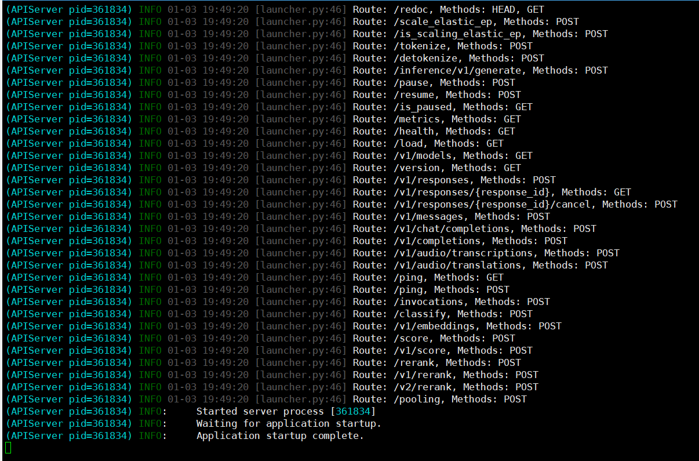
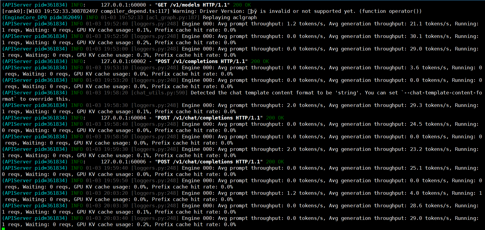

# Qwen3-8B vllm-ascend 部署调用

## **vllm-ascend 简介**

`vllm-ascend` 是一个由社区维护的让vLLM在Ascend NPU无缝运行的后端插件。此插件是 vLLM 社区中支持昇腾后端的推荐方式。它遵循[RFC]: Hardware pluggable所述原则：通过解耦的方式提供了vLLM对Ascend NPU的支持。使用 vLLM 昇腾插件，可以让类Transformer、混合专家(MOE)、嵌入、多模态等流行的大语言模型在 Ascend NPU 上无缝运行。

## 环境准备

本文基础环境如下：

```
----------------
ubuntu 22.04
NPU驱动 25.2.0
python 3.10
cann 8.3.RC2
torch 2.8.0
torch-npu 2.8.0
----------------
```

> 本文默认学习者已配置好以上 `Pytorch (CANN)` 环境，如未配置请先自行安装。

> 请确定昇腾NPU芯片的版本，目前支持A2和A3系列产品。

> 裸金属服务器或物理机可以通过docker pull获取设备对应镜像(使用AutoDL平台条跳过此步骤)：
```bash
# A2系列产品
docker pull quay.io/ascend/vllm-ascend:v0.13.0rc1
# A3系列产品
docker pull quay.io/ascend/vllm-ascend:v0.13.0rc1-a3
```

首先 `pip` 换源加速下载并安装依赖包：

```bash
python -m pip install --upgrade pip
pip config set global.index-url https://pypi.tuna.tsinghua.edu.cn/simple

pip install modelscope

# Install vllm-project/vllm. The newest supported version is v0.13.0.
pip install vllm==0.13.0
# Install vllm-project/vllm-ascend from pypi.
pip install vllm-ascend==0.13.0rc1
```

> 考虑到部分同学配置环境可能会遇到一些问题，我们在 AutoDL 平台准备了 Qwen3 在昇腾设备运行的环境镜像，点击下方链接并直接创建 Autodl 示例即可。
> ***https://www.codewithgpu.com/i/datawhalechina/self-llm/Qwen3***

## 模型下载

使用 modelscope 中的 snapshot_download 函数下载模型，第一个参数为模型名称，参数 cache_dir 为模型的下载路径。

新建 `model_download.py` 文件并在其中输入以下内容，粘贴代码后记得保存文件。

```python
from modelscope import snapshot_download

model_dir = snapshot_download('Qwen/Qwen3-8B', cache_dir='/root/autodl-tmp', revision='master')
```

然后在终端中输入 `python model_download.py` 执行下载，这里需要耐心等待一段时间直到模型下载完成。

> 注意：记得修改 `cache_dir` 为你的模型下载路径哦~

## **代码准备**

### **Python 脚本**

新建 `vllm_model.py` 文件并在其中输入以下内容，粘贴代码后请及时保存文件。下面的代码有很详细的注释，如有不理解的地方，欢迎大家提 `issue`。

首先从 `vLLM` 库中导入 `LLM` 和 `SamplingParams` 类。`LLM` 类是使用 `vLLM` 引擎运行离线推理的主要类。`SamplingParams` 类指定采样过程的参数，用于控制和调整生成文本的随机性和多样性。

`vLLM` 提供了非常方便的封装，我们直接传入模型名称或模型路径即可，不必手动初始化模型和分词器。

然后，通过使用分词器的 apply_chat_template 函数，将我们的 prompt（提示词）格式化为模型所需的输入格式。

默认情况下，Qwen3 启用了思考能力，类似于 QwQ-32B。这意味着该模型将利用其推理能力来提升生成回答的质量。例如，当在 tokenizer.apply_chat_template 中显式设置 enable_thinking=True 或保留其默认值时，模型将进入思考模式。

我们可以通过这个代码示例熟悉下 ` vLLM` 引擎的使用方式。被注释的部分内容可以丰富模型的能力，但不是必要的，大家可以按需选择，自己多多动手尝试 ~

```python
import gc
import torch
from vllm import LLM, SamplingParams
from transformers import AutoTokenizer
import os
import json

# 自动下载模型时，指定使用modelscope; 否则，会从HuggingFace下载
os.environ['VLLM_USE_MODELSCOPE']='True'

def get_completion(prompts, model, tokenizer=None, temperature=0.6, top_p=0.95, top_k=20, min_p=0, max_tokens=4096, max_model_len=8192):
    stop_token_ids = [151645, 151643]
    # 创建采样参数。temperature 控制生成文本的多样性，top_p 控制核心采样的概率，top_k 通过限制候选词的数量来控制生成文本的质量和多样性, min_p 通过设置概率阈值来筛选候选词，从而在保证文本质量的同时增加多样性
    sampling_params = SamplingParams(temperature=temperature, top_p=top_p, top_k=top_k, min_p=min_p, max_tokens=max_tokens, stop_token_ids=stop_token_ids)  # max_tokens 用于限制模型在推理过程中生成的最大输出长度
    # 初始化 vLLM 推理引擎
    llm = LLM(model=model, tokenizer=tokenizer, max_model_len=max_model_len,trust_remote_code=True)  # max_model_len 用于限制模型在推理过程中可以处理的最大输入和输出长度之和。
    outputs = llm.generate(prompts, sampling_params)
    return outputs


if __name__ == "__main__":
    # 初始化 vLLM 推理引擎
    model='/root/autodl-tmp/Qwen/Qwen3-8B' # 指定模型路径
    tokenizer = AutoTokenizer.from_pretrained(model, use_fast=False) # 加载分词器

    prompt = "给我一个关于大模型的简短介绍。"
    messages = [
        {"role": "user", "content": prompt}
    ]
    text = tokenizer.apply_chat_template(
        messages,
        tokenize=False,
        add_generation_prompt=True,
        enable_thinking=True  # 是否开启思考模式，默认为 True
    )

    outputs = get_completion(text, model, tokenizer=None, temperature=0.6, top_p = 0.95, top_k=20, min_p=0)  # 对于思考模式，官方建议使用以下参数：temperature = 0.6，TopP = 0.95，TopK = 20，MinP = 0。

    # 输出是一个包含 prompt、生成文本和其他信息的 RequestOutput 对象列表。
    # 打印输出。
    for output in outputs:
        prompt = output.prompt
        generated_text = output.outputs[0].text
        print(f"Prompt: {prompt!r}, \nResponse: {generated_text!r}")
```

运行代码

```bash
python vllm_model.py
```

结果如下：

```bash
Prompt: '<|im_start|>user\n给我一个关于大模型的简短介绍。<|im_end|>\n<|im_start|>assistant\n', 
Response: '<think>\n嗯，用户让我给一个关于大模型的简短介绍。首先，我需要确定用户的需求是什么。他们可能是在学习相关知识，或者需要向他人解释大模型是什么。不过，用户可能没有明确说明他们的背景，所以得保持介绍简洁易懂，避免使用太多专业术语。\n\n接下来，我得考虑大模型的基本定义。大模型通常指的是参数量巨大的机器学习模型，比如像GPT、BERT这样的模型。需要提到它们的规模，比如参数数量，以及它们的能力，比如自然语言处理、代码生成等。\n\n然后，用户可能想知道大模型的应用场景。比如文本生成、翻译、问答系统，甚至图像处理。不过要简短，所以不能展开太多。还要提到它们的训练数据量大，需要大量计算资源，这可能也是用户关心的点。\n\n另外，用户可能对大模型的优势和挑战感兴趣。比如，它们能处理复杂任务，但训练成本高，存在伦理问题。这部分需要简明扼要，避免过于深入。\n\n还要注意用户可能的深层需求。比如，他们可能想了解大模型的发展趋势，或者如何应用到实际项目中。不过因为要求是简短介绍，所以可能不需要深入这些方面。\n\n最后，要确保语言通俗易懂，适合不同背景的读者。可能需要避免过于技术性的术语，或者在必要时简单解释。比如，参数量巨大，可以提到“数以十亿甚至万亿级别”的参数。\n\n总结一下，结构应该是：定义、核心特点（参数量、训练数据、能力）、应用场景、优势与挑战。保持每部分简短，用例子帮助理解。这样用户就能快速抓住大模型的关键点。\n</think>\n\n大模型（Large Model）是指参数量巨大（通常达到数十亿甚至万亿级别）的深度学习模型，通过海量数据训练，具备强大的语言理解、生成和推理能力。它们能执行复杂任务，如自然语言处理（如文本生成、翻译、问答）、代码编写、图像识别等。核心优势在于：  \n1. **泛化能力**：通过学习海量文本，理解语言规律并生成高质量内容；  \n2. **多模态扩展**：部分模型支持文本、图像、语音等多类型数据处理；  \n3. **持续学习**：通过微调可适应特定领域或任务。  \n\n挑战包括训练成本高、能耗大、潜在伦理风险（如生成虚假信息）。当前，大模型已广泛应用于AI助手、内容创作、科研等领域，是推动人工智能技术革新的关键方向。'
```

模型的 response 由两部分组成，一部分是思考过程，用\<think>和\</think>包裹住，另一部分是最终答案，在\</think>标识符之后。

如果不需要开启思考模式，只需要将参数 ensure_thinking 设置为 False。例如：

```python
import gc
import torch
from vllm import LLM, SamplingParams
from transformers import AutoTokenizer
import os
import json

# 自动下载模型时，指定使用modelscope; 否则，会从HuggingFace下载
os.environ['VLLM_USE_MODELSCOPE']='True'

def get_completion(prompts, model, tokenizer=None, temperature=0.6, top_p=0.95, top_k=20, min_p=0, max_tokens=4096, max_model_len=8192):
    stop_token_ids = [151645, 151643]
    # 创建采样参数。
    sampling_params = SamplingParams(temperature=temperature, top_p=top_p, top_k=top_k, min_p=min_p, max_tokens=max_tokens, stop_token_ids=stop_token_ids)
    # 初始化 vLLM 推理引擎
    llm = LLM(model=model, tokenizer=tokenizer, max_model_len=max_model_len,trust_remote_code=True)
    outputs = llm.generate(prompts, sampling_params)
    return outputs


if __name__ == "__main__":
    # 初始化 vLLM 推理引擎
    model='/root/autodl-tmp/Qwen/Qwen3-8B' # 指定模型路径
    tokenizer = AutoTokenizer.from_pretrained(model, use_fast=False) # 加载分词器

    prompt = "你是谁？"
    messages = [
        {"role": "user", "content": prompt}
    ]
    text = tokenizer.apply_chat_template(
        messages,
        tokenize=False,
        add_generation_prompt=True,
        enable_thinking=False  # 是否开启思考模式，默认为 True
    )

    outputs = get_completion(text, model, tokenizer=None, temperature=0.7, top_p = 0.8, top_k=20, min_p=0)  # 对于非思考模式，官方建议使用以下参数：temperature = 0.7，TopP = 0.8，TopK = 20，MinP = 0。

    # 输出是一个包含 prompt、生成文本和其他信息的 RequestOutput 对象列表。
    # 打印输出。
    for output in outputs:
        prompt = output.prompt
        generated_text = output.outputs[0].text
        print(f"Prompt: {prompt!r},Response: {generated_text!r}")
```

结果如下：

```bash
Prompt: '<|im_start|>user\n你是谁？<|im_end|>\n<|im_start|>assistant\n<think>\n\n</think>\n\n',
Response: '我是通义千问，由通义实验室研发的超大规模语言模型。我能够进行多轮对话，回答各种问题，创作文字，编写程序，理解并生成多种语言。我的目标是成为人类最聪明的助手，帮助人类更好地生活和工作。如果你有任何问题或需要帮助，欢迎随时向我提问！'

```

### 创建兼容 OpenAI API 接口的服务器

`Qwen3-8B` 兼容 `OpenAI API` 协议，所以我们可以直接使用 `vLLM` 和 `vllm-ascend` 在昇腾服务器上创建 `OpenAI API` 服务器接口。`vLLM` 搭配`vllm-ascend`插件部署实现 `OpenAI API` 协议的昇腾服务器非常方便。默认会在 http://localhost:8000 启动服务器。服务器当前一次托管一个模型，并实现列表模型、`completions` 和 `chat completions` 端口。

- `completions`：是基本的文本生成任务，模型会在给定的提示后生成一段文本。这种类型的任务通常用于生成文章、故事、邮件等。
- `chat completions`：是面向对话的任务，模型需要理解和生成对话。这种类型的任务通常用于构建聊天机器人或者对话系统。

在创建服务器时，我们可以指定模型名称、模型路径、聊天模板等参数。

- `--host` 和 `--port` 参数指定地址。
- `--model` 参数指定模型名称。
- `--chat-template` 参数指定聊天模板。
- `--served-model-name` 指定服务模型的名称。
- `--max-model-len` 指定模型的最大长度。

我们复制以下命令到终端上，就可以成功启动 Qwen3-8B 模型的 API 接口

```bash
VLLM_USE_MODELSCOPE=true vllm serve /root/autodl-tmp/Qwen/Qwen3-8B --served-model-name Qwen3-8B --max_model_len 8192
```

加载完毕后出现如下信息说明服务成功启动



- 通过 `curl` 命令查看当前的模型列表

```bash
curl http://localhost:8000/v1/models
```

​ 得到的返回值如下所示

```json
{
  "object": "list",
  "data": [
    {
      "id": "Qwen3-8B",
      "object": "model",
      "created": 1767441055,
      "owned_by": "vllm",
      "root": "/root/autodl-tmp/Qwen/Qwen3-8B",
      "parent": null,
      "max_model_len": 8192,
      "permission": [
        {
          "id": "modelperm-ab5083b23cb93d96",
          "object": "model_permission",
          "created": 1767441055,
          "allow_create_engine": false,
          "allow_sampling": true,
          "allow_logprobs": true,
          "allow_search_indices": false,
          "allow_view": true,
          "allow_fine_tuning": false,
          "organization": "*",
          "group": null,
          "is_blocking": false
        }
      ]
    }
  ]
}
```

- 使用 `curl` 命令测试 `OpenAI Completions API`

```bash
curl http://localhost:8000/v1/completions \
    -H "Content-Type: application/json" \
    -d '{
        "model": "Qwen3-8B",
        "prompt": "我想问你，5的阶乘是多少？<think>\n",
        "max_tokens": 1024,
        "temperature": 0
    }'
```

​ 得到的返回值如下所示

```json
{
  "id": "cmpl-b45e1856e1be429e",
  "object": "text_completion",
  "created": 1767441153,
  "model": "Qwen3-8B",
  "choices": [
    {
      "index": 0,
      "text": "嗯，好的，我现在要算5的阶乘是多少。首先，我得回忆一下阶乘的定义。阶乘就是从1乘到那个数本身，对吧？比如n的阶乘就是n×(n-1)×(n-2)×…×1。那这样的话，5的阶乘应该是5×4×3×2×1。不过，我是不是应该再仔细确认一下这个定义有没有错误？\n\n让我再想想，比如3的阶乘是3×2×1=6，对吧？那4的阶乘就是4×3×2×1=24，对吗？那5的阶乘应该就是5×4×3×2×1。那这样的话，先算5×4=20，然后20×3=60，接着60×2=120，最后120×1=120。所以结果应该是120？\n\n不过，有没有可能我哪里算错了？比如，是不是有时候阶乘的定义是从0开始？比如0的阶乘是1？不过这里的问题是5的阶乘，所以应该没问题。或者有没有可能我乘的时候顺序搞错了？比如是不是应该从5开始一直乘到1，没错，确实是这样。\n\n或者有没有可能我漏掉了某个数？比如5×4×3×2×1，这五个数都乘上去了，对吧？是的，没错。那再重新计算一遍：5×4=20，20×3=60，60×2=120，120×1=120。没错，结果应该是120。\n\n不过，为了确保正确，我可以换一种方式计算。比如，先算5×4=20，然后20×3=60，接着60×2=120，最后乘以1还是120。或者，我可以分步计算：5×4=20，然后20×3=60，再乘以2得到120，再乘以1还是120。看起来都是对的。\n\n或者，我可以使用阶乘的递推公式，比如n! = n × (n-1)!。所以，5! = 5 × 4!。而4!是24，所以5×24=120。对的，这样算也是120。所以不管用哪种方法，结果都是120。看来答案是对的。\n\n不过，有没有可能我记错了4!的值？比如，4!是不是24？让我再确认一下：4×3×2×1=24，没错。那3!是6，没错。所以5!就是5×24=120。没错。\n\n或者，有没有可能我混淆了阶乘和其他运算？比如，有时候可能会有指数运算，但阶乘是乘积，不是指数。比如，5的平方是25，但5的阶乘是120，所以没问题。\n\n总之，经过多次验证，我觉得5的阶乘应该是120。不过，为了彻底确认，我可以查一下阶乘表或者用计算器算一下。不过现在假设没有计算器，只能手动计算，那结果应该是正确的。\n\n所以，最终的答案应该是120。\n</think>\n\n5的阶乘（记作5!）是通过将从1到5的所有正整数相乘得到的。具体计算过程如下：\n\n$$\n5! = 5 \\times 4 \\times 3 \\times 2 \\times 1\n$$\n\n分步计算：\n- $5 \\times 4 = 20$\n- $20 \\times 3 = 60$\n- $60 \\times 2 = 120$\n- $120 \\times 1 = 120$\n\n因此，**5的阶乘是120**。\n\n**答案：120**",
      "logprobs":null,
      "finish_reason":"stop",
      "stop_reason":null,
      "token_ids":null,
      "prompt_logprobs":null,
      "prompt_token_ids":null
    }
  ],
  "service_tier":null,
  "system_fingerprint":null,
  "usage": {
    "prompt_tokens": 12,
    "total_tokens": 850,
    "completion_tokens": 838,
    "prompt_tokens_details": null
  },
  "kv_transfer_params":null
}
```

- 用 `Python` 脚本请求 `OpenAI Completions API`

```python
# vllm_openai_completions.py
from openai import OpenAI
client = OpenAI(
    base_url="http://localhost:8000/v1",
    api_key="sk-xxx", # 随便填写，只是为了通过接口参数校验
)

completion = client.chat.completions.create(
  model="Qwen3-8B",
  messages=[
    {"role": "user", "content": "我想问你，5的阶乘是多少？<think>\n"}
  ]
)

print(completion.choices[0].message)
```

```shell
python vllm_openai_completions.py
```

​ 得到的返回值如下所示

```
ChatCompletionMessage(content='<think>\n嗯，用户问的是5的阶乘是多少。首先，我得确认一下阶乘的定义。阶乘就是从1乘到那个数，比如n的阶乘是n×(n-1)×...×1。所以5的阶乘应该是5×4×3×2×1。不过，我得仔细计算一下，避免出错。\n\n先算5乘4，等于20。然后20乘3，得到60。接着60乘2是120，再乘1的话还是120。所以结果应该是120。不过，可能用户是刚开始学阶乘，或者只是想确认一下。也有可能他们需要更详细的步骤，或者想了解阶乘的应用场景。比如阶乘在排列组合中经常用到，或者在概率计算里。\n\n另外，用户可能对阶乘的符号不太熟悉，比如n!表示阶乘，所以可能需要解释一下符号的含义。不过问题直接问的是数值，所以可能不需要深入解释，但适当的补充会有帮助。比如提到阶乘在数学中的用途，或者举一个例子，比如5!等于120，可以用来计算排列数P(5,5)=5!。\n\n也有可能用户是在做作业或者考试题，需要快速得到答案。这时候直接给出结果并确认计算过程是关键。同时，要确保没有计算错误，比如5×4=20，没错；20×3=60，正确；60×2=120，没错；最后乘1还是120。所以结果正确。\n\n另外，可能用户对阶乘的递归定义感兴趣，比如n! = n × (n-1)!，所以5! =5×4!，而4!=24，所以5×24=120。这也是一种计算方式，可能用户想了解不同的方法。不过问题本身只需要答案，但提供不同的计算方法可能有助于理解。\n\n总之，用户的问题看起来简单，但作为回答者，需要确保准确性和清晰性，可能还需要提供额外的信息来帮助理解，但根据问题本身，直接回答120即可，同时确认计算过程正确无误。\n</think>\n\n5的阶乘（5!）计算如下：\n\n$$\n5! = 5 \\times 4 \\times 3 \\times 2 \\times 1 = 120\n$$\n\n**答案：120**  \n阶乘表示从1乘到该数的所有整数的乘积，常用于排列组合等数学问题中。', refusal=None, role='assistant', annotations=None, audio=None, function_call=None, tool_calls=[], reasoning=None, reasoning_content=None)
```

- 用 `curl` 命令测试 `OpenAI Chat Completions API`

```bash
curl http://localhost:8000/v1/chat/completions \
    -H "Content-Type: application/json" \
    -d '{
        "model": "Qwen3-8B",
        "messages": [
            {"role": "user", "content": "我想问你，5的阶乘是多少？<think>\n"}
        ]
    }'
```

得到的返回值如下所示

```json
{
  "id":"chatcmpl-b570ef80c3eb172c",
  "object":"chat.completion",
  "created":1767441563,
  "model":"Qwen3-8B",
  "choices":[
    {
      "index":0,
      "message":{
        "role":"assistant",
        "content":"<think>\n嗯，用户问的是5的阶乘是多少。首先，我需要确认阶乘的定义。阶乘就是从1乘到那个数，比如n的阶乘就是n×(n-1)×...×1。所以5的阶乘应该是5×4×3×2×1。\n\n不过，我得仔细检查一下，避免计算错误。先算5乘4，等于20。然后20乘3，得到60。接着60乘2是120，最后120乘1还是120。所以结果应该是120。\n\n但有时候可能会有混淆，比如是否包括0的情况？不过阶乘的定义是从1开始的，所以0的阶乘是1，但这里的问题是关于5的，所以不用考虑0。另外，用户可能只是想确认基本的阶乘计算，或者他们可能在学习排列组合，需要这个数值来解题。\n\n也有可能用户对阶乘的概念不太清楚，所以除了给出答案，可能还需要简单解释一下阶乘的定义，确保他们理解。比如，阶乘在数学中常用于计算排列数或组合数，比如5个不同的物品有多少种排列方式，就是5!，也就是120种。\n\n不过用户的问题很直接，可能只需要答案。但作为回答，可能还是应该简要说明计算过程，这样用户不仅得到答案，还能理解方法。比如分步骤解释每一步的乘法，这样即使他们以后遇到更大的数也能自己计算。\n\n另外，要确认是否有可能用户有其他意图，比如是否在某个特定的上下文中使用阶乘，比如编程中的递归函数或者数学公式中的应用。但根据问题本身，应该只是基础的数学问题。\n\n总结一下，5的阶乘是5×4×3×2×1=120，所以答案应该是120。确保计算正确，然后给出清晰的步骤解释，帮助用户理解。\n</think>\n\n5的阶乘（5!）是将1到5的所有正整数相乘的结果。计算过程如下：\n\n$$\n5! = 5 \\times 4 \\times 3 \\times 2 \\times 1 = 120\n$$\n\n**答案：** 5的阶乘是 **120**。",
        "refusal":null,
        "annotations":null,
        "audio":null,
        "function_call":null,
        "tool_calls":[],
        "reasoning":null,
        "reasoning_content":null
      },
        "logprobs":null,
        "finish_reason":"stop",
        "stop_reason":null,
        "token_ids":null
    }
  ],
  "service_tier":null,
  "system_fingerprint":null,
  "usage":{
    "prompt_tokens":20,
    "total_tokens":503,
    "completion_tokens":483,
    "prompt_tokens_details":null
  },
    "prompt_logprobs":null,
    "prompt_token_ids":null,
    "kv_transfer_params":null
}
```

- 用 `Python` 脚本请求 `OpenAI Chat Completions API`

```python
# vllm_openai_chat_completions.py
from openai import OpenAI
openai_api_key = "sk-xxx" # 随便填写，只是为了通过接口参数校验
openai_api_base = "http://localhost:8000/v1"

client = OpenAI(
    api_key=openai_api_key,
    base_url=openai_api_base,
)

chat_outputs = client.chat.completions.create(
    model="Qwen3-8B",
    messages=[
        {"role": "user", "content": "什么是深度学习？"},
    ]
)
print(chat_outputs)
```

```shell
python vllm_openai_chat_completions.py
```

得到的返回值如下所示

```
ChatCompletion(id='chatcmpl-a8a98b44cd2f50fc', choices=[Choice(finish_reason='stop', index=0, logprobs=None, message=ChatCompletionMessage(content='<think>\n嗯，用户问的是“什么是深度学习？”，我需要先理解这个问题。首先，用户可能对人工智能或机器学习有一定了解，但可能不太清楚深度学习的具体定义和应用。我应该先从基础开始解释，确保他们理解基本概念。\n\n深度学习属于机器学习的一个子领域，对吧？那我要先说明机器学习是什么，然后再引出深度学习。不过用户可能已经知道机器学习，所以可以直接点出深度学习是机器学习的一种，但更复杂。\n\n接下来，需要解释深度学习的核心概念，比如神经网络，特别是深度神经网络。这里要提到神经网络的结构，比如输入层、隐藏层、输出层，以及激活函数的作用。可能还需要提到多层结构，也就是“深度”所在。\n\n然后，应该说明深度学习的工作原理，比如通过多层处理数据，自动提取特征。这里可以举例子，比如图像识别，深度学习如何从像素到高级特征。这样用户更容易理解。\n\n还要提到深度学习的应用领域，比如计算机视觉、自然语言处理、语音识别等，这样用户知道它的实际用途。同时，可以提到一些常见的模型，比如CNN、RNN、Transformer，这些模型在不同领域的作用。\n\n另外，可能需要解释深度学习的优势和挑战。优势比如自动特征提取，减少人工设计特征的需要；挑战包括数据需求大、计算资源高、模型可解释性差等。这些内容能帮助用户全面了解深度学习的优缺点。\n\n还要注意用户可能的背景，比如是否是学生、研究者还是普通用户。如果是普通用户，可能需要更通俗的语言，避免太多术语。但用户的问题比较基础，可能需要适当的技术术语，但也要解释清楚。\n\n有没有可能用户混淆了深度学习和其他机器学习方法？比如，传统机器学习方法需要手动特征工程，而深度学习自动处理。这点需要强调，以突出深度学习的独特之处。\n\n另外，可能需要提到深度学习的发展历史，比如神经网络的复兴，大数据和GPU的推动，这样用户了解其背景。不过可能不需要太详细，保持简洁。\n\n最后，总结一下深度学习的定义、结构、工作原理、应用和优缺点，确保回答全面且易懂。检查是否有遗漏的重要点，比如训练过程中的反向传播，或者深度学习与传统机器学习的区别，这些可能需要补充。\n\n总之，要确保回答结构清晰，从定义到结构，再到原理、应用和挑战，用简单明了的语言，帮助用户全面理解深度学习。\n</think>\n\n深度学习（Deep Learning）是**机器学习**的一个子领域，其核心思想是通过**模拟人脑神经网络的结构和功能**，从数据中自动学习复杂的模式和特征。它以“深度”（即多层的神经网络结构）为特点，能够处理高维、非线性、复杂的数据，广泛应用于图像识别、自然语言处理、语音识别、推荐系统等领域。\n\n---\n\n### **核心概念**\n1. **神经网络（Neural Network）**  \n   深度学习的基础是**人工神经网络**（Artificial Neural Network, ANN），它由大量相互连接的“神经元”组成。每个神经元接收输入信号，通过加权求和后应用**激活函数**（如ReLU、Sigmoid）生成输出。\n\n2. **深度结构**  \n   “深度”指的是神经网络的**层数多**（通常超过3层）。例如：\n   - **输入层**：接收原始数据（如图像像素、文本词向量）。\n   - **隐藏层**：通过多层非线性变换提取特征（如从边缘到物体轮廓再到整体形状）。\n   - **输出层**：生成最终结果（如分类标签、预测值）。\n\n3. **特征自动提取**  \n   与传统机器学习不同，深度学习**无需手动设计特征**。通过多层网络自动从数据中学习低级到高级的特征表示（例如：从像素到边缘、到纹理、到物体形状）。\n\n---\n\n### **工作原理**\n1. **数据输入**  \n   原始数据（如图像、文本、音频）被输入网络。\n\n2. **前向传播**  \n   数据通过每一层神经元进行计算，逐层传递，最终生成输出。\n\n3. **损失函数**  \n   通过**损失函数**（如交叉熵、均方误差）衡量预测结果与真实值的差距。\n\n4. **反向传播与优化**  \n   利用**梯度下降**算法调整网络参数（权重和偏置），最小化损失函数。这一过程通过反向传播计算梯度，并逐层更新参数。\n\n5. **训练与泛化**  \n   通过大量数据训练网络，使其在未见过的数据上也能表现良好（泛化能力）。\n\n---\n\n### **常见模型**\n- **卷积神经网络（CNN）**：擅长处理图像数据，通过卷积层提取空间特征。\n- **循环神经网络（RNN）**：处理序列数据（如文本、语音），支持时间依赖性建模。\n- **Transformer**：基于自注意力机制，广泛应用于自然语言处理（如BERT、GPT）。\n- **生成对抗网络（GAN）**：通过生成器和判别器的对抗训练生成逼真数据。\n\n---\n\n### **优势**\n1. **自动特征提取**：减少人工设计特征的复杂性。\n2. **处理复杂数据**：适用于高维、非结构化数据（如图像、语音、文本）。\n3. **端到端学习**：直接从输入到输出，无需中间步骤。\n\n---\n\n### **挑战**\n1. **数据需求大**：需要大量高质量数据进行训练。\n2. **计算资源高**：训练深度模型通常需要高性能GPU/TPU。\n3. **可解释性差**：模型内部决策过程难以直观理解。\n4. **过拟合风险**：模型可能过度依赖训练数据，导致泛化能力差。\n\n---\n\n### **应用场景**\n- **计算机视觉**：人脸识别、物体检测、医学影像分析。\n- **自然语言处理**：机器翻译、情感分析、聊天机器人。\n- **语音识别**：语音转文本、语音助手。\n- **推荐系统**：个性化推荐（如Netflix、电商平台）。\n- **自动驾驶**：环境感知、路径规划。\n\n---\n\n### **总结**\n深度学习通过多层神经网络模拟人脑的学习能力，从数据中自动挖掘复杂模式。它在多个领域取得了突破性进展，但也面临数据、计算和可解释性等挑战。随着技术的发展，深度学习正持续推动人工智能的边界。', refusal=None, role='assistant', annotations=None, audio=None, function_call=None, tool_calls=[], reasoning=None, reasoning_content=None), stop_reason=None, token_ids=None)], created=1767441799, model='Qwen3-8B', object='chat.completion', service_tier=None, system_fingerprint=None, usage=CompletionUsage(completion_tokens=1393, prompt_tokens=12, total_tokens=1405, completion_tokens_details=None, prompt_tokens_details=None), prompt_logprobs=None, prompt_token_ids=None, kv_transfer_params=None)
```

另外，在以上所有的在请求处理过程中， `API` 后端都会打印相对应的日志和统计信息:


