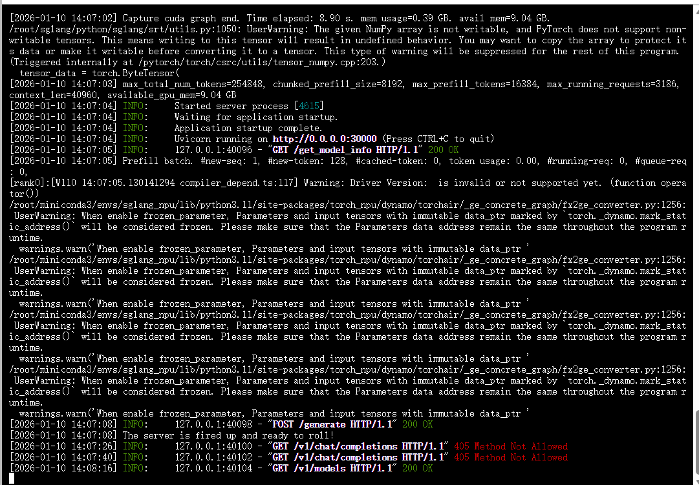
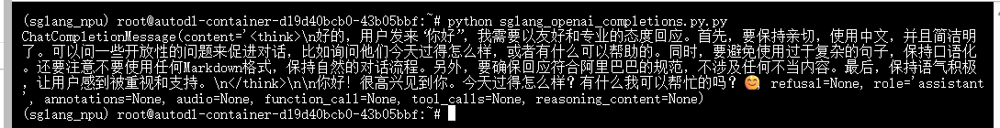

# Qwen3-8B sglang-ascend部署调用


## 环境准备

本文基础环境如下：

```
----------------
ubuntu 22.04
NPU驱动 25.2.0
python 3.11
cann 8.2.RC1
torch 2.6.0
torch-npu 2.6.0
----------------
```

> 本文默认学习者已配置好以上 `Pytorch (CANN)` 环境，如未配置请先自行安装。

> 请确定昇腾NPU芯片的版本，目前支持A2和A3系列产品。

## 环境搭建

### Python 版本

```python
conda create --name sglang_npu python=3.11
conda activate sglang_npu
```

`pip` 换源加速下载并安装依赖包

```
python -m pip install --upgrade pip
pip config set global.index-url https://pypi.tuna.tsinghua.edu.cn/simple
pip install modelscope
```


### Pytorch-npu 安装

```python
PYTORCH_VERSION=2.6.0
TORCHVISION_VERSION=0.21.0
TORCH_NPU_VERSION=2.6.0.post3
pip install torch==$PYTORCH_VERSION torchvision==$TORCHVISION_VERSION --index-url https://download.pytorch.org/whl/cpu
pip install torch_npu==$TORCH_NPU_VERSION
```

### 安装 Deep-ep 与 sgl-kernel-npu

```
pip install wheel==0.45.1

git clone https://github.com/sgl-project/sgl-kernel-npu.git

#添加环境变量
export LD_LIBRARY_PATH=/usr/local/Ascend/ascend-toolkit/latest/runtime/lib64/stub:$LD_LIBRARY_PATH
source /usr/local/Ascend/ascend-toolkit/set_env.sh

#编译并安装deep-ep与 sgl-kernel-npu
cd sgl-kernel-npu
bash build.sh
pip install output/deep_ep*.whl output/sgl_kernel_npu*.whl --no-cache-dir
```

### 源码安装 SGLang

```
git clone -b v0.5.3rc0 https://github.com/sgl-project/sglang.git

cd sglang

pip install -e python[srt_npu]
```

## 模型下载

使用 modelscope 中的 snapshot_download 函数下载模型，第一个参数为模型名称，参数 cache_dir 为模型的下载路径。

新建 `model_download.py` 文件并在其中输入以下内容，粘贴代码后记得保存文件。

```python
from modelscope import snapshot_download

model_dir = snapshot_download('Qwen/Qwen3-8B', cache_dir='/root/autodl-tmp', revision='master')
```

然后在终端中输入 `python model_download.py` 执行下载，这里需要耐心等待一段时间直到模型下载完成。

> 注意：记得修改 `cache_dir` 为你的模型下载路径哦~

## 创建兼容 OpenAI API 接口的服务器

`Qwen3-8B` 兼容 `OpenAI API` 协议，所以我们可以直接使用  `sglang-ascend`在昇腾服务器上创建`OpenAI API` 服务器接口。

在创建服务器时，我们可以指定模型名称、模型路径、聊天模板等参数。

- `--host` 和 `--port`： 参数指定地址。
- `--model-path`：本地模型路径。
- `attention-backend`：指定底层注意力计算使用的硬件后端

```
python3 -m sglang.launch_server --model-path autodl-tmp/Qwen/Qwen3-8B --attention-backend ascend --host 0.0.0.0 --port 30000
```

这样就算启动成功！！！




- 通过 `curl` 命令查看当前的模型列表

```bash
curl http://localhost:30000/v1/models
```


得到的返回值如下所示

```json
{
  "object": "list",
  "data": [
    {
      "id": "autodl-tmp/Qwen/Qwen3-8B",
      "object": "model",
      "created": 1768025296,
      "owned_by": "sglang",
      "root": "autodl-tmp/Qwen/Qwen3-8B",
      "max_model_len": 40960
    }
  ]
}
```

- 使用 `curl` 命令测试 `OpenAI Completions API`

```bash
curl http://localhost:30000/v1/chat/completions \
  -H "Content-Type: application/json" \
  -d '{
    "model": "Qwen3-8B",
    "messages": [{"role": "user", "content": "你好！"}]
  }'
```

得到的返回值如下所示

```json
{
  "id": "556383264b9247c7a43369c6a82c2b29",
  "object": "chat.completion",
  "created": 1768025567,
  "model": "Qwen3-8B",
  "choices": [
    {
      "index": 0,
      "message": {
        "role": "assistant",
        "content": "<think>\n好的，用户打招呼说“你好！”，我需要友好回应。首先，要保持自然，用中文回应。然后，可以询问用户今天过得怎么样，或者有什么可以帮助的。这样既亲切又专业。还要注意语气要温暖，避免太过机械。可能需要根据用户的后续问题调整回答，但当前只需要一个合适的开场白。确保没有使用任何Markdown格式，保持口语化。\n</think>\n\n你好！今天过得怎么样呀？有什么我可以帮你的吗？😊",
        "reasoning_content": null,
        "tool_calls": null
      },
      "logprobs": null,
      "finish_reason": "stop",
      "matched_stop": 151645
    }
  ],
  "usage": {
    "prompt_tokens": 10,
    "total_tokens": 111,
    "completion_tokens": 101,
    "prompt_tokens_details": null,
    "reasoning_tokens": 0
  },
  "metadata": {
    "weight_version": "default"
  }
}
```

- 用 `Python` 脚本请求 `OpenAI Completions API`

```python
# vllm_openai_completions.py
from openai import OpenAI
client = OpenAI(
    base_url="http://localhost:3000/v1",
    api_key="sk-xxx", # 随便填写，只是为了通过接口参数校验
)

completion = client.chat.completions.create(
  model="Qwen3-8B",
  messages=[
    {"role": "user", "content": "你好\n"}
  ]
)

print(completion.choices[0].message)
```

```shell
python sglang_openai_completions.py
```




## 参考文章

[快速安装昇腾环境 — 昇腾开源 文档](https://ascend.github.io/docs/sources/ascend/quick_install.html)

[安装CANN-CANN社区版8.3.RCX-昇腾社区](https://www.hiascend.com/document/detail/zh/CANNCommunityEdition/83RC1/softwareinst/instg/instg_0008.html?Mode=PmIns&InstallType=local&OS=openEuler&Software=cannToolKit)

[支持 NPU 的 SGLang 安装指南 — SGLang 框架](https://docs.sglang.com.cn/platforms/ascend_npu.html#python-version)

[sgl-kernel-npu/python/sgl_kernel_npu/README.md at main ·SGL-project/SGL-kernel-npu](https://github.com/sgl-project/sgl-kernel-npu/blob/main/python/sgl_kernel_npu/README.md)
