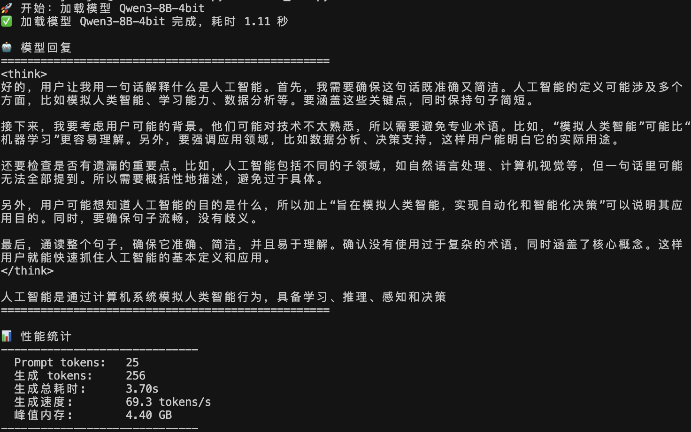
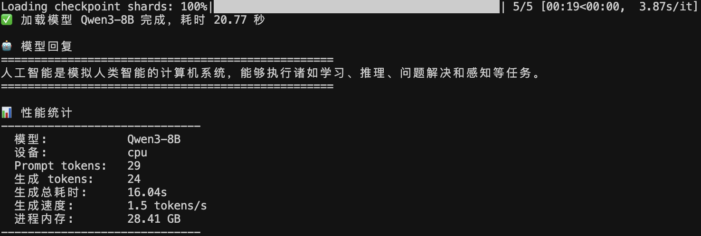

MLX 是由苹果公司发布的在 Apple Silicon 芯片上的深度学习框架。与 PyTorch 等传统框架不同，MLX 充分利用了 Apple M 系列芯片的硬件优势，将将数据维护在共享内存中，不需要频繁地在 CPU 和 GPU 之间传输数据，这样的共享内存架构大大提升了模型推理的效率。

## 与 vLLM 的区别

MLX-LM 是基于 MLX 框架构建的用于大模型推理的库，支持多种大语言模型（LLM）的部署和使用。通过 MLX-LM，用户可以在搭载 Apple M 系列芯片的设备上高效地运行大模型，实现本地推理。相比于 vLLM 等推理框架，架构区别如下所示：

```bash
# vLLM 架构示意图
┌───────────────────────────────┐
│        应用层 / 服务层         │
│  OpenAI-compatible API        │
│  (chat / completions)         │
└───────────────▲───────────────┘
                │
┌───────────────┴───────────────┐
│            vLLM               │
│  - Continuous Batching        │
│  - PagedAttention (KV Cache)  │
│  - 高并发 / 高吞吐             │
└───────────────▲───────────────┘
                │
┌───────────────┴───────────────┐
│     CUDA / Triton / NCCL      │
└───────────────▲───────────────┘
                │
┌───────────────┴───────────────┐
│        NVIDIA GPU             │
│  A100 / H100 / RTX            │
│  独立显存 (HBM / GDDR)        │
└───────────────────────────────┘
```

```bash
# MLX-LM 架构示意图
┌───────────────────────────────┐
│        用户接口层             │
│  CLI / Chat / Script          │
│  (mlx_lm.generate / chat)     │
└───────────────▲───────────────┘
                │
┌───────────────┴───────────────┐
│            mlx-lm             │
│  - 模型封装                   │
│  - 4bit / 8bit 推理            │
│  - 单用户 / 本地               │
└───────────────▲───────────────┘
                │
┌───────────────┴───────────────┐
│              MLX              │
│  - Tensor / Autograd          │
│  - Metal 后端                 │
└───────────────▲───────────────┘
                │
┌───────────────┴───────────────┐
│        Apple Silicon          │
│  CPU + GPU + NPU              │
│  Unified Memory (统一内存)     │
└───────────────────────────────┘
```

可以看到，vLLM 主要针对 NVIDIA GPU 进行优化，适合高并发和高吞吐的场景，而 MLX-LM 则充分利用了 Apple Silicon 的统一内存架构，适合单用户的本地推理需求。在 Apple M 系列芯片上使用 MLX-LM，可以实现高效的大模型推理体验。

具体使用差异对比如下表所示：

| 特性               | vLLM                          | MLX-LM                        |
|--------------------|-------------------------------|-------------------------------|
| 目标硬件           | NVIDIA GPU                    | Apple M 系列芯片              |
| 内存架构           | 独立显存 (HBM / GDDR)            | 统一内存 (Unified Memory)     |
| 并发支持           | 高并发 / 高吞吐                 | 单用户 / 本地                   |
| 模型量化         | 支持，但需自行实现               | 原生支持 4bit / 8bit 推理    |
| 框架依赖           | CUDA / Triton / NCCL           | MLX (Metal 后端)               |
| 使用复杂度         | 较高，需要配置环境和依赖       | 较低，适合本地快速部署         |

## 与 CPU 调用对比

我们在1台 M3 MAX 芯片、内存 64G的 MackBook Pro笔记本上分别用CPU和MLX框架调用Qwen3-8B模型(对应脚本路径分别为`models_mlx/qwen3/Qwen3_mlx.py`和`models_mlx/qwen3/Qwen3_transformers.py`)，得出结果分别如下：


<!--  -->


<div align=center>

<div align=center>图 1 Qwen3-8B模型CPU部署效果</div>
</div>

<div align=center>

<div align=center>图 2 Qwen3-8B模型MLX框架部署效果</div>
</div>

可以看到无论是生成速度还是消耗的峰值内存方面，MLX框架都要明显优于纯CPU调用