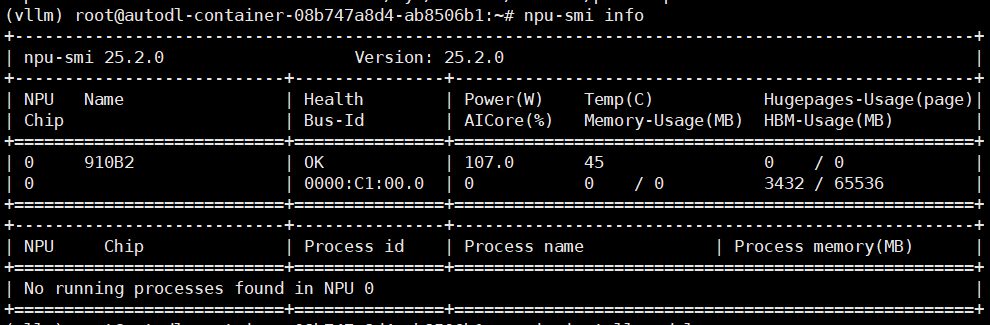

# Ascend NPU 平台支持模型列表

> 本页面专门收录了在Ascend NPU平台上经过测试和验证的大语言模型部署教程。我们为每个支持的模型提供了详细的 NPU 环境配置指南、部署步骤和优化建议。所有教程均在实际 NPU 硬件环境中验证通过，确保能够在 NPU 平台上顺利运行。

## NPU 硬件环境支持

目前教程主要支持以下 NPU 硬件平台：
- **Atlas A2 系列**：Atlas 800I A2、Atlas 800T A2、Atlas 300I A2等；
- **Atlas A3 系列**：Atlas 800I A3、Atlas 800T A3等；

注：Atlas A2 代表昇腾910B系列芯片，型号包含昇腾910B1、910B2、910B3、910B4、910B4-1； Atlas A3 代表昇腾910C系列芯片。

## 目录

- [Qwen3](#qwen3)

## 已支持模型列表

### Qwen3

[Qwen3](https://github.com/QwenLM/Qwen3)
- [x] [Qwen3-8B MindIE 部署调用](./models_ascend/qwen3/01-Qwen3-8B-MindIE部署调用.md) @刘志文
- [x] [Qwen3-8B vLLM-ascend 部署调用](./models_ascend/qwen3/02-Qwen3-8B-vLLM-ascend部署调用.md) @刘志文

### 大模型服务化性能和精度测试
- [x] [AISBench 测试工具环境配置](https://github.com/Zhiwen-Liu/LLM-Testing/blob/main/%E6%B5%8B%E8%AF%84%E5%89%8D%E5%87%86%E5%A4%87/AISBench%E5%AE%89%E8%A3%85%E4%B8%8E%E5%8D%B8%E8%BD%BD.md) @刘志文
- [x] [昇腾大模型服务化性能和精度测试](https://github.com/Zhiwen-Liu/LLM-Testing) @刘志文

## Ascend NPU 环境配置通用指南

### 1. 系统要求

**操作系统：**
- Linux openEuler 22.03 LTS for ARM（推荐）
- Linux Ubuntu 22.04 LTS for ARM（推荐）

**硬件要求：**
- Atlas A2 系列或Atlas A3 系列产品
- 最低 128GB 内存，推荐 256GB+
- 存储：至少 50GB 可用空间

### 2. 驱动固件安装和Docker环境准备

**Ascend NPU 驱动：**
- 下载并安装最新的 [Ascend NPU 驱动和固件包](https://www.hiascend.com/hardware/firmware-drivers/community?product=4&model=32&cann=8.5.0.alpha002&driver=Ascend+HDK+25.3.RC1)
- 确保 NPU 驱动正确安装和识别
    ```bash
    # 检查 NPU 设备状态
    npu-smi info
    ```
    

**Docker 环境：**
- 安装 Docker 并配置镜像源
- 确保 Docker 容器可以正常使用，且在容器内可以访问Ascend NPU 设备。

### 3. 软件环境

**Python 环境：**
```bash
# 推荐使用 Python 3.9+
conda create -n ascend_llm python=3.9
conda activate ascend_llm

# 更换 pypi 源加速安装
pip config set global.index-url https://pypi.tuna.tsinghua.edu.cn/simple
```

**核心依赖：**
- torch
- torch-npu
- transformers
- huggingface_hub
- modelscope


## 性能优化建议

### 1. CPU和内存优化
- 开启CPU高性能模式和透明大页
  ```bash
  # 开启CPU高性能模式，在相同时延约束下，大模型推理TPS会有约3%的提升。
  cpupower -c all frequency-set -g performance
  # 开启透明大页，多次实验的吞吐率结果会更稳定。
  echo always > /sys/kernel/mm/transparent_hugepage/enabled
  ```
### 2. 框架加速
- 在支持的硬件上使用对应加速框架进行加速，如MindIE、vllm-ascend等。

### 3. 模型量化
- 使用[msModelSlim](https://gitcode.com/Ascend/msit/tree/master/msmodelslim) 昇腾模型压缩工具对模型进行W8A8等量化减少内存占用，在保证精度的前提下提升推理速度。

## 常见问题

### Q: 如何检查我的 Ascend NPU 设备是否被正确识别？
A: 可以使用以下命令检查硬件支持情况：
```bash
# 检查 NPU 设备状态
npu-smi info
```


### Q: 如何贡献新的 Ascend NPU 模型教程？
A: 欢迎提交 PR 到本仓库，我们特别期待：
- 更多 Ascend NPU 型号的支持教程
- Linux Ascend NPU 环境的部署指南
- 性能优化和基准测试结果

> 💡 **提示：** 本教程系列正在持续更新中，如果您有特定 Ascend NPU 平台的模型部署需求或建议，欢迎通过 Issue 或 PR 与我们联系。